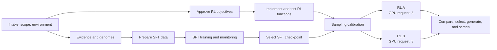

# Phage Dependency-Aware Orchestration Implementation Plan

> **For agentic workers:** REQUIRED SUB-SKILL: Use superpowers:subagent-driven-development
> (recommended) or superpowers:executing-plans to implement this plan task-by-task. Steps use
> checkbox (`- [ ]`) syntax for tracking.

**Goal:** Make dependency-aware, resource-admitted concurrency and bounded autonomy the concise
default for multi-week phage-generation workflows.

**Architecture:** The controller owns an approved project DAG and autonomy envelope; the execution
adapter reconciles capacity and admits dependency-ready nodes without oversubscription. Existing
stage skills, safety gates, and execution facilities remain unchanged.

**Tech Stack:** Agent Skills Markdown, JSON behavioral evals, Python/pytest package checks, and the
existing standard-library skill-eval runner.

## Global Constraints

- Keep one Mermaid starting graph in `project-contract.md`; link to it rather than duplicating it.
- A node launches only when both dependency-ready and resource-admissible.
- Safety, biological evidence, approval, lineage, and acceptance gates remain hard dependencies.
- Two requested eight-GPU RL runs queue on one eight-GPU host even though they are DAG-independent.
- Once the initial plan and autonomy envelope are authorized, interactive and batch runs both make
  reversible in-envelope decisions, report them durably, and escalate only by exception.
- Numeric action IDs are traceability metadata, not runtime ordering.
- Do not implement a scheduler, packing solver, runtime feature, or leaf-skill rewrite.
- Keep new entry-skill prose compact and avoid loading validation records during ordinary skill use.

______________________________________________________________________

### Task 1: Controller DAG and bounded-autonomy contract

**Files:**

- Modify: `recipes/evo2_phage_gen/.agents/skills/bionemo-phage-design/scripts/tests/test_skill_package_layout.py`
- Modify: `recipes/evo2_phage_gen/.agents/skills/bionemo-phage-design/evals/evals.json`
- Modify: `recipes/evo2_phage_gen/.agents/skills/bionemo-phage-design/SKILL.md`
- Modify: `recipes/evo2_phage_gen/.agents/skills/bionemo-phage-design/references/project-contract.md`

**Interfaces:**

- Consumes: existing root project files, stage outputs, approvals, and execution-environment record.

- Produces: `planning/DEPENDENCY_GRAPH.yaml` as scheduling source of truth and an approved
  `autonomy_envelope` consumed by the execution adapter.

- [ ] **Step 1: Add a failing static contract test**

Add this focused test:

````python
def test_controller_uses_dependency_graph_and_bounded_autonomy() -> None:
    skills_root = RECIPE_AGENT_DIR / "skills"
    controller = (skills_root / "bionemo-phage-design" / "SKILL.md").read_text(
        encoding="utf-8"
    )
    contract = (
        skills_root / "bionemo-phage-design" / "references" / "project-contract.md"
    ).read_text(encoding="utf-8")

    for marker in (
        "planning/DEPENDENCY_GRAPH.yaml",
        "dependency-ready and resource-admissible",
        "blocked node blocks only its descendants",
    ):
        assert marker in controller
    for marker in (
        "autonomy_envelope",
        "Numeric action IDs preserve traceability",
        "```mermaid",
        "Implement and test RL functions",
        "GPU request: 8",
    ):
        assert marker in contract
````

- [ ] **Step 2: Add the controller pressure eval**

Append this case to the controller eval array and assert its ID in
`test_behavioral_evals_cover_scope_runlog_and_wandb_regressions`:

```json
{
  "id": "bionemo-phage-design-007-resource-aware-dag-autonomy",
  "prompt": "An approved eight-GPU phage plan is active and I will be offline. SFT is healthy and training; its selected checkpoint is not available yet. The RL objective contract is approved, but its reward functions are not implemented. Sampling calibration requires both the selected SFT checkpoint and tested reward functions. I requested two alternative eight-GPU RL runs after calibration on this single eight-GPU host. Keep useful work moving without changing the biological intent or resource ceiling.",
  "expected_output": "A dependency- and resource-aware continuation that overlaps safe work, queues incompatible GPU jobs, and proceeds autonomously inside the approved envelope.",
  "assertions": [
    "The response updates a durable dependency DAG and editable Mermaid view; stage or action numbers are traceability rather than mandatory runtime order.",
    "While SFT is monitored, the response starts implementation and tests for the already-approved RL objectives; calibration still waits for both tested objectives and the selected SFT checkpoint.",
    "The two eight-GPU RL alternatives may be dependency-ready together, but admission control reserves the single eight-GPU pool for only one at a time and queues the other with a resource reason.",
    "A blocked node stalls only its descendants while unrelated safe work continues.",
    "The response records in-envelope decisions and deviations in DECISIONS.md and RUNLOG.md without routine questions, escalating only for changed biological intent, safety conflict, missing authority, new irreversible action, exhausted recovery, or resource/cost expansion."
  ],
  "expected_skill": "bionemo-phage-design",
  "expected_script": null
}
```

- [ ] **Step 3: Run RED checks**

```bash
python -m pytest recipes/evo2_phage_gen/.agents/skills/bionemo-phage-design/scripts/tests/test_skill_package_layout.py::test_controller_uses_dependency_graph_and_bounded_autonomy -q
python recipes/evo2_phage_gen/.agents/skills/bionemo-phage-design/scripts/run_skill_evals.py --skill-root recipes/evo2_phage_gen/.agents/skills --repo-root . --recipe-root recipes/evo2_phage_gen --validate
```

Expected: the static test fails on missing DAG/autonomy markers; eval validation passes.

- [ ] **Step 4: Capture the no-guidance baseline before editing skill prose**

Dispatch five fresh-context agents with no target skill loaded and the exact prompt from
`bionemo-phage-design-007-resource-aware-dag-autonomy`. Record whether each response waits
only on SFT, overlaps objective implementation, oversubscribes GPUs, asks a routine question, and
continues independent work around a blocked branch. Do not expose the eval assertions or expected
output.

- [ ] **Step 5: Implement the minimal controller rule**

Replace stage-order language with:

```markdown
Build and maintain `planning/DEPENDENCY_GRAPH.yaml` plus the editable Mermaid view in
`planning/PLAN.md`. Treat the plan as a DAG: launch every safe, non-conflicting node that
is dependency-ready and resource-admissible; numeric stage/action order is not execution order.
Monitoring an active job is not an exclusive phase. A blocked node blocks only its descendants, so
continue unrelated safe work.
```

State once that interactive mode iterates the initial plan, batch derives it from durable authority,
and after authorization both modes act autonomously within the recorded envelope while reporting
decisions and escalating only outside it.

- [ ] **Step 6: Add the concise durable project contract**

Add `DEPENDENCY_GRAPH.yaml` to the root layout and initialization action. Define each node
with `id`, `owner_skill`, `state`, hard/soft dependencies,
`approval_gates`, `resource_pool`, `resource_request`,
`write_scope`, `exclusive_locks`, `priority`, `outputs`, and
`acceptance_checks`. Define project-level `autonomy_envelope` fields for intent,
resource/cost ceiling, reversible adaptations, retry limits, reporting policy, and escalation.

Include this single editable starting graph:



State that current occupancy comes from the adapter, unknown material capacity prevents admission,
decisions go to `planning/DECISIONS.md` and root `RUNLOG.md`, and numeric action
IDs preserve traceability without imposing runtime order.

- [ ] **Step 7: Run GREEN checks and commit**

Run the Step 3 commands. Expected: both pass.

```bash
git add recipes/evo2_phage_gen/.agents/skills/bionemo-phage-design/SKILL.md recipes/evo2_phage_gen/.agents/skills/bionemo-phage-design/references/project-contract.md recipes/evo2_phage_gen/.agents/skills/bionemo-phage-design/evals/evals.json recipes/evo2_phage_gen/.agents/skills/bionemo-phage-design/scripts/tests/test_skill_package_layout.py
git commit -m "docs: make phage planning dependency aware"
```

______________________________________________________________________

### Task 2: Resource-aware execution admission

**Files:**

- Modify: `recipes/evo2_phage_gen/.agents/skills/bionemo-phage-design-adapt-execution/evals/evals.json`
- Modify: `recipes/evo2_phage_gen/.agents/skills/bionemo-phage-design-adapt-execution/SKILL.md`
- Modify: `recipes/evo2_phage_gen/.agents/skills/bionemo-phage-design-adapt-execution/references/execution-contract.md`
- Modify: `recipes/evo2_phage_gen/.agents/skills/bionemo-phage-design/scripts/tests/test_skill_package_layout.py`

**Interfaces:**

- Consumes: graph readiness, environment capacity, occupancy, reservations, and facility state.

- Produces: admitted launches or a queued state with a reason and reconsideration trigger.

- [ ] **Step 1: Add the failing adapter test and eval**

Add this test:

```python
def test_execution_adapter_uses_resource_aware_admission() -> None:
    skills_root = RECIPE_AGENT_DIR / "skills"
    adapter = (
        skills_root / "bionemo-phage-design-adapt-execution" / "SKILL.md"
    ).read_text(encoding="utf-8")
    contract = (
        skills_root
        / "bionemo-phage-design-adapt-execution"
        / "references"
        / "execution-contract.md"
    ).read_text(encoding="utf-8")

    assert "resource-aware admission control" in adapter
    for marker in (
        "dependency-ready",
        "resource-admissible",
        "reservations",
        "write-scope conflicts",
        "queued",
    ):
        assert marker in contract
```

Append this eval and assert its ID in the behavioral-eval coverage test:

```json
{
  "id": "bionemo-phage-design-adapt-execution-007-dag-admission",
  "prompt": "SFT is running on an eight-GPU host. An approved CPU-compatible RL-objective implementation node is ready now. Later, two requested RL alternatives will each need all eight GPUs. Apply the project dependency graph without oversubscribing resources or turning monitoring into a blocking phase.",
  "expected_output": "A reconciled admission plan that overlaps safe CPU work, serializes incompatible GPU jobs, and preserves durable reservations and monitoring state.",
  "assertions": [
    "The response distinguishes dependency-ready from resource-admissible and refreshes CPU, RAM, GPU, storage, I/O, occupancy, reservations, and write or exclusive-lock conflicts before launch.",
    "The response admits RL-objective implementation while SFT monitoring remains due-gated when aggregate requests and write scopes fit.",
    "The two later eight-GPU RL jobs remain independent in the DAG, but only one is admitted; the other is queued with the resource reason and reconsideration trigger.",
    "Reservations and stable handles are persisted before launch success and released only after facility-native terminal-state reconciliation.",
    "Each active node keeps independent due times, and a monitor that is not due returns without preventing other ready work."
  ],
  "expected_skill": "bionemo-phage-design-adapt-execution",
  "expected_script": null
}
```

- [ ] **Step 2: Verify RED**

```bash
python -m pytest recipes/evo2_phage_gen/.agents/skills/bionemo-phage-design/scripts/tests/test_skill_package_layout.py::test_execution_adapter_uses_resource_aware_admission -q
```

Expected: FAIL because admission/reservation language is absent.

- [ ] **Step 3: Implement the admission recipe**

Require the adapter to consume the graph, reconcile facility state, and apply resource-aware
admission control. Add this cycle to the execution contract:

1. Reconcile durable node/attempt state with facility-native status.
2. Select nodes whose hard dependencies and gates succeeded.
3. Refresh capacity, occupancy, reservations, storage/I/O headroom, and write/exclusive locks.
4. Admit a highest-priority safe set whose aggregate requests fit; no optimal solver is required.
5. Persist reservations and stable handles before launch success.
6. Queue non-fitting ready nodes with a reason; release only after verified terminal state and
   reconsider after launch, completion, failure, capacity change, or material plan change.

Replace “advance the next approved stage” with “re-evaluate and admit the safe ready set.” Each
active node retains independent due times; a not-due monitor returns immediately.

- [ ] **Step 4: Verify GREEN and commit**

Run the Step 2 command and:

```bash
python recipes/evo2_phage_gen/.agents/skills/bionemo-phage-design/scripts/run_skill_evals.py --skill-root recipes/evo2_phage_gen/.agents/skills --repo-root . --recipe-root recipes/evo2_phage_gen --validate
```

Expected: both pass.

```bash
git add recipes/evo2_phage_gen/.agents/skills/bionemo-phage-design-adapt-execution/SKILL.md recipes/evo2_phage_gen/.agents/skills/bionemo-phage-design-adapt-execution/references/execution-contract.md recipes/evo2_phage_gen/.agents/skills/bionemo-phage-design-adapt-execution/evals/evals.json recipes/evo2_phage_gen/.agents/skills/bionemo-phage-design/scripts/tests/test_skill_package_layout.py
git commit -m "docs: add resource-aware phage admission"
```

______________________________________________________________________

### Task 3: Portable handoff guarantee

**Files:**

- Modify: `.agents/skills/bionemo-phage-generation/evals/evals.json`
- Modify: `.agents/skills/bionemo-phage-generation/SKILL.md`
- Modify: `recipes/evo2_phage_gen/.agents/skills/bionemo-phage-design/scripts/tests/test_skill_package_layout.py`

**Interfaces:**

- Consumes: original request and selected recipe-local controller.

- Produces: a handoff preserving orchestration/autonomy without copying the detailed contract.

- [ ] **Step 1: Add and run the failing handoff assertion**

Add these markers to the existing `portable_skill` loop:

```python
"dependency-aware, resource-admitted execution",
"bounded autonomy",
```

Append this literal assertion to
`bionemo-phage-generation-005-complete-local-handoff`:

```json
"The handoff requires dependency-aware, resource-admitted execution, independent safe progress during monitoring, and bounded autonomy with durable decision reporting after plan approval."
```

Run:

```bash
python -m pytest recipes/evo2_phage_gen/.agents/skills/bionemo-phage-design/scripts/tests/test_skill_package_layout.py::test_portable_skill_requires_complete_checkout_and_absolute_discovery_handoff -q
```

Expected: FAIL because both phrases are missing.

- [ ] **Step 2: Add one concise handoff sentence**

```markdown
Verify the implementation defaults to dependency-aware, resource-admitted execution, continues
independent safe work during monitoring, and uses bounded autonomy after plan approval while
reporting material in-envelope decisions.
```

- [ ] **Step 3: Verify and commit**

Run the Step 1 test command and:

```bash
python recipes/evo2_phage_gen/.agents/skills/bionemo-phage-design/scripts/run_skill_evals.py --skill-root recipes/evo2_phage_gen/.agents/skills --repo-root . --recipe-root recipes/evo2_phage_gen --validate
```

Expected: both pass.

```bash
git add .agents/skills/bionemo-phage-generation/SKILL.md .agents/skills/bionemo-phage-generation/evals/evals.json recipes/evo2_phage_gen/.agents/skills/bionemo-phage-design/scripts/tests/test_skill_package_layout.py
git commit -m "docs: preserve orchestration in phage handoff"
```

______________________________________________________________________

### Task 4: Pressure-test and validate the complete package

**Files:**

- Modify only if a GREEN failure identifies a minimal wording gap in a Task 1–3 file.

**Interfaces:**

- Consumes: final skill bytes and the unchanged pressure prompt.

- Produces: evidence that behavior changed without adding a runtime scheduler.

- [ ] **Step 1: Run five fresh GREEN pressure tests**

Dispatch five fresh agents with no conversation history, load the updated controller and adapter,
and use the exact Task 1 prompt without assertions. Require all five to overlap RL implementation
with SFT monitoring, wait to calibrate, serialize the two RL jobs, continue independent work around
a blocked branch, and avoid routine questions while documenting decisions. A wording change is a
new variant and requires five fresh repetitions.

- [ ] **Step 2: Run focused offline validation**

```bash
python -m pytest recipes/evo2_phage_gen/.agents/skills/bionemo-phage-design/scripts/tests/test_skill_package_layout.py -q
python recipes/evo2_phage_gen/.agents/skills/bionemo-phage-design/scripts/tests/test_run_skill_evals.py
python recipes/evo2_phage_gen/.agents/skills/bionemo-phage-design/scripts/run_skill_evals.py --skill-root recipes/evo2_phage_gen/.agents/skills --repo-root . --recipe-root recipes/evo2_phage_gen --validate
python recipes/evo2_phage_gen/.agents/skills/bionemo-phage-design/scripts/run_skill_evals.py --skill-root recipes/evo2_phage_gen/.agents/skills --repo-root . --recipe-root recipes/evo2_phage_gen --dry-run --all --results-dir /tmp/phage-orchestration-codex-dry
python recipes/evo2_phage_gen/.agents/skills/bionemo-phage-design/scripts/run_skill_evals.py --skill-root recipes/evo2_phage_gen/.agents/skills --repo-root . --recipe-root recipes/evo2_phage_gen --harness claude --dry-run --all --results-dir /tmp/phage-orchestration-claude-dry
python ci/scripts/check_copied_files.py
git diff --check
```

Expected: all pass; dry runs make no paid/live model, GPU, scheduler, cloud, or publication call.

- [ ] **Step 3: Inspect scope and context size**

Run `git diff --stat` and count the three changed entry `SKILL.md` files. Confirm
the Mermaid graph exists once, no leaf skill changed, and the entry prose remains compact.

- [ ] **Step 4: Verify before completion**

Read and apply `superpowers:verification-before-completion`. If GREEN testing required a
wording refinement, stage only affected orchestration files and commit:

```bash
git commit -m "test: validate phage orchestration contract"
```

Do not create an empty commit.
