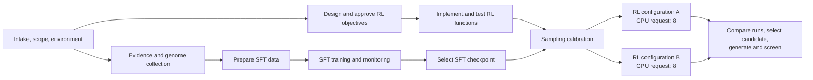

# Phage Dependency-Aware Orchestration Design

**Date:** 2026-08-11
**Status:** Approved design; pending written-spec review

## Objective

Change the BioNeMo phage-generation skill package from an implicitly stage-serial workflow to
resource-aware DAG orchestration with bounded autonomy. After an initial plan and authority envelope
are approved, the controller should keep multi-week work moving, run independent work concurrently
when capacity permits, document its decisions, and ask the user only by exception.

This is a skill and contract change. It does not add a custom workflow scheduler.

## Problem

The controller currently says to resolve dependencies “in stage order,” and the execution contract
describes advancing “the next approved stage” after a long-running job completes. A model can
therefore treat the written stage list as a mandatory serial pipeline, spend an SFT run only
monitoring, or stop repeatedly for routine decisions.

That loses useful overlap. For example, after an RL objective contract is approved, the reward
functions and their tests can be implemented while SFT is training. Conversely, dependency
independence alone is not permission to oversubscribe finite hardware: two alternative eight-GPU RL
runs must queue on an eight-GPU machine.

## Design principles

1. The project plan is a directed acyclic graph, not an ordered stage list.
2. A node must be both dependency-ready and resource-admissible before launch.
3. The controller launches a work-conserving safe set of ready nodes rather than one arbitrary “next”
   stage.
4. Numeric action IDs preserve traceability; they do not impose execution order.
5. After initial approval, the controller operates with bounded autonomy and management by
   exception.
6. A blocked node blocks only its descendants. Independent safe work continues.
7. Safety, authority, lineage, biological evidence, and acceptance gates remain hard dependencies;
   concurrency never weakens them.

## Durable planning contract

Add planning/DEPENDENCY_GRAPH.yaml to the project root contract. planning/PLAN.md contains an
editable human-readable Mermaid view of the same graph; the YAML is the scheduling source of truth.
The controller updates both when nodes or edges materially change.

The YAML records:

```yaml
schema_version: 1
plan_sha256: "..."
environment_path: planning/execution/ENVIRONMENT.yaml
autonomy_envelope:
  status: approved
  approved_at: "..."
  intent_and_priorities: []
  resource_and_cost_ceiling: {}
  allowed_reversible_adaptations: []
  retry_limits: {}
  reporting_policy: {}
  escalation_triggers: []
resource_pools:
  local_compute:
    capacity_source: planning/execution/ENVIRONMENT.yaml
nodes:
  - id: implement-rl-objectives
    owner_skill: bionemo-phage-design-implement-rl-objectives
    state: planned
    hard_dependencies: [approve-rl-objectives]
    soft_dependencies: []
    approval_gates: []
    resource_pool: local_compute
    resource_request:
      gpus: 0
      cpu_cores: 8
      ram_bytes: null
      scratch_bytes: null
      io_class: moderate
    write_scope: [rl/objective-implementation]
    exclusive_locks: []
    priority: 50
    outputs: []
    acceptance_checks: []
```

Unknown resource values remain null with a reason and prevent admission when they are material to
safe capacity planning. Current occupancy and external reservations come from the execution adapter,
not from stale graph values.

## Editable Mermaid starting graph

Place this example in the controller guidance and/or project plan contract as a starting point. The
model must edit it for the selected project rather than copying it as a universal pipeline.



In an eight-GPU pool, R1 and R2 may become dependency-ready together but only one is
resource-admissible. The other remains queued until the first reservation is released. Meanwhile,
E and CPU-compatible F may overlap when their write scopes and aggregate resource use are safe.

## Scheduling semantics

For each scheduling decision:

1. Reconcile durable node and attempt state with the execution facility.
2. Mark a node dependency-ready only when all hard predecessors and approval/acceptance gates have
   succeeded. Soft dependencies affect priority or evidence quality but do not silently become hard
   gates.
3. Re-read resource capacity, current occupancy, active reservations, storage headroom, I/O limits,
   and write/exclusive-lock conflicts.
4. Admit the highest-priority safe set whose aggregate resource requests fit. Prefer useful
   concurrency, but do not require an optimal packing solver.
5. Persist reservations and stable execution handles before considering launches successful.
6. Keep dependency-ready nodes that do not fit in a queued state, with the resource reason and next
   reconsideration trigger. Do not label ordinary resource waiting as blocked or failed.
7. Release reservations only after verified terminal state. Re-evaluate the queue on launch,
   completion, failure, capacity change, or material plan change.

Sequential execution is valid when required by a hard edge, insufficient capacity, exclusive
resource or write scope, authority gate, or measured contention. Record that reason. Never launch
two individually valid jobs whose combined GPU memory, CPU/RAM, storage, I/O, network, tool
concurrency, or checkpoint-write peak exceeds the safe envelope.

Monitoring is one coordinator activity, not an exclusive workflow phase. Each active node retains
its own due times. Between due observations, the controller schedules other ready work. A timerless
monitor returns immediately when nothing is due and does not prevent progress elsewhere.

## Bounded autonomy and operating modes

The initial plan includes an approved autonomy envelope: scientific intent and priorities, allowed
stages, resource/cost ceilings, reversible adaptations, retry policy, report cadence, and escalation
triggers. The model translates the “spirit” of the request into these durable fields rather than
relying on private conversational interpretation.

- **Interactive mode:** the model and user iterate on the initial plan and autonomy envelope before
  material execution.
- **Batch mode:** the model derives the initial plan and available authority from the supplied brief
  and durable records, exposing assumptions and any missing launch authority.

After execution is authorized, both modes use the same autonomous runtime behavior. The controller:

- makes best-effort, evidence-backed, reversible choices within the envelope;
- records the decision, alternatives, evidence, confidence, consequences, and reversibility in
  planning/DECISIONS.md and the root RUNLOG.md;
- summarizes material choices, deviations, blocked nodes, and next actions in reports;
- continues independent safe nodes when another node needs user input; and
- does not request routine feedback for monitoring events, nonmaterial choices, or adaptations
  already authorized by the plan.

Escalation is reserved for a changed biological objective, safety-policy conflict, unresolved
material biology outside the decision policy, new irreversible/destructive action, publication or
access change, resource/cost expansion beyond the ceiling, missing authority, or exhausted bounded
recovery. Escalation blocks only the affected node and descendants unless project-wide safety or
resource integrity is at risk.

## Skill and contract changes

Update only the orchestration surfaces needed to make this behavior durable:

- portable bionemo-phage-generation handoff language and its eval assertions;
- recipe-local bionemo-phage-design intake/execution language and controller evals;
- project-contract.md root layout, planning artifacts, action-order meaning, autonomy envelope, and
  decision reporting;
- bionemo-phage-design-adapt-execution and execution-contract.md admission, reservation, multi-node
  monitoring, and re-entry language; and
- package-layout tests that enforce the new contract and behavioral-eval coverage.

Avoid changing scientific stage ownership, objective meaning, safety gates, or runtime code. Add
leaf-skill wording only if RED testing shows the controller/adapter contract is insufficient to make
long-running operators yield control. Keep the operational wording concise: one normative rule,
one editable graph, one admission recipe, and one bounded-autonomy rule should carry the behavior.

## Testing strategy

Apply skill TDD:

1. Add focused package assertions and a behavioral pressure scenario before changing skill prose;
   verify the assertions fail for missing dependency-graph/autonomy language.
2. Run fresh-context no-guidance control scenarios. The main pressure case has an approved plan, an
   active SFT job, an approved RL objective contract, two later eight-GPU RL alternatives on an
   eight-GPU host, an offline user, and a deadline. Capture whether agents wait only on SFT, launch
   both RL jobs, or ask routine questions.
3. Add the minimal positive contract: required graph fields, readiness/admission recipe, autonomy
   envelope, decision reporting, and escalation boundaries.
4. Re-run the same scenarios with the changed skill. Require overlap of SFT monitoring with RL
   implementation, sequential admission of the two eight-GPU RL jobs, continued independent work
   around a blocked node, and no routine user interruptions.
5. Run repository eval validation, package-layout tests, copied-file checks, and Markdown/JSON
   formatting checks.

## Non-goals

- Do not implement a bespoke DAG engine, optimal bin-packing solver, or cluster scheduler.
- Do not promise concurrency when the execution facility cannot safely isolate or query jobs.
- Do not run speculative RL implementation before its biological objective contract is approved.
- Do not let autonomy bypass safety, lineage, validation, authority, cost, access, or destructive
  action gates.
- Do not require the user to synchronously supervise a healthy multi-week run.

## Success criteria

The updated package makes it unambiguous that:

- dependency-aware, resource-aware concurrency is the default;
- independent work overlaps when safely admissible;
- independent but resource-incompatible jobs queue sequentially;
- an approved initial plan establishes a bounded autonomy envelope;
- interactive and batch differ mainly in initial plan formation, not runtime supervision;
- autonomous decisions are durable and reviewable;
- only exceptional out-of-envelope choices require user input; and
- blocked branches do not stall unrelated safe work.
