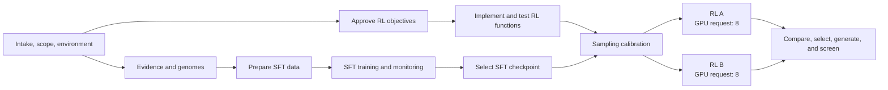

# Project and attempt contract

After applying [workspace-contract.md](workspace-contract.md), use paths relative to the absolute project result root under the selected recipe's `results/` directory. Keep large and generated data there; do not write run artifacts beside the recipe-local skill documents.

## Root layout

```text
PROJECT.yaml
SUMMARY.md
RUNLOG.md
planning/
  PLAN.md
  DEPENDENCY_GRAPH.yaml
  DESIGN_SPEC.yaml
  DECISIONS.md
  handoffs/
  execution/
    ENVIRONMENT.yaml
    EXECUTION_PLAN.md
    ACTIONS.yaml
    scripts/
research/runs/
inputs/models/
genomes/runs/
sft/
  SFT_PLAN.yaml
  SPLIT_MANIFEST.yaml
  runs/
rl/
  RL_OBJECTIVES.yaml
  runs/
rollout/runs/
reports/
```

PROJECT.yaml records schema version, slug, creation time, operating mode, project mode, absolute repository/recipe/result roots, target accession and sequence hash, host, objective, design-spec path and hash, repository revision, execution-plan path, and stage pointers. Root PROJECT.yaml and SUMMARY.md expose concise jump links for source revision, design scope, stage attempts, selected SFT, RL, and rollout checkpoints, prompt manifest, TensorBoard directories, W&B status/URLs, and scheduler or cloud jobs. Keep detail append-only in ACTIONS.yaml, run logs, and monitor events. Never store credentials.

Create `PROJECT.yaml`, `SUMMARY.md`, root `RUNLOG.md`, `planning/PLAN.md`, `planning/DEPENDENCY_GRAPH.yaml`, `planning/DESIGN_SPEC.yaml`, and `planning/DECISIONS.md` as one initialization action before creating any stage attempt. Seed the root RUNLOG with the user brief or its durable path, mode, roots, revision/dirty state, initial whole-genome scope, assumptions, unresolved decisions, and telemetry plan. Append every controller decision, material user approval, stage handoff, attempt status transition, and root-pointer promotion. Stage RUNLOG files do not replace this project-wide chronology, and SUMMARY.md does not replace it. In a read-only session, name these exact planned files without claiming creation.

## Operating mode and portable memory

Record `operating_mode: interactive|batch` separately from `project_mode: case-study-replication|adapted-design`.

- **Interactive (default):** inspect first, write a compact initial plan and assumptions, then iterate with the user before material launches or biologically consequential choices.
- **Batch:** consume the supplied brief plus verified repository and result artifacts, infer reversible defaults with evidence/confidence, and produce the best executable handoff without waiting for nonmaterial answers. Leave authority, credential, destructive, and unresolved biological choices blocked rather than guessing.

Use durable files as cross-run memory in this order: current user brief and recorded decisions; PROJECT.yaml/SUMMARY.md and stable stage pointers; immutable requests, manifests, configs, hashes, and OUTPUTS; RUNLOG/ACTIONS and prior evidence; then clearly labeled inference. A harness memory, conversation summary, or agent-specific store may suggest where to look but never overrides checked artifacts. Batch plans record each inferred intent, source, confidence, consequence if wrong, and validation step. Interactive decisions are written before handoff so a later batch run can resume without private context. On every fresh or restarted agent session, recover the active attempt from these records and reconcile it with the recorded execution facility before launching, stopping, or relaunching anything.

## Dependency DAG and bounded autonomy

`planning/DEPENDENCY_GRAPH.yaml` is the durable scheduling source of truth; `planning/PLAN.md` holds its editable Mermaid view.

Each node defines `id`, `owner_skill`, `state`, hard/soft dependencies, `approval_gates`, `resource_pool`, `resource_request`, `write_scope`, `exclusive_locks`, `priority`, `outputs`, and `acceptance_checks`.

Every applicable safety, biological-evidence, approval, lineage, and acceptance gate MUST be a satisfied `hard_dependencies` entry before its node is dependency-ready; `soft_dependencies` inform priority only and never admit a node.
The project-level `autonomy_envelope`, approved with the plan and consumed by the execution adapter, defines intent, resource/cost ceiling, reversible adaptations, retry limits, reporting policy, and escalation.

The adapter supplies current occupancy and admits only dependency-ready nodes whose requests fit the approved pool and ceiling; unknown material capacity prevents admission. A blocked node blocks only its descendants, while unrelated safe work continues. Record in-envelope decisions and deviations in `planning/DECISIONS.md` and root `RUNLOG.md`; escalate only for changed biological intent, safety conflict, missing authority, new irreversible action, exhausted recovery, or resource/cost expansion.

Numeric action IDs preserve traceability without imposing runtime order.
The editable starting graph is:



## Ordered action trace

Represent every material action performed or handed off as an ordered intent-named script or execution-plane equivalent. Project setup uses project/NNN; stage actions use STAGE/ATTEMPT/NNN, with a monotonic three-digit prefix inside each namespace. Never reuse or overwrite a script path. Root ACTIONS.yaml is the single ordered ledger.

Keep reusable project setup and orchestration scripts under planning/execution/scripts/. Put stage-specific scripts under STAGE/runs/ATTEMPT/scripts/. Each ledger item records ID, intent, prerequisites, script path, script, command, and config hashes, executor, host, execution-facility, scheduler, or cloud identity and URL, start, end, exit status, stdout, stderr, log paths, outputs and hashes, and idempotence or resume guard. No runnable action exists only in chat. Add a guarded run-all only after individual actions stabilize; enforce prerequisites, terminal-state checks, and resume guards.

## Every stage attempt

Create a unique never-reused directory under its stage runs/:

```text
STAGE_REQUEST.yaml
RUN.yaml
STATUS.json
TELEMETRY.json
resolved_config.yaml
command.sh
source_state.json
scripts/
logs/
metrics/
checkpoints/
artifacts/
monitor/
  state.json
  events.jsonl
OUTPUTS.yaml
SUMMARY.md
RUNLOG.md
```

Use lifecycle states planned, submitted, running, succeeded, failed, stopped-early, and blocked. Write status atomically when feasible. Record physical paths and portable artifact identities; never assume another host shares a mount. `RUN.yaml` also records the execution facility, stable handle and native queries, host/lifetime scope, command and config identity, logs/heartbeat, checkpoint-resume state, and restart policy needed to recover after an agent-session restart.

Use blocked only for missing authority or an unresolved material choice. Operational gate/process failures must trigger bounded diagnosis and repair/retry, then become running, succeeded, or explicitly failed; they must not remain an indefinite apparently active wait.

## Ownership and promotion

- The controller owns root indexes, stable stage pointers, and cross-stage handoffs.
- Under controller delegation, bionemo-phage-design-adapt-execution owns planning/execution/ and its environment, plan, action ledger, and reusable scripts.
- Other leaf skills own only their stage attempts. Put proposed stable manifests in artifacts/; the controller verifies and promotes them.
- Treat STAGE_REQUEST.yaml, input hashes, and completed lineage as immutable. Relaunch into a new attempt or append a true resume event.
- Link large inputs instead of copying. Record path, size, hash, source, license, and version.

The objective-planning leaf writes rl/runs/ATTEMPT/artifacts/RL_OBJECTIVES.yaml plus its standard outputs; only the controller promotes an approved copy to rl/RL_OBJECTIVES.yaml.

## RL lineage blocks

Every RL request, run, output, and summary contains SFT and prompt lineage:

```yaml
sft_lineage:
  project_slug: "..."
  project_root: "..."
  stage_name: "sft"
  stage_type: "supervised-fine-tuning"
  run_id: "..."
  checkpoint_iteration: 0
  checkpoint_path: "..."
  artifact_id: null
  checkpoint_sha256: "..."
  base_model: {provider: "...", id: "...", version: "...", sha256: "..."}
  dataset_sha256: "..."
  split_manifest_path: "..."
  split_manifest_sha256: "..."
  resolved_config_sha256: "..."
  selection_metric: "validation_loss"
  selection_evidence: "..."
  rationale: "..."
prompt_lineage:
  manifest_path: "..."
  manifest_sha256: "..."
  reference_genome_sha256: "..."
  derivation: {slice: "...", rotation: null, tokenizer: "...", tokenizer_version: "..."}
  prompt_ids: []
  prompt_lengths: []
  seeds: []
  procedure_version: "..."
```

This is a compact root-navigation block. The detailed operator schema and validation requirements in ../../bionemo-phage-design-operate-nemo-rl/references/lineage-contract.md are authoritative and must also be satisfied. Reject incomplete lineage rather than guessing. A different project root is valid when every identity and checksum resolves.

## Literature assets

Checked-in papers, supplements, figures, attribution, and manifests live under ../assets/literature/. Read each MANIFEST.json before use. Treat papers as methods evidence, not universal thresholds.
