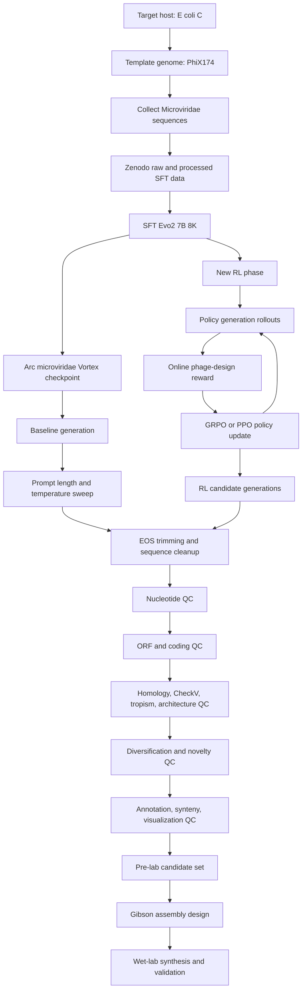

# Evo2 Phage Genome Design

This recipe is the staging area for reproducing Arc Institute's Evo2
Microviridae phage-design workflow and extending it with an RL phase after SFT.
The initial target is to start from Arc's fine-tuned
`evo-design/evo-2-7b-8k-microviridae` checkpoint, convert it into the
Megatron Bridge checkpoint format used by `recipes/evo2_megatron`, reproduce the
published generation and filtering workflow, and then optimize a reward that
improves the rate of high-quality candidates before wet-lab validation.

The package intentionally shares the Evo2 implementation through the symlink at
`src/bionemo/evo2`. Phage-specific code should live under
`src/bionemo/evo2_phage_gen`. It should also share the 512-token nucleotide
tokenizer from `recipes/evo2_megatron/tokenizers`, either by symlink or by a
copied-file mapping if CI/package behavior makes symlinking awkward.

## Local References

The recipe pins NeMo-RL by git commit and carries a local patch that can be
applied to the installed package with `evo2_phage_patch_nemo_rl`. Runtime
artifacts and downloaded analysis assets live under the gitignored
`recipes/evo2_phage_gen/data` tree so the recipe can be recreated without any
`dist/` scratch state:

| Path                                              | Purpose                                                                 |
| ------------------------------------------------- | ----------------------------------------------------------------------- |
| `recipes/evo2_phage_gen/patches`                  | Upstreamable NeMo-RL patch files applied after package install.         |
| `recipes/evo2_phage_gen/configs/nemo_rl_defaults` | Local copies of the NeMo-RL GRPO defaults this recipe inherits.         |
| `recipes/evo2_phage_gen/data/checkpoints`         | Local Vortex, MBridge, GRPO, generation, and analysis outputs.          |
| `recipes/evo2_phage_gen/data/external`            | Downloaded tools/databases and the Arc Evo2 reference checkout.         |
| `dist/`                                           | Optional scratch checkouts for source review only; not required to run. |

The current `recipes/evo2_megatron/pyproject.toml` and this recipe both pin
`megatron-bridge==v0.5.0` by git tag and source `megatron-core` from the same
tag's `3rdparty/Megatron-LM` submodule. Keeping Bridge and MCore pinned as a
pair matters: NeMo-RL's Megatron generation path requires MCore inference APIs
such as `megatron.core.inference` and `InferenceCudaGraphScope`.

## NeMo-RL Adapter Plan

The current `patches/nemo-rl-evo2-mbridge-grpo.patch` is intentionally narrow,
but the errors hit while wiring Evo2 point to a cleaner upstream shape:

- NeMo-RL should expose a Megatron model adapter registry keyed by config, model
  name, or provider type. The adapter should own model/provider construction,
  tokenizer selection, target allowlist additions, and checkpoint-preload hooks.
- Generation setup should ask the adapter for architecture-specific inference
  components. For Evo2, that means using
  `build_evo2_mamba_inference_state_config()` and binding Hyena recurrent-state
  views when dynamic requests are assigned slots.
- Dataset processing should also be registry-based. DNA prompts should register
  a plain tokenizer processor and not inherit chat-template assumptions from math
  examples.
- MBridge checkpoint loading should remain topology-agnostic. Converted
  checkpoints should contain full logical tensors plus canonical MCore
  `ShardedObject` extra state, while runtime-only Transformer Engine state is
  initialized by the destination model.

That would let new Megatron model families plug into NeMo-RL through a contained
adapter package, similar in spirit to MBridge providers, rather than modifying
NeMo-RL core files for each model architecture.

NeMo-RL package integration:

- The GRPO launcher lives in `bionemo.evo2_phage_gen.run_phage_grpo` and calls
  NeMo-RL package APIs directly.
- The GRPO defaults inherited by `configs/grpo_phage_megatron.yaml` are copied
  into `configs/nemo_rl_defaults`.
- After installing the environment, run `evo2_phage_patch_nemo_rl` to patch the
  importable `nemo_rl` package.
- Processor, environment, and Megatron-model adapter registration should be
  ordinary upstream extension points. Once those hooks land, delete the patch
  file and patch application step entirely.

## Source Workflow

Arc's `data/external/arc_evo2/phage_gen` checkout contains:

- `pipelines/genome_design_filtering_pipeline.py`: the main post-generation
  filtering pipeline.
- `pipelines/genome_design_filtering_pipeline_config_template.yaml`: thresholds
  and toggles for nucleotide, ORF, homology, diversification, and synteny
  filters.
- `pipelines/genetic_architecture.py`: PhiX174-like genetic architecture
  scoring based on start/stop codon arrangements.
- `analysis/`: downstream QC and wet-lab analysis scripts, including mutation
  classification, genome annotation, competition analysis, Gibson assembly
  design, and Shannon diversity analysis.
- `data/`: PhiX174 references, SFT variants, generated phage genomes, and
  viable/nonviable candidate sets.

The paper describes SFT of Evo1 7B 131K and Evo2 7B 8K on approximately 15k
Microviridae sequences, prompt-guided whole-genome generation from PhiX174-like
consensus starts, computational filtering, and wet-lab validation. The reported
screen curated 302 generated candidates, synthesized 285 assemblies, and found
16 viable phages.

## End-To-End Workflow



The first replication milestone should not retrain SFT. It should convert
Arc's released `evo2_7b_microviridae.pt`, generate with the converted checkpoint
through Megatron, and reproduce the filtering/QC behavior against Arc's
published generated FASTAs. After that works, the SFT replication can fetch the
Zenodo Microviridae datasets and reproduce the SFT stage.

The Vortex-to-MBridge converter is not part of the scientific workflow above.
It is an implementation shortcut for replication: it lets us start from Arc's
released SFT checkpoint, compare baseline generation against RL-improved
generation, and defer SFT reproduction until the generation, filtering, reward,
and QC path is working. Once SFT is replicated, the final goal is an end-to-end
run from SFT through RL and pre-lab QC.

## Paper Workflow To Code Map

| Workflow step                       | Paper role                                                                                                                        | Arc `phage_gen` mapping                                                                                                                                                                                   | Notes for this recipe                                                                                                                 |
| ----------------------------------- | --------------------------------------------------------------------------------------------------------------------------------- | --------------------------------------------------------------------------------------------------------------------------------------------------------------------------------------------------------- | ------------------------------------------------------------------------------------------------------------------------------------- |
| Select target host and template     | Uses E. coli C and PhiX174 as a tractable Microviridae design system.                                                             | `data/NC_001422_1.fna`, `data/NC_001422.1_Gprotein.fasta`, `data/NC_001422.1_pseudocircular.gff`.                                                                                                         | These references are prepared locally in `data/external/arc_evo2/phage_gen/data`.                                                     |
| Collect related training data       | Approximately 15k Microviridae sequences for SFT.                                                                                 | Not bundled in `phage_gen`; paper points to Zenodo `10.5281/zenodo.17101843`.                                                                                                                             | Fetch later for SFT replication; not needed for initial filtering replication from the released checkpoint.                           |
| SFT Evo2                            | Fine-tunes Evo2 7B 8K on Microviridae data.                                                                                       | Not implemented in `phage_gen`; generation/fine-tuning code is in the main Evo2 repo.                                                                                                                     | Use BioNeMo/Megatron training for our SFT reproduction after baseline conversion and filtering are validated.                         |
| Load released SFT checkpoint        | Arc provides `evo2_7b_microviridae.pt` in Vortex format.                                                                          | Main Evo2 repo maps `evo2_7b_microviridae` to `evo-design/evo-2-7b-8k-microviridae`.                                                                                                                      | Add `vortex_to_mbridge` converter and exact full-checkpoint round-trip test.                                                          |
| Prompt and sample genomes           | Uses the first nucleotides from the PhiX174-like consensus start; useful region is around 4-9 nt prompts and temperature 0.7-0.9. | No dedicated `phage_gen` generation script; generated outputs are represented by `data/all_generated_phages.fasta`, whose headers retain model, temperature, top-k, and prompt-length metadata.           | Use Megatron `infer_evo2` with repeated short PhiX174-start prompts, then prepend the prompt back to each completion before FASTA QC. |
| Initial cleanup                     | EOS trimming, ID replacement, prompt removal/prepending.                                                                          | `pipelines/genome_design_filtering_pipeline.py`; config section 1 in `genome_design_filtering_pipeline_config_template.yaml`.                                                                             | Make path handling reproducible and remove hard-coded local paths.                                                                    |
| Nucleotide QC                       | Valid DNA alphabet, 4-6 kb length, 30-65 percent GC, homopolymer \<=10, optional dinucleotide and tetranucleotide checks.         | `genome_design_filtering_pipeline.py` functions `valid_nt_chars`, `valid_genome_len`, `valid_gc_content`, `valid_nt_homopolymer_len`, `valid_dinucleotide_content`, `valid_tud`; config section 2.        | Good first online reward components for RL.                                                                                           |
| ORF and coding QC                   | ORF count, ORF lengths, coding density, amino-acid homopolymers.                                                                  | `genome_design_filtering_pipeline.py` Prodigal section and functions around `run_prodigal`, `valid_orf_count`, `valid_orf_lengths`, `valid_coding_density`, `valid_aa_homopolymer_len`; config section 3. | Existing script has hard-coded Prodigal path; parameterize before use.                                                                |
| Bespoke ORF prediction for homology | Uses Orfipy on pseudocircularized genomes to better handle circular genomes and overlapping ORFs.                                 | `append_upstream_of_last_frame_stop`, `run_orfipy`, `clean_orfipy_fasta_file` in `genome_design_filtering_pipeline.py`; standalone `analysis/genome_annotator.py`.                                        | Prefer consolidating reusable annotation logic under `evo2_phage_gen`.                                                                |
| Protein hit count                   | Requires at least 7 protein database hits for quality control.                                                                    | `run_mmseqs_search_proteins`, `valid_protein_database_hit_count`; config section 4 points to PHROGs MMseqs DB.                                                                                            | Requires external PHROGs DB and annotation TSV.                                                                                       |
| Training-data similarity            | Optional sequence identity check against Microviridae SFT genomes.                                                                | `run_mmseqs_search_genomes`, `valid_mmseqs_pident`; config section 4.                                                                                                                                     | Needs Zenodo raw SFT FASTA for faithful replication.                                                                                  |
| CheckV quality                      | Viral completeness/quality check; paper reports most final candidates are High Quality or Complete.                               | `run_checkv`, `valid_checkv_quality`; config section 4.                                                                                                                                                   | Requires CheckV database.                                                                                                             |
| Reference-genome identity           | Global identity to PhiX174 reference.                                                                                             | `calculate_pident_to_ref`, `valid_reference_genome_pident`; config section 4.                                                                                                                             | Slow global alignment; keep offline.                                                                                                  |
| Genetic architecture score          | Scores preservation of PhiX174-like start/stop architecture and can remove over-similar genomes.                                  | `pipelines/genetic_architecture.py`; wrappers in `genome_design_filtering_pipeline.py`; visualization in `genetic_architecture_visualization.py`.                                                         | Make reference paths configurable; candidate for RL reward after batching.                                                            |
| Tropism constraint                  | Requires spike protein similarity to PhiX174 G protein.                                                                           | MMseqs protein search against `data/NC_001422.1_Gprotein.fasta`; `valid_mmseqs_pident`; config section 4.                                                                                                 | Requires building local MMseqs DB for the G protein reference.                                                                        |
| Diversification                     | Clustering, reference identity removal, genetic architecture removal.                                                             | `run_mmseqs_clustering`, `extract_mmseqs_cluster_representatives`, `valid_mmseqs_pident`, `valid_genetic_architecture_score`; config section 5.                                                           | Offline candidate thinning.                                                                                                           |
| Annotation, visualization, synteny  | GFF/GBK creation, LoVis4u plots, AAI, required genes, syntenic and total gene counts.                                             | `genome_design_filtering_pipeline.py` section 6, `pipelines/genetic_architecture_visualization.py`, `analysis/genome_annotator.py`.                                                                       | Full pre-lab report should include these outputs.                                                                                     |
| Diversity analysis                  | Measures retained sequence diversity after filtering.                                                                             | `analysis/shannon_diversity_analysis.sh`.                                                                                                                                                                 | Script has hard-coded paths; adapt before production use.                                                                             |
| Mutation type analysis              | Compares viable generated phages to lab-evolved, wild isolates, and SFT variants by mutation class.                               | `analysis/mutation_type_analysis.py`.                                                                                                                                                                     | Needs NCBI BLAST/Entrez credentials or local cache strategy.                                                                          |
| Assembly design                     | Designs Gibson fragments for circular genomes.                                                                                    | `analysis/genome_gibson_assembly.py`.                                                                                                                                                                     | Final pre-lab handoff step before synthesis.                                                                                          |
| Competition sequencing analysis     | Post-lab fitness analysis from sequencing reads.                                                                                  | `analysis/competition_analysis.py`.                                                                                                                                                                       | Not pre-lab, but keep in repo for end-to-end reproduction of paper analyses.                                                          |

## Pre-Lab QC Outputs

Before any wet-lab handoff, the recipe should produce a candidate report with:

- Filter counts after every pipeline stage:
  `qc1_initial`, `qc2_nt_filter`, `qc3_orf_filter`, `qc4_homology_filter`,
  `qc5_diversification_filter`, and `qc6_synteny_filter`.
- Final FASTA and CSV files for retained candidates.
- Per-candidate nucleotide metrics: length, GC, longest homopolymer,
  optional dinucleotide and tetranucleotide statistics.
- Per-candidate ORF metrics: ORF count, ORF lengths, coding density, and
  amino-acid homopolymer length.
- Protein homology metrics: PHROGs or curated phage protein hit count, top hit
  annotations, and average protein identity where enabled.
- Tropism metric: spike-protein identity to PhiX174 G protein.
- Viral quality metric: CheckV quality class where enabled.
- Novelty metrics: sequence identity to training genomes, identity to PhiX174,
  MMseqs cluster representative status, and AAI to natural proteins.
- Architecture/synteny metrics: genetic architecture score, total gene count,
  syntenic gene count, required gene presence, GFF/GBK files, and LoVis4u PDFs.
- Diversity summary across the retained pool using MMseqs clustering and
  Shannon diversity.
- Mutation analysis for selected candidates relative to closest known
  PhiX174-like genomes when NCBI BLAST/GenBank access is available.
- Gibson assembly fragment design with overlap quality metrics for final
  synthesis candidates.

## Data Audit

Prepared by `evo2_phage_prepare_external_assets` under
`data/external/arc_evo2/phage_gen/data`:

| File                                      |                 Records | Role                                                |
| ----------------------------------------- | ----------------------: | --------------------------------------------------- |
| `NC_001422_1.fna`                         |                       1 | PhiX174 reference genome.                           |
| `NC_001422.1_Gprotein.fasta`              |                       1 | PhiX174 spike protein for tropism filtering.        |
| `NC_001422.1_pseudocircular.gff`          | 15 feature/header lines | Reference annotation for visualization and synteny. |
| `all_generated_phages.fasta`              |                     302 | Paper candidate set before synthesis outcomes.      |
| `viable_generated_phage_genomes.fasta`    |                      16 | Functional generated phages.                        |
| `nonviable_generated_phage_genomes.fasta` |                     286 | Non-functional or non-viable generated candidates.  |
| `rokyta2006_phix174like_genomes.fasta`    |                      16 | Wild PhiX174-like isolates.                         |
| `wichman2005_lt180_genomes.fasta`         |                      39 | Lab-evolved PhiX174 genomes.                        |
| `phage_sft_genomes_phix174_variants.fna`  |                     134 | PhiX174 variant subset used by analysis scripts.    |

Not bundled and still needed:

- Full Microviridae SFT training data. The paper's data-availability section
  points to Zenodo `10.5281/zenodo.17101843`. The Zenodo landing page lists
  `microviridae_sft_training_data_raw.fna` and
  `microviridae_sft_training_data_processed.fna` totaling about 150 MB. The
  processed file uses soft prompt tokens: `+` for Microviridae, `+~` for
  95-100 percent identity to PhiX174, `+^` for 70-80 percent, `+#` for
  50-70 percent, and `+$` for less than 50 percent.
- PHROGs protein MMseqs database and annotation file.
- CheckV database.
- MMseqs databases built from the SFT FASTA, PhiX174 G protein, reference
  genomes, and any candidate pools used for clustering.
- Optional NCBI BLAST/Entrez access or cached GenBank records for mutation
  type analysis.
- Raw sequencing reads for competition analysis, which are not part of the
  pre-lab candidate QC path.

Data-loading note:

- SFT replication uses the existing Evo2 Megatron preprocessing and indexed
  dataset path for the processed Microviridae FASTA. The preprocessing config
  keeps `force_uppercase: false` so the paper's soft prompt tokens remain
  intact.
- The dataloader must be deterministic under the parallelism strategy we use
  for SFT/RL, likely tensor parallelism plus data parallelism. In particular,
  ranks that are part of the same data-parallel sample group must agree on
  sample identity: `__getitem__(i)` must return the same sequence on every rank
  that participates in that sample, with sharding/sampling applied only at the
  intended data-parallel boundary.
- Add tests or a smoke script that launches multiple ranks, indexes the same
  FASTA examples on each rank, and asserts identical sequence IDs/tokens before
  any rank-local packing, padding, or loss masking.

Replication order:

1. Start with the released `evo2_7b_microviridae.pt` checkpoint, converted to
   MBridge.
2. Reproduce generation and filtering outputs using `all_generated_phages.fasta`
   and then newly generated FASTAs.
3. Only after the converter and filter/QC pipeline are validated, fetch the
   Zenodo SFT datasets and reproduce the SFT stage.

## Local SFT Debug

Run these commands from the recipe directory:

```bash
cd recipes/evo2_phage_gen
source .ci_test_env.sh
```

Download the processed Microviridae SFT FASTA from the Zenodo paper record:

```bash
evo2_phage_download_sft_data
```

Add `--include-raw` if you also want
`data/external/zenodo/microviridae_sft_training_data_raw.fna` for identity
filtering and dataset inspection. The SFT training path uses the processed file,
which includes the paper's soft prompt tokens.

Convert the BioNeMo-hosted Evo2 7B base checkpoint that SFT starts from:

```bash
mkdir -p data/checkpoints
BASE_NEMO2_CKPT=$(download_bionemo_data evo2/7b-8k:1.0)

evo2_convert_nemo2_to_mbridge \
  --mixed-precision-recipe bf16_mixed \
  --tokenizer-path tokenizers/nucleotide_fast_tokenizer_512 \
  --model-size evo2_7b_base \
  --seq-length 10240 \
  --nemo2-ckpt-dir "${BASE_NEMO2_CKPT}" \
  --mbridge-ckpt-dir data/checkpoints/evo2_7b_base_mbridge
```

The released Arc Microviridae checkpoint is a Vortex checkpoint, so convert it
with the reverse converter when evaluating the SFT target:

```bash
evo2_convert_vortex_to_mbridge \
  --vortex-ckpt-path data/checkpoints/evo2_7b_microviridae.pt \
  --mbridge-ckpt-dir data/checkpoints/evo2_7b_microviridae_mbridge \
  --model-size evo2_7b_base \
  --seq-length 10240 \
  --tokenizer-path tokenizers/nucleotide_fast_tokenizer_512
```

Preprocess the SFT FASTA into Megatron indexed datasets:

```bash
preprocess_evo2 --config configs/sft_microviridae_preprocess.yaml
```

This reads `configs/sft_microviridae_preprocess.yaml` and writes train,
validation, and test `.bin/.idx` prefixes under `data/sft/preprocessed/`. The
training dataset config is `configs/sft_microviridae_dataset.yaml`.

Paper SFT settings:

- Evo 1 7B 131K: 5,000 iterations on 16 H100 GPUs, batch size 64 samples,
  context length 10,240 tokens, or 655,360 tokens per optimizer step.
- Evo 2 7B 8K: 12,000 iterations on 32 H100 GPUs, batch size 32 samples,
  context length 10,240 tokens, or 327,680 tokens per optimizer step.
- Each sample is one phage genome, including the soft prompt tokens. Sequences
  shorter than 10,240 tokens are padded to the context length, and loss is only
  defined on non-pad sequence tokens.
- The Evo 2 SFT learning-rate schedule starts at `1e-5`, linearly warms up for
  5 percent of the 12,000 fine-tuning iterations, then cosine decays to `1e-6`.

For a paper-faithful Evo2 SFT run, keep `--seq-length 10240`,
`--global-batch-size 32`, `--lr 1e-5`, `--min-lr 1e-6`, warm up for 600 steps,
decay over 12,000 steps, and train for 12,000 optimizer steps. On this
two-A6000 workspace, full-parameter 7B SFT reaches the first optimizer step but
OOMs during Adam state initialization, even at shorter sequence lengths.

Use the following 4-layer TP=2 smoke to validate the local SFT data and training
path before moving to a larger GPU system:

```bash
torchrun --nproc-per-node 2 --no-python train_evo2 \
  --dataset-config configs/sft_microviridae_dataset.yaml \
  --result-dir data/checkpoints/sft \
  --experiment-name microviridae_sft_4layer_seq2048_smoke \
  --finetune-ckpt-dir data/checkpoints/evo2_7b_base_mbridge \
  --hf-tokenizer-model-path tokenizers/nucleotide_fast_tokenizer_512 \
  --model-size evo2_7b_base \
  --num-layers 4 \
  --hybrid-override-pattern 'SDH*' \
  --seq-length 2048 \
  --tensor-model-parallel-size 2 \
  --pipeline-model-parallel-size 1 \
  --context-parallel-size 1 \
  --sequence-parallel \
  --micro-batch-size 1 \
  --global-batch-size 1 \
  --max-steps 2 \
  --eval-interval 2 \
  --eval-iters 1 \
  --lr 1e-5 \
  --min-lr 1e-6 \
  --warmup-steps 1 \
  --decay-steps 2 \
  --workers 2 \
  --ckpt-format torch_dist \
  --log-interval 1 \
  --optim-full-reshardable \
  --activation-checkpoint-recompute-num-layers 2 \
  --seed 1234 \
  --dataset-seed 1234
```

This writes checkpoint/log output under
`data/checkpoints/sft/microviridae_sft_4layer_seq2048_smoke`. The validated
smoke loaded the base checkpoint subset, ran two optimizer steps, saved
`checkpoints/iter_0000002`, and produced these logs:

| Iteration | Train LM Loss | Validation LM Loss | Notes                            |
| --------: | ------------: | -----------------: | -------------------------------- |
|         1 |      7.334370 |                  - | First optimizer step.            |
|         2 |      7.065330 |           4.894439 | Checkpoint saved at iteration 2. |

The final validation-set and test-set summaries were `5.606985` and `5.376484`,
respectively. The full-parameter 7B attempt with the same data path, TP=2, and
`seq_length=10240` OOMed at Adam state initialization; reducing to
`seq_length=2048` still OOMed, confirming that optimizer state, not sequence
activation memory, is the local blocker.

Evaluate both the base checkpoint and released Microviridae checkpoint on a
small recipe-local validation FASTA sample before starting SFT. With TP=2,
disable sequence parallelism for arbitrary-length FASTA records so odd sequence
lengths do not hit the MCore reduce-scatter divisibility assertion.

Base checkpoint starting-point loss:

```bash
torchrun --nproc_per_node 2 --no-python predict_evo2 \
  --fasta data/sft/eval/microviridae_sft_processed_val_sample_32.fna \
  --ckpt-dir data/checkpoints/evo2_7b_base_mbridge \
  --output-dir data/sft/eval/predict_evo2_7b_base_mbridge \
  --tensor-parallel-size 2 \
  --no-sequence-parallel \
  --micro-batch-size 1 \
  --output-log-prob-seqs \
  --log-prob-collapse-option mean \
  --mask-phylogenetic-tags
```

Microviridae SFT target loss:

```bash
torchrun --nproc_per_node 2 --no-python predict_evo2 \
  --fasta data/sft/eval/microviridae_sft_processed_val_sample_32.fna \
  --ckpt-dir data/checkpoints/evo2_7b_microviridae_mbridge \
  --output-dir data/sft/eval/predict_microviridae_mbridge \
  --tensor-parallel-size 2 \
  --no-sequence-parallel \
  --micro-batch-size 1 \
  --output-log-prob-seqs \
  --log-prob-collapse-option mean \
  --mask-phylogenetic-tags
```

Summarize either prediction directory:

```bash
python - <<'PY'
from pathlib import Path
import torch

for label, path in [
    ("base", Path("data/sft/eval/predict_evo2_7b_base_mbridge/predictions__rank_0__dp_rank_0.pt")),
    ("microviridae", Path("data/sft/eval/predict_microviridae_mbridge/predictions__rank_0__dp_rank_0.pt")),
]:
    pred = torch.load(path, map_location="cpu")
    loss = -pred["log_probs_seqs"].float()
    print(
        f"{label}: n={loss.numel()} mean_loss={loss.mean().item():.6f} "
        f"median_loss={loss.median().item():.6f} "
        f"min_loss={loss.min().item():.6f} max_loss={loss.max().item():.6f}"
    )
PY
```

Current validation losses on the 32-record sample:

| Checkpoint                     | Mean loss | Median loss | Min loss | Max loss |
| ------------------------------ | --------: | ----------: | -------: | -------: |
| `evo2_7b_base_mbridge`         |  0.839977 |    0.807660 | 0.327738 | 1.166395 |
| `evo2_7b_microviridae_mbridge` |  0.008796 |    0.008097 | 0.002886 | 0.018409 |

Use the base loss as the starting point and the Microviridae loss as the
short-run target when debugging the SFT stage.

## Replication Command Checklist

Run these from the repository root.

01. Build and enter the recipe environment:

    ```bash
    cd recipes/evo2_phage_gen
    ./.ci_build_env.sh
    source .ci_test_env.sh
    evo2_phage_patch_nemo_rl
    cd ../..
    ```

    If the install fails while building CUDA extension packages because they
    cannot import the container's preinstalled PyTorch, retry the build command
    as `UV_NO_MANAGED_PYTHON=1 ./.ci_build_env.sh`. This can happen when `uv`
    selects a managed Python whose system site packages do not include the
    container CUDA/PyTorch stack.

02. Prepare recipe-local external assets and Arc reference data:

    ```bash
    evo2_phage_prepare_external_assets
    ```

    Add `--download-large-databases` when you are ready to fetch the PHROGs
    MMseqs DB and CheckV DB.

03. Validate the converter with the CI-friendly 1B Vortex checkpoint:

    ```bash
    EVO2_CHECKPOINT_CACHE_DIR=recipes/evo2_phage_gen/data/checkpoints \
    python -m pytest \
      recipes/evo2_megatron/tests/bionemo/evo2/utils/checkpoint/test_vortex_to_mbridge.py \
      -q
    ```

04. Download Arc's Microviridae Vortex checkpoint to the local replication cache:

    ```bash
    mkdir -p recipes/evo2_phage_gen/data/checkpoints
    python - <<'PY'
    from pathlib import Path
    import shutil

    from huggingface_hub import hf_hub_download

    src = hf_hub_download(
        repo_id="evo-design/evo-2-7b-8k-microviridae",
        filename="evo2_7b_microviridae.pt",
    )
    dst = Path("recipes/evo2_phage_gen/data/checkpoints/evo2_7b_microviridae.pt")
    shutil.copy2(src, dst)
    print(dst)
    PY
    ```

05. Convert the local Microviridae Vortex checkpoint to MBridge:

    ```bash
    evo2_convert_vortex_to_mbridge \
      --vortex-ckpt-path recipes/evo2_phage_gen/data/checkpoints/evo2_7b_microviridae.pt \
      --mbridge-ckpt-dir recipes/evo2_phage_gen/data/checkpoints/evo2_7b_microviridae_mbridge \
      --model-size evo2_7b_base \
      --seq-length 10240 \
      --tokenizer-path recipes/evo2_phage_gen/tokenizers/nucleotide_fast_tokenizer_512
    ```

06. Export the converted checkpoint back to Vortex:

    ```bash
    evo2_export_mbridge_to_vortex \
      --mbridge-ckpt-dir recipes/evo2_phage_gen/data/checkpoints/evo2_7b_microviridae_mbridge \
      --output-path recipes/evo2_phage_gen/data/checkpoints/converted_evo2_7b_microviridae.pt \
      --model-size evo2_7b_base
    ```

07. Verify exact original-vs-converted Vortex equality:

    ```bash
    python - <<'PY'
    from io import BytesIO
    from pathlib import Path

    import torch
    from torch.serialization import safe_globals

    orig_path = Path("recipes/evo2_phage_gen/data/checkpoints/evo2_7b_microviridae.pt")
    conv_path = Path("recipes/evo2_phage_gen/data/checkpoints/converted_evo2_7b_microviridae.pt")
    with safe_globals([BytesIO]):
        orig = torch.load(orig_path, map_location="cpu", weights_only=True, mmap=True)
        conv = torch.load(conv_path, map_location="cpu", weights_only=True, mmap=True)

    missing = set(orig) - set(conv)
    extra = set(conv) - set(orig)
    print(f"original_keys={len(orig)} converted_keys={len(conv)} missing={len(missing)} extra={len(extra)}")
    assert not missing and not extra
    for key in sorted(orig):
        a = orig[key]
        b = conv[key]
        if isinstance(a, BytesIO):
            assert isinstance(b, BytesIO), key
            assert a.getvalue() == b.getvalue(), key
        else:
            assert torch.equal(a, b), key
    print("EXACT_ROUNDTRIP_OK")
    PY
    ```

08. Run a short Megatron inference smoke:

    ```bash
    mkdir -p recipes/evo2_phage_gen/data/checkpoints/generation
    infer_evo2 \
      --ckpt-dir recipes/evo2_phage_gen/data/checkpoints/evo2_7b_microviridae_mbridge \
      --prompt GAGTTTTATCGCTTCCATGACGCAGAAGTTAACACTTTCGGATATTTCTGATGAGTCGAAAAATTATCTT \
      --max-new-tokens 8 \
      --temperature 0.8 \
      --top-k 4 \
      --seed 7 \
      --tensor-parallel-size 1 \
      --max-seq-length 128 \
      --max-batch-size 1 \
      --output-file recipes/evo2_phage_gen/data/checkpoints/generation/smoke_microviridae.jsonl
    ```

09. Reproduce the dependency-light nucleotide QC smoke:

    ```bash
    evo2_phage_nucleotide_qc \
      --input-fasta recipes/evo2_phage_gen/data/external/arc_evo2/phage_gen/data/all_generated_phages.fasta \
      --output-dir recipes/evo2_phage_gen/data/checkpoints/phage_qc_smoke
    ```

10. Score the same FASTA with the online reward:

    ```bash
    evo2_phage_score_fasta \
      --input-fasta recipes/evo2_phage_gen/data/external/arc_evo2/phage_gen/data/all_generated_phages.fasta \
      --output-csv recipes/evo2_phage_gen/data/checkpoints/phage_qc_smoke/rewards.csv
    ```

11. Re-run the checkpoint-prior analysis used by the converter:

    ```bash
    evo2_analyze_inverse_prior \
      --checkpoint-dir "$HOME/.cache/bionemo/d663c529ac7ae0b6f2fd3a852253a484bd8a6576992e9ec73045ce7af2365990-nemo2_evo2_1b_8k.tar.gz.untar" \
      --output-json recipes/evo2_phage_gen/data/checkpoints/prior_analysis/evo2_1b_8k_prior.json

    evo2_analyze_inverse_prior \
      --checkpoint-dir "$HOME/.cache/bionemo/78fc05536e1a9bd2febacea079a4beedf93ddcba1c69ac24690a5f7b649a0655-nemo2_evo2_7b_8k.tar.gz.untar" \
      --output-json recipes/evo2_phage_gen/data/checkpoints/prior_analysis/evo2_7b_8k_prior.json
    ```

12. Check the NeMo-RL GRPO scaffold readiness:

    ```bash
    evo2_phage_check_rl --allow-template-gaps --warn-only
    ```

    On the current two-A6000 workspace, the local checkpoint, checkpoint
    `run_config.yaml`, BioNeMo checkpoint targets, tokenizer, prompt data,
    Megatron generation backend, inherited colocated Megatron GRPO topology, and
    GPU count pass. After installing the environment, run
    `evo2_phage_patch_nemo_rl` so the Evo2/MBridge patch is applied to the
    importable `nemo_rl` package.

13. Inspect the NeMo-RL GRPO scaffold:

    ```bash
    cd recipes/evo2_phage_gen
    evo2_phage_run_grpo \
      --config configs/grpo_phage_megatron.yaml
    cd ../..
    ```

    This is expected to require a NeMo-RL-capable environment with runtime
    dependencies such as `ray`.

The tutorial notebook at `examples/replication_walkthrough.ipynb` mirrors this
checklist with runnable lightweight QC/reward cells and guarded heavyweight
checkpoint cells.

## Baseline Generation Settings

The paper's Microviridae SFT generation did not use taxonomy prompts for the
targeted PhiX174-like design stage. It sampled from the SFT models starting at
the first position of a genome and conditioned on the first nucleotides of the
PhiX174-like consensus start. The bundled reference
`data/external/arc_evo2/phage_gen/data/NC_001422_1.fna` starts with:

```text
GAGTTTTATCGCTTCCATGACGCAGAAGTTAACACTTTCGGATATTTCTGATGAGTCGAA...
```

The publication reports that one or two consensus nucleotides were too weakly
conditioning, while nine or more nucleotides at low temperature tended toward
memorized PhiX174 recall. The useful regime for diverse, PhiX174-like genomes
was around 4-9 nt prompts and sampling temperature 0.7-0.9, with `n = 1000`
sequences per prompt/temperature parameter combination in the sweep.

For this recipe, start with the following prompt set:

| Prompt length | Prompt      |
| ------------- | ----------- |
| 4             | `GAGT`      |
| 5             | `GAGTT`     |
| 6             | `GAGTTT`    |
| 7             | `GAGTTTT`   |
| 8             | `GAGTTTTA`  |
| 9             | `GAGTTTTAT` |

The Arc curated candidate FASTA in `data/external/arc_evo2/phage_gen/data` is not the raw
generation sweep, but its headers preserve useful provenance. In
`all_generated_phages.fasta`, most retained candidates are from top-k 4
sampling at temperatures 0.7 or 0.9 and prompt lengths 4, 9, or 11 bp:
302 total candidates; 244 Evo 1 and 58 Evo 2; temperature counts
`0.7:174`, `0.9:107`, `0.5:12`, `0.1:6`, `1.1:3`; prompt-length counts
`4:181`, `9:45`, `11:61`, `99:12`, and one each for 6, 7, and 8.

Generate one paper-style parameter combination with repeated prompts:

```bash
mkdir -p recipes/evo2_phage_gen/data/checkpoints/generation/prompts
evo2_phage_generation write-prompts \
  --output-dir recipes/evo2_phage_gen/data/checkpoints/generation/prompts \
  --prompt-lengths 4 \
  --num-prompts 1000 \
  --id-prefix phix174

infer_evo2 \
  --ckpt-dir recipes/evo2_phage_gen/data/checkpoints/evo2_7b_microviridae_mbridge \
  --prompt-file recipes/evo2_phage_gen/data/checkpoints/generation/prompts/phix174_prompt4_1000.jsonl \
  --max-new-tokens 5996 \
  --temperature 0.7 \
  --top-k 4 \
  --top-p 0.0 \
  --seed 7 \
  --tensor-parallel-size 1 \
  --max-seq-length 6144 \
  --max-batch-size 1 \
  --output-file recipes/evo2_phage_gen/data/checkpoints/generation/phix174_prompt4_temp0.7.jsonl
```

Mini prompt-file smoke result:

```bash
evo2_phage_generation write-prompts \
  --output-dir recipes/evo2_phage_gen/data/checkpoints/generation/mini_smoke/prompts \
  --prompt-lengths 4 \
  --num-prompts 2 \
  --id-prefix mini

infer_evo2 \
  --ckpt-dir recipes/evo2_phage_gen/data/checkpoints/evo2_7b_microviridae_mbridge \
  --prompt-file recipes/evo2_phage_gen/data/checkpoints/generation/mini_smoke/prompts/mini_prompt4_2.jsonl \
  --max-new-tokens 16 \
  --temperature 0.7 \
  --top-k 4 \
  --top-p 0.0 \
  --seed 11 \
  --tensor-parallel-size 1 \
  --max-seq-length 128 \
  --max-batch-size 1 \
  --output-file recipes/evo2_phage_gen/data/checkpoints/generation/mini_smoke/mini_prompt4_temp0.7.jsonl

evo2_phage_generation jsonl-to-fasta \
  --input-jsonl recipes/evo2_phage_gen/data/checkpoints/generation/mini_smoke/mini_prompt4_temp0.7.jsonl \
  --output-fasta recipes/evo2_phage_gen/data/checkpoints/generation/mini_smoke/mini_prompt4_temp0.7.fasta

evo2_phage_nucleotide_qc \
  --input-fasta recipes/evo2_phage_gen/data/checkpoints/generation/mini_smoke/mini_prompt4_temp0.7.fasta \
  --output-dir recipes/evo2_phage_gen/data/checkpoints/generation/mini_smoke/qc
```

This loaded the converted 7B Microviridae checkpoint through Megatron/MCore
CUDA graph inference, generated two deterministic 16-token completions from
two `GAGT` prompts, reconstructed FASTA records by prepending the prompt, and
passed both records through the valid-nucleotide filter. Both records are
expected to fail genome-length QC because this smoke intentionally generates
20 nt sequences, not 4-6 kb candidate genomes.

Run the full first-pass Evo2 sweep:

```bash
mkdir -p \
  recipes/evo2_phage_gen/data/checkpoints/generation/prompts \
  recipes/evo2_phage_gen/data/checkpoints/generation/jsonl

evo2_phage_generation write-prompts \
  --output-dir recipes/evo2_phage_gen/data/checkpoints/generation/prompts \
  --prompt-lengths 4 5 6 7 8 9 \
  --num-prompts 1000 \
  --id-prefix phix174

for temp in 0.7 0.8 0.9; do
  for prompt_len in 4 5 6 7 8 9; do
    infer_evo2 \
      --ckpt-dir recipes/evo2_phage_gen/data/checkpoints/evo2_7b_microviridae_mbridge \
      --prompt-file recipes/evo2_phage_gen/data/checkpoints/generation/prompts/phix174_prompt${prompt_len}_1000.jsonl \
      --max-new-tokens $((6000 - prompt_len)) \
      --temperature "${temp}" \
      --top-k 4 \
      --top-p 0.0 \
      --seed 7 \
      --tensor-parallel-size 1 \
      --max-seq-length 6144 \
      --max-batch-size 1 \
      --output-file recipes/evo2_phage_gen/data/checkpoints/generation/jsonl/phix174_prompt${prompt_len}_temp${temp}.jsonl
  done
done
```

Convert generated JSONL to FASTA before QC. `infer_evo2` writes `prompt` and
`completion` separately, so FASTA reconstruction should prepend the prompt to
the completion:

```bash
evo2_phage_generation jsonl-to-fasta \
  --input-dir recipes/evo2_phage_gen/data/checkpoints/generation/jsonl \
  --output-fasta recipes/evo2_phage_gen/data/checkpoints/generation/evo2_microviridae_prompt_sweep.fasta
```

Then run the nucleotide QC and reward commands above on
`evo2_microviridae_prompt_sweep.fasta`. Full paper replication still needs the
external ORF, MMseqs, PHROGs, CheckV, architecture, and diversification stages.

## Arc External QC Pipeline

Arc's full `genome_design_filtering_pipeline.py` is kept in the local reference
checkout at `data/external/arc_evo2/phage_gen/pipelines`. This recipe includes a local config
template at `configs/arc_genome_design_filtering_local.yaml` with repo-local
paths for the generated FASTA, PhiX174 reference genome, PhiX174 G protein, and
expected external database locations under `recipes/evo2_phage_gen/data/external`.
It also includes `configs/arc_genome_design_filtering_curated_smoke.yaml`, which
points at Arc's bundled `all_generated_phages.fasta` so the nucleotide-only Arc
pipeline can be smoke-tested before local generation has produced a prompt-sweep
FASTA.

The template is safe by default: nucleotide filtering is enabled, while Prodigal,
Orfipy/MMseqs homology filtering, CheckV, diversification, and LoVis4u/synteny
visualization are disabled until their dependencies and databases are installed.

Arc's pipeline includes a few user-local absolute paths: `genetic_architecture.py`
reads a legacy PhiX174 FASTA at import time, `run_prodigal` calls a user-local
Prodigal binary, and `run_checkv` sets a user-local CheckV database path.
Prepare a patched local workdir that copies Arc's pipeline files and rewrites
those paths to use the repo-local PhiX174 reference, `prodigal` from `PATH`, and
the caller's `CHECKVDB` environment:

```bash
evo2_phage_prepare_arc_pipeline --overwrite
```

Run the local template from that prepared workdir so sibling imports such as
`genetic_architecture.py` resolve:

```bash
evo2_phage_check_external_qc \
  --config recipes/evo2_phage_gen/configs/arc_genome_design_filtering_local.yaml \
  --genetic-architecture-import-fasta recipes/evo2_phage_gen/data/external/arc_evo2/phage_gen/data/NC_001422_1.fna \
  --warn-only

python recipes/evo2_phage_gen/data/arc_pipeline_patched/genome_design_filtering_pipeline.py \
  recipes/evo2_phage_gen/configs/arc_genome_design_filtering_local.yaml
```

Drop `--warn-only` when using the checker as a gate immediately before running
Arc's pipeline. The default checker exits nonzero if required inputs for enabled
stages are missing; with the safe-by-default template, the prompt-sweep FASTA is
the only required item expected to be missing before generation has run.

For the curated-candidate smoke config:

```bash
evo2_phage_prepare_arc_pipeline --overwrite

evo2_phage_check_external_qc \
  --config recipes/evo2_phage_gen/configs/arc_genome_design_filtering_curated_smoke.yaml \
  --genetic-architecture-import-fasta recipes/evo2_phage_gen/data/external/arc_evo2/phage_gen/data/NC_001422_1.fna \
  --warn-only

python recipes/evo2_phage_gen/data/arc_pipeline_patched/genome_design_filtering_pipeline.py \
  recipes/evo2_phage_gen/configs/arc_genome_design_filtering_curated_smoke.yaml
```

Patched curated smoke result: Arc's nucleotide-only pipeline loads 302 bundled
curated candidates and retains 302 after valid DNA characters, 4-6 kb length,
30-65 percent GC, and nucleotide homopolymer length at most 10.

Before enabling the external stages, prepare the Python-installed tools and
downloaded assets under the ignored `recipes/evo2_phage_gen/data/external/`
tree:

```bash
export PATH="$PWD/recipes/evo2_phage_gen/data/external/bin:$PATH"

# Lightweight setup: creates a prodigal wrapper backed by pyrodigal, downloads
# the latest official MMseqs2-GPU binary, and downloads the PHROGs v4 annotation.
evo2_phage_prepare_external_assets

# Full external database setup. This also downloads the PHROGs MMseqs profile DB
# and CheckV database, which are larger and slower to fetch.
evo2_phage_prepare_external_assets --download-large-databases
export CHECKVDB="$PWD/recipes/evo2_phage_gen/data/external/checkv/checkv-db-v1.5"
```

`pyproject.toml` installs the Python-facing analysis dependencies by default,
including `checkv`, `orfipy`, `lovis4u`, `pyrodigal`, `pyrodigal-gv`,
`biopython`, `biotite`, and plotting/data-analysis packages. The asset command
handles the pieces that are not normal Python package dependencies: the
MMseqs2-GPU executable, the Prodigal-compatible wrapper, PHROGs files, and the
CheckV database.

The expected populated paths are:

- `recipes/evo2_phage_gen/data/external/zenodo/microviridae_sft_training_data_raw.fna`
  for training-data identity filtering.
- `recipes/evo2_phage_gen/data/external/phrogs/phrogs_mmseqs_db/phrogs_mmseqs_db`
  and `recipes/evo2_phage_gen/data/external/phrogs/phrog_annot_v4.tsv` for PHROGs
  protein hit counts and annotation.
- `recipes/evo2_phage_gen/data/external/mmseqs/NC_001422_1_Gprotein/` with an MMseqs
  database built from `data/external/arc_evo2/phage_gen/data/NC_001422.1_Gprotein.fasta`
  for the tropism filter.
- A CheckV database and `CHECKVDB` environment setting for CheckV quality
  filtering.
- A Prodigal-compatible executable discoverable on `PATH`; the asset command
  creates `recipes/evo2_phage_gen/data/external/bin/prodigal` as a wrapper around
  `pyrodigal`.
- `orfipy`, `checkv`, and `lovis4u` CLIs from the recipe environment.

Arc's conda environment files in `data/external/arc_evo2/phage_gen/environments/*.yaml`
remain useful references if a host prefers conda-managed bioinformatics tools,
but the recipe now installs the Python CLIs in its own environment where
possible.

After those commands work, rerun `evo2_phage_check_external_qc` without
`--warn-only`, then enable one config stage at a time. Start with
`orf_filtering`, then `homology_filtering` after the PHROGs, tropism-protein,
and training-data databases are present, then CheckV after `CHECKVDB` points at
the downloaded CheckV database.

Current nucleotide-QC replication:

```bash
evo2_phage_nucleotide_qc \
  --input-fasta recipes/evo2_phage_gen/data/external/arc_evo2/phage_gen/data/all_generated_phages.fasta \
  --output-dir recipes/evo2_phage_gen/data/checkpoints/qc/all_generated_phages_nucleotide
```

The bundled `all_generated_phages.fasta` contains 302 paper candidates. All 302
pass the dependency-light nucleotide filters: valid DNA characters, 4-6 kb
length, 30-65 percent GC, and nucleotide homopolymer length at most 10. This is
expected because the bundled FASTA is already the curated paper candidate set,
not raw model samples.

Current online reward scorer:

```bash
evo2_phage_score_fasta \
  --input-fasta recipes/evo2_phage_gen/data/external/arc_evo2/phage_gen/data/all_generated_phages.fasta \
  --output-csv recipes/evo2_phage_gen/data/checkpoints/qc/all_generated_phages_rewards.csv
```

The first RL objective boundary is
`bionemo.evo2_phage_gen.reward.score_nucleotide_metrics`. It returns scalar
rewards and per-component diagnostics for online-safe filters. The Arc curated
candidate set scores 1.0 on every online component, so this reward is most useful
for raw rollouts; later RL phases should add ORF, tropism, architecture, and
novelty terms as batched/offline reward components once their external tools and
databases are configured.

## Checkpoint Conversion Plan

Arc's Hugging Face repository for
`evo-design/evo-2-7b-8k-microviridae` contains one 13 GB Vortex checkpoint:
`evo2_7b_microviridae.pt`. The model card states that it is a 10,240-token,
12,000-iteration fine-tune from `arcinstitute/evo2_7b_base`.

The general conversion tool should be added to `recipes/evo2_megatron`, next to
the existing MBridge-to-Vortex exporter:

- Add `bionemo.evo2.utils.checkpoint.vortex_to_mbridge`.
- Add a CLI such as `evo2_convert_vortex_to_mbridge` to both
  `recipes/evo2_megatron/pyproject.toml` and
  `recipes/evo2_phage_gen/pyproject.toml`, because this recipe exposes Evo2
  through a symlink.
- Reuse the existing MBridge checkpoint packaging path from
  `savanna_to_mbridge.py`.
- Add focused tests that round-trip synthetic state dicts through
  MBridge-to-Vortex and Vortex-to-MBridge for the ambiguous layer families.
- Add a CI-runnable full checkpoint round-trip test that downloads the smaller
  public 1B Vortex checkpoint from `arcinstitute/evo2_1b_base`, converts it to
  MBridge state-dict form, converts back to Vortex, and asserts exact key and
  value equality for every tensor or byte-metadata value.

CI checkpoint test:

```bash
EVO2_CHECKPOINT_CACHE_DIR=recipes/evo2_phage_gen/data/checkpoints \
python -m pytest \
  recipes/evo2_megatron/tests/bionemo/evo2/utils/checkpoint/test_vortex_to_mbridge.py \
  -q
```

This exercises `arcinstitute/evo2_1b_base/evo2_1b_base.pt` with the
`evo2_1b_base` provider and is not skipped in CI.

Microviridae bootstrap status:

```bash
evo2_convert_vortex_to_mbridge \
  --vortex-ckpt-path recipes/evo2_phage_gen/data/checkpoints/evo2_7b_microviridae.pt \
  --mbridge-ckpt-dir recipes/evo2_phage_gen/data/checkpoints/evo2_7b_microviridae_mbridge \
  --model-size evo2_7b_base \
  --seq-length 10240 \
  --tokenizer-path recipes/evo2_phage_gen/tokenizers/nucleotide_fast_tokenizer_512

evo2_export_mbridge_to_vortex \
  --mbridge-ckpt-dir recipes/evo2_phage_gen/data/checkpoints/evo2_7b_microviridae_mbridge \
  --output-path recipes/evo2_phage_gen/data/checkpoints/converted_evo2_7b_microviridae.pt \
  --model-size evo2_7b_base
```

The cached validation run compared
`recipes/evo2_phage_gen/data/checkpoints/evo2_7b_microviridae.pt` with
`recipes/evo2_phage_gen/data/checkpoints/converted_evo2_7b_microviridae.pt` and passed exact equality:
386 original keys, 386 converted keys, zero missing/extra keys, and exact tensor
or byte equality for every value.

The packaged MBridge checkpoint lives at
`recipes/evo2_phage_gen/data/checkpoints/evo2_7b_microviridae_mbridge`. The DCP model state is kept
loadable for Megatron training/inference; Vortex-only metadata needed for exact
export is stored in `vortex_passthrough.pt` beside the checkpoint. The
validation path loads the packaged checkpoint, restores that sidecar through
`load_mbridge_state_dict`, exports back to Vortex, and passes exact equality
against the original Hugging Face checkpoint: 386 original keys, 386 round-trip
keys, zero missing/extra keys, and exact tensor or byte equality.

Megatron inference smoke test:

```bash
infer_evo2 \
  --ckpt-dir recipes/evo2_phage_gen/data/checkpoints/evo2_7b_microviridae_mbridge \
  --prompt GAGTTTTATCGCTTCCATGACGCAGAAGTTAACACTTTCGGATATTTCTGATGAGTCGAAAAATTATCTT \
  --max-new-tokens 8 \
  --temperature 0.8 \
  --top-k 4 \
  --seed 7 \
  --tensor-parallel-size 1 \
  --max-seq-length 128 \
  --max-batch-size 1 \
  --output-file recipes/evo2_phage_gen/data/checkpoints/generation/smoke_microviridae.jsonl
```

This loaded the converted 7B checkpoint on one A6000, used MCore local CUDA
graphs, peaked at about 17.5 GB GPU memory, and generated `GATAAAGC` for the
short smoke prompt.

Ambiguous reverse mappings need a principled initialization projection:

- Long Hyena filters: MBridge parameters `p` and `gamma` map to Vortex
  `log_poles = -exp(p) * exp(gamma)`. Reverse conversion searches nearby fp32
  values for an exact round-trip pair and prefers a balanced split,
  `p ~= gamma ~= 0.5 * log(-log_poles)`. This is data-driven: prior analysis
  on the original BioNeMo 1B and 7B checkpoints shows trained `p` and `gamma`
  both move close to zero and track each other, rather than staying close to
  the initial `gamma = log(U(0.01, 0.1))` support.
- Medium explicit filters: MBridge `h` and `decay` map to Vortex `filter.h`
  through a product after truncation. The current exact-reproduction converter
  chooses `decay = 1` and `h = filter.h` so exporting back to Vortex is bitwise
  identical. Use `evo2_analyze_inverse_prior` on original 1B/7B checkpoints to
  decide whether a future training-oriented inverse should instead project
  toward the trained decay distribution.
- Non-ambiguous mappings, such as MLP `w1/w2` split from concatenated
  `linear_fc1.weight`, attention projections, RMSNorm scales, and short-conv
  reshaping, should directly invert `mbridge_to_vortex.py`.

The implementation should instantiate the target Evo2 provider with the same
model size, sequence length, dtype, initialization settings, and RNG seed used
for training so the initialization anchors are reproducible.

Prior-analysis status:

```bash
evo2_analyze_inverse_prior \
  --checkpoint-dir "$HOME/.cache/bionemo/d663c529ac7ae0b6f2fd3a852253a484bd8a6576992e9ec73045ce7af2365990-nemo2_evo2_1b_8k.tar.gz.untar" \
  --output-json recipes/evo2_phage_gen/data/checkpoints/prior_analysis/evo2_1b_8k_prior.json

evo2_analyze_inverse_prior \
  --checkpoint-dir "$HOME/.cache/bionemo/78fc05536e1a9bd2febacea079a4beedf93ddcba1c69ac24690a5f7b649a0655-nemo2_evo2_7b_8k.tar.gz.untar" \
  --output-json recipes/evo2_phage_gen/data/checkpoints/prior_analysis/evo2_7b_8k_prior.json
```

Both reports show less than 0.01 percent of `gamma` values inside the original
log-init support. The 7B medians are approximately `p=-0.048` and
`gamma=-0.049`; the 1B medians are approximately `p=-0.144` and
`gamma=-0.186`. This supports the balanced inverse prior for continuing
training from a converted Vortex checkpoint.

## Nucleotide QC And Online Reward

This recipe includes dependency-light versions of the paper's first nucleotide
QC stage and an online-safe scalar reward:

```bash
evo2_phage_nucleotide_qc \
  --input-fasta recipes/evo2_phage_gen/data/external/arc_evo2/phage_gen/data/all_generated_phages.fasta \
  --output-dir recipes/evo2_phage_gen/data/checkpoints/phage_qc_smoke

evo2_phage_score_fasta \
  --input-fasta recipes/evo2_phage_gen/data/external/arc_evo2/phage_gen/data/all_generated_phages.fasta \
  --output-csv recipes/evo2_phage_gen/data/checkpoints/phage_qc_smoke/rewards.csv
```

Smoke result on Arc's bundled generated phages: 302 initial sequences, 302 pass
valid nucleotide characters, length, GC, and homopolymer filters. The online
reward smoke has 302 rows with mean/min/max reward all equal to 1.0. This only
covers the dependency-light nucleotide layer; ORF, protein, MMseqs, CheckV, and
genetic-architecture checks still need their external databases and tools.

## RL Stack Direction

Use NeMo-RL first for the MVP unless a blocking Evo2 integration issue appears.
Reasons:

- NeMo-RL includes GRPO/PPO/SFT infrastructure and Megatron policy workers with
  `policy.generation.backend: megatron`.
- Its Megatron generation path uses MCore dynamic inference, CUDA graphs, and
  non-colocated refit support, so Evo2 does not need vLLM layers.
- Megatron-RL exists in the pinned MCore commit, but its README still describes
  the external surface as under active development and not yet intended as an
  out-of-the-box framework.

Open exploration for the first RL milestone:

- Verify NeMo-RL's Megatron model-import path can construct BioNeMo's Evo2
  `HyenaModelProvider` rather than a standard GPTModel-only provider.
- Decide whether the first reward-optimization pass should be GRPO, PPO, or a
  simpler reward-weighted SFT baseline. GRPO is attractive because the reward is
  sequence-level and candidate validation is sparse.
- Confirm the checkpoint handoff path from MBridge SFT checkpoints into NeMo-RL
  policy initialization and back into this recipe's train/infer scripts.

Current RL scaffold:

```bash
cd recipes/evo2_phage_gen
evo2_phage_check_rl --allow-template-gaps --warn-only

evo2_phage_run_grpo \
  --config configs/grpo_phage_megatron.yaml
cd ../..
```

The launcher registers `phage_qc` as a NeMo-RL environment backed by
`bionemo.evo2_phage_gen.nemo_rl_env.PhageQCEnvironment`, registers the plain DNA
prompt processor, then calls NeMo-RL's GRPO APIs directly. The config sets
`policy.generation.backend: "megatron"`, initializes from the converted
Microviridae MBridge checkpoint, and uses the dependency-light phage reward as
the environment score.

`evo2_phage_check_rl` verifies NeMo-RL imports, Ray, the GRPO config defaults,
the converted checkpoint and latest-iteration marker, the checkpoint
`run_config.yaml`, importability of the BioNeMo `_target_` objects stored in
that checkpoint config, tokenizer, prompt JSONL, Megatron generation backend,
`phage_qc` environment config, CUDA GPU count, colocated Megatron generation
topology, and the Evo2 policy finalization hook.

The recipe keeps upstreamable NeMo-RL changes in
`patches/nemo-rl-evo2-mbridge-grpo.patch`. Apply them to the installed package
with:

```bash
evo2_phage_patch_nemo_rl
```

The patch:

- Lets Megatron checkpoint configs declare additional safe `_target_` prefixes
  through `policy.megatron_cfg.target_allowlist_prefixes`, needed for
  `bionemo.evo2.*` and `bionemo.common.*` targets in Evo2 MBridge checkpoints.
- Makes NeMo-RL tolerate non-Hugging-Face `policy.model_name` values for FLOPs
  tracking. Evo2 already has provider-level FLOPs via
  `HyenaModelProvider._get_num_floating_point_operations(batch_size)`; wiring
  that into NeMo-RL's FLOPs tracker is the preferred upstream follow-up.
- Makes colocated Megatron generation use the configured tokenizer path and
  avoid `AutoBridge.from_hf_pretrained(policy.model_name)` when the training
  policy is reused for generation.
- Skips unused refit metadata preparation for colocated Megatron generation.
- Adds Evo2/Hyena dynamic-inference setup for Megatron generation by using the
  Evo2 Mamba-state config and binding Hyena recurrent-state views into MCore's
  dynamic context.

Current two-A6000 status: the short GRPO run loads the converted checkpoint with
TP=2, initializes policy and reference models, runs CUDA graph-backed Megatron
generation, computes rewards/logprobs, and reaches backward/training. The
non-offloaded run runs out of GPU memory at Adam state initialization. A retry
with optimizer CPU offload progressed to setup but needs a larger-GPU validation
run or further memory tuning before this recipe can claim a saved RL checkpoint.

## Reward And QC Plan

The reward should start with cheap online components and reserve expensive tools
for offline QC and candidate selection.

Online reward candidates:

- Valid DNA alphabet after EOS trimming.
- Genome length in the 4-6 kb design window.
- GC content in the 30-65% range.
- Nucleotide homopolymer penalty above 10 bases.
- Optional dinucleotide and tetranucleotide usage shaping.
- Genetic architecture score against the PhiX174 template, once the current
  script is made path-configurable and fast enough for batched scoring.

Offline or periodic QC candidates:

- ORF prediction and coding-density checks.
- Protein database hit count against PHROGs or a curated Microviridae database.
- Tropism spike-protein similarity to PhiX174 G protein.
- Training-data and reference-genome identity filters.
- CheckV quality.
- MMseqs clustering for redundancy reduction.
- Average protein identity, gene annotation, and synteny filters.
- The analysis scripts in `data/external/arc_evo2/phage_gen/analysis` for mutation classes,
  genome annotation, competition analysis, assembly design, and diversity.

The first RL objective should report both reward improvements and the projected
candidate yield after the full offline QC cascade. The practical target is not
only a higher predicted viability rate, but also fewer total generations needed
to produce a reviewable wet-lab candidate set.

## Implementation Phases

1. Recipe bootstrap

   - Add missing package metadata and environment scripts copied from
     `recipes/evo2_megatron`.
   - Keep `src/bionemo/evo2` as the shared Evo2 symlink and put phage-specific
     modules under `src/bionemo/evo2_phage_gen`.
   - Symlink or copy the 512-token nucleotide tokenizer from
     `recipes/evo2_megatron/tokenizers` so conversion, generation, SFT, and RL
     all use the same vocabulary.
   - Update recipe CI sparse checkout to recursively include repo-internal
     symlink targets.

2. Baseline replication

   - Copy or adapt Arc's phage generation, filtering, and analysis code with
     path-configurable databases and no hard-coded user directories.
   - Reproduce the SFT-era generation settings: PhiX174 consensus prompts,
     4-9 nucleotide prompt lengths, and sampling temperatures around 0.7-0.9.
   - Produce the same candidate-filter accounting tables as Arc's pipeline.

3. Vortex-to-MBridge converter

   - Implement the reverse converter in `recipes/evo2_megatron`.
   - Support `evo2_7b_microviridae` as a model-size alias if needed.
   - Validate with a full `evo2_7b_microviridae.pt` round trip: Vortex to
     MBridge to Vortex, then exact key-set equality and exact tensor equality
     against the original checkpoint.
   - Keep smaller synthetic round-trip tests for ambiguous filter inversions so
     unit coverage remains practical even when the 13 GB integration test is
     not run.

4. RL MVP

   - Build a NeMo-RL config that uses Megatron training and Megatron generation.
   - Implement a scalar phage-design reward from the online reward components.
   - Run a small smoke test on short generations before scaling to full
     4-6 kb genomes.

5. Full QC and analysis

   - Integrate the expensive QC cascade as an offline evaluation job.
   - Track candidate pass rates by filter stage, sequence diversity, novelty,
     and similarity to known viable/nonviable sets.
   - Use failures to refine reward weights or add new proxy rewards.

## CI Symlink Checkout Note

Sparse recipe checkouts need to include symlink targets such as
`recipes/evo2_megatron/src/bionemo/evo2`. The workflow step in
`.github/workflows/unit-tests-recipes.yml` should expand repo-internal symlink
targets recursively, then call `git sparse-checkout add --no-cone` for each
target before tests run. This should be implemented once this recipe is added to
recipe CI, because a one-level expansion will miss symlinks that point to paths
containing additional symlinks.

## Citation

```bibtex
@article {king2025,
   author = {King, Samuel H and Driscoll, Claudia L and Li, David B and Guo, Daniel and Merchant, Aditi T and Brixi, Garyk and Wilkinson, Max E and Hie, Brian L},
   title = {Generative design of novel bacteriophages with genome language models},
   year = {2025},
   doi = {10.1101/2025.09.12.675911},
   publisher = {Cold Spring Harbor Laboratory},
   URL = {https://www.biorxiv.org/content/10.1101/2025.09.12.675911v1},
   journal = {bioRxiv}
}
```
