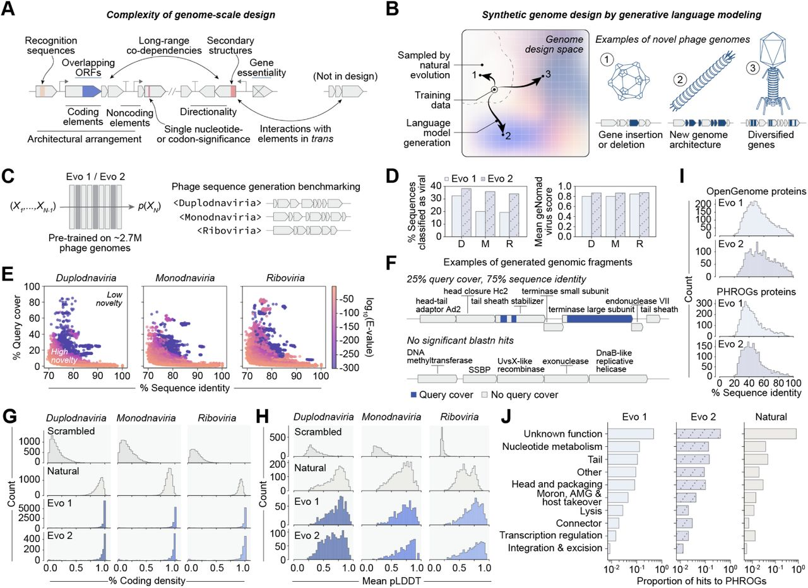
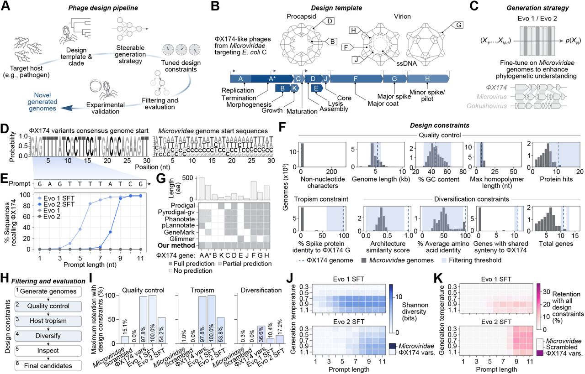
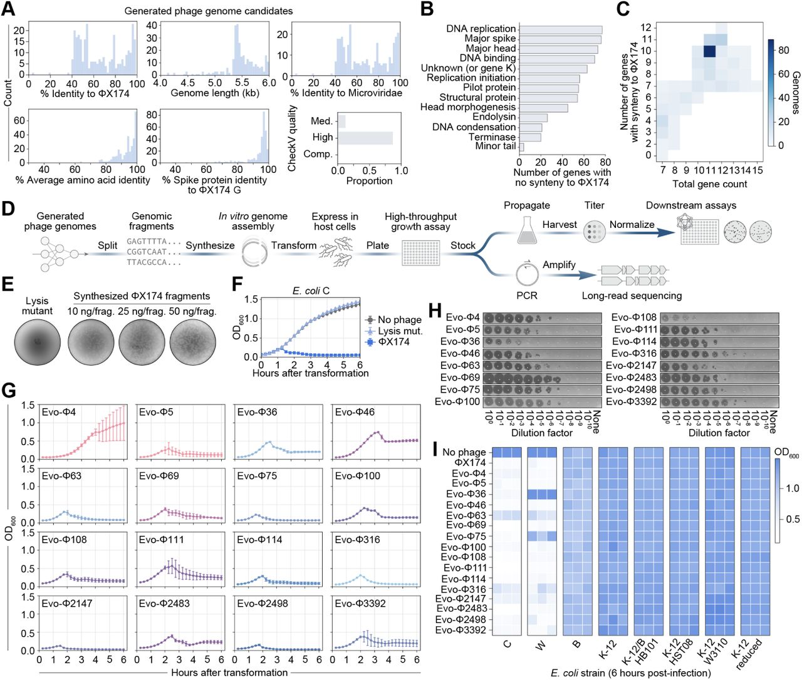
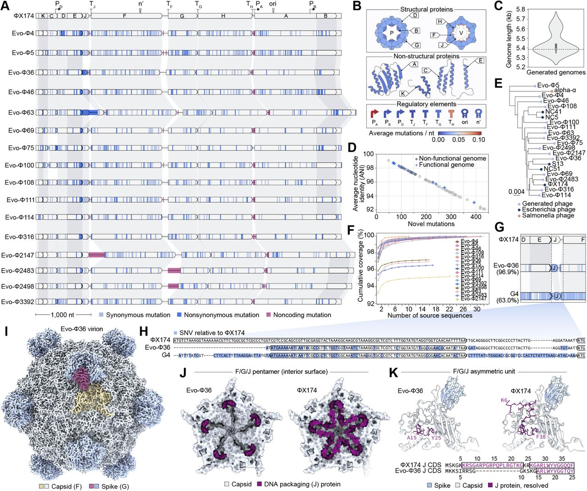
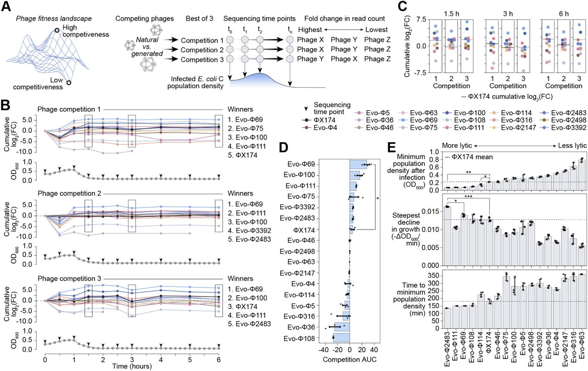
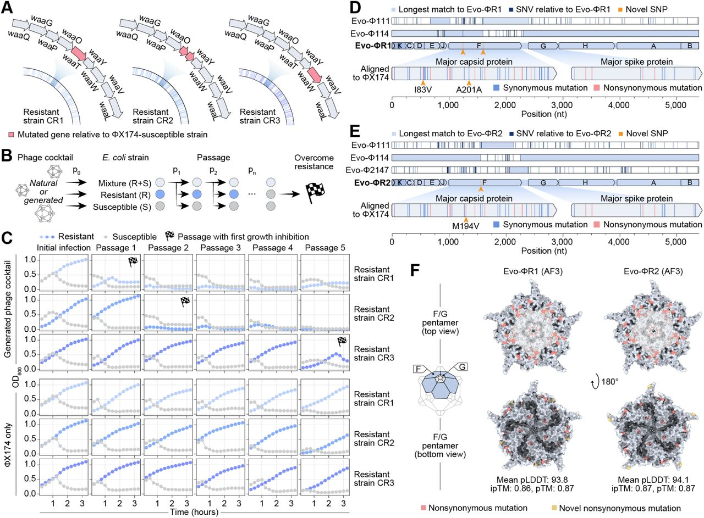

# Generative design of novel bacteriophages with genome language models

Samuel H. King, Claudia L. Driscoll, David B. Li, Daniel Guo, Aditi T. Merchant, Garyk Brixi, Max E. Wilkinson, Brian L. Hie

Version: v1\
DOI: [10.1101/2025.09.12.675911](https://doi.org/10.1101/2025.09.12.675911)\
License: [CC-BY-4.0](https://creativecommons.org/licenses/by/4.0/)

## Abstract

Many important biological functions arise not from single genes, but from complex interactions encoded by entire genomes. Genome language models have emerged as a promising strategy for designing biological systems, but their ability to generate functional sequences at the scale of whole genomes has remained untested. Here, we report the first generative design of viable bacteriophage genomes. We leveraged frontier genome language models, Evo 1 and Evo 2, to generate whole-genome sequences with realistic genetic architectures and desirable host tropism, using the lytic phage ΦX174 as our design template. Experimental testing of AI-generated genomes yielded 16 viable phages with substantial evolutionary novelty. Cryo-electron microscopy revealed that one of the generated phages utilizes an evolutionarily distant DNA packaging protein within its capsid. Multiple phages demonstrate higher fitness than ΦX174 in growth competitions and in their lysis kinetics. A cocktail of the generated phages rapidly overcomes ΦX174-resistance in three *E. coli* strains, demonstrating the potential utility of our approach for designing phage therapies against rapidly evolving bacterial pathogens. This work provides a blueprint for the design of diverse synthetic bacteriophages and, more broadly, lays a foundation for the generative design of useful living systems at the genome scale.

## 1. Introduction

Advances in DNA sequencing and synthesis have vastly improved our ability to read and write DNA at the scale of whole genomes ([Edgar et al., 2022](#ref-21); [Gibson et al., 2008](#ref-30); [Hutchison et al., 2016](#ref-37); [Richardson et al., 2017](#ref-81); K. [Wang et al., 2019](#ref-102)). While these technologies could also facilitate whole-genome design, potentially enabling new biotechnologies or therapeutic modalities ([Dedrick et al., 2019](#ref-18); [Durrant et al., 2024](#ref-20); [Mandell et al., 2015](#ref-60); [Nyerges et al., 2023](#ref-71)), intelligently composing novel genomes still represents a monumental challenge. Genomes contain emergent complexity, wherein interactions involving multiple genes, regulatory elements, recognition sequences, and other features are tightly orchestrated to enable replication and other higher-order functions (**[Figure 1A](#f1)**) ([Costanzo et al., 2016](#ref-14); [Elena & Lenski, 1997](#ref-23); [Jacob & Monod, 1961](#ref-41)). Genomes are also highly sensitive to their sequence composition, as even a single mutation can render an entire genome nonviable ([Barrell et al., 1976](#ref-4); [Hutchison et al., 1999](#ref-38); [Sanjuán et al., 2004](#ref-87)). Despite efforts to design novel proteins, reprogram genetic codes, and engineer increasingly complex biological circuits ([Dauparas et al., 2022](#ref-17); [Fredens et al., 2019](#ref-29); [Hayes et al., 2025](#ref-34); [Hie et al., 2024](#ref-35); [Ingraham et al., 2023](#ref-40); [Jiang et al., 2024](#ref-45); [Srinivasan & Smolke, 2020](#ref-94)), there remains no generalizable framework for designing entire genomes.

**Figure 1 Evo composes realistic bacteriophage genomic sequences.(A) Key considerations highlighting the complexity of genome-scale design. (B) Generative genome language models have the potential to access novel phage genome design space when trained on a subset of observed natural evolution. (C) We benchmarked Evo 1 and Evo 2 on a broad zero-shot prompting task for phage genome design. (D) Generated sequences consistently classified as viral by geNomad (left), with high average virus classification scores across prompts (right). D, Duplodnaviria; M, Monodnaviria; R, Riboviria. (E) Generated sequences show low query cover and sequence identity against natural sequences in nucleotide BLAST searches, indicating high novelty. (F) Generated sequences contain predicted phage-like architectures, with regions that match natural sequences (blue) and novel regions without nucleotide BLAST hits (gray). (G) Predicted coding densities of generated sequences are high, similar to natural sequences and unlike scrambled natural sequences. (H) ESMFold-predicted protein structures from generated sequences have mean predicted local distance difference test (pLDDT) scores similar to natural proteins, substantially higher than scrambled natural sequence controls. (I) Generated proteins align to proteins in the OpenGenome and PHROGs databases with generally low sequence identities, indicating high novelty. (J) Functional annotations of generated proteins closely match those of natural phages when queried against the PHROGs database.**

Recent advances in artificial intelligence leverage data and compute at scale to enable complex generative tasks ([Kaplan et al., 2020](#ref-46); [Vaswani et al., 2017](#ref-100)). In biology, language models trained on vast genomic sequence datasets learn complex rules that enable the generative design of novel DNA sequences with desired functions ([Brixi et al., 2025](#ref-9); [Merchant et al., 2024](#ref-64); Nguyen, Poli, [Durrant, et al., 2024](#ref-20)). For example, we have previously reported the successful design of functional systems such as CRISPR-Cas complexes, transposable elements, and toxin-antitoxin interactions with the genomic language models, Evo 1 and Evo 2 ([Merchant et al., 2024](#ref-64); Nguyen, Poli, [Durrant, et al., 2024](#ref-20)). However, these systems contain only a small number of genetic components, whereas the design of complete genomes would require new methodological advances and much deeper integration of machine learning, computational biology, and experimental biology.

Here, we report the first generative design of complete genomes. We focused on the design of bacteriophages, which have tremendous utility as biotechnological tools and have therapeutic relevance as treatments for bacterial infections ([Dedrick et al., 2019](#ref-18); [Kilcher & Loessner, 2019](#ref-49); [Kim et al., 2025](#ref-50); [Pires et al., 2016](#ref-76); [Strathdee et al., 2023](#ref-96)). As a design template, we selected ΦX174, a lytic *Microviridae* phage with a ∼5.4 kilobase (kb) genome containing 11 genes, at least seven regulatory elements, and two recognition sequences ([Jaschke et al., 2019](#ref-43); [Logel & Jaschke, 2020](#ref-59); [Sanger et al., 1977](#ref-86); [Shlomai & Kornberg, 1980](#ref-91)). While ΦX174 has a much more complex genetic architecture than any previously AI-generated biological system, its relatively small genomic length and rich history of experimental work ([Kirchberger & Ochman, 2023](#ref-52)) also make ΦX174 a tractable and safe model for establishing whole-genome design. Notably, ΦX174 was the first complete DNA genome sequenced and synthesized ([Sanger et al., 1977](#ref-86); [Smith et al., 2003](#ref-93)) and has continually served as a pivotal model within molecular biology ([Barrell et al., 1976](#ref-4); [Goulian et al., 1967](#ref-32); [Jaschke et al., 2012](#ref-44)).

Enabling generative design of complete bacteriophages first required substantial computational development of both generative models and bioinformatic prediction tools. Our full generative pipeline consisted of unsupervised pretraining with Evo 1 and Evo 2, task-specific fine-tuning on *Microviridae* genomes, prompt engineering with ΦX174-specific sequences, and inference-time guidance via predictive models of genomic architecture and host tropism. Whole-genome bacteriophage design also required substantial development of experimental methods, including a novel protocol that enabled us to screen ∼300 genome designs to yield 16 functional phages, with tropism successfully limited to the target host.

The generated phages have substantial evolutionary novelty in their sequences and structures. Some of these phages also have faster lysis kinetics than ΦX174 or directly outcompete ΦX174 in a growth assay. In a setting analogous to pathogen resistance to phage therapies, a cocktail of our generated phages rapidly overcame resistance in three different ΦX174-resistant *E. coli* strains, whereas ΦX174 alone could not overcome resistance. These results establish generative genomics as a powerful strategy for accessing novel evolutionary spaces and for potentially creating effective and evolutionarily resilient phage therapeutics.

More broadly, this study establishes a generalizable approach to generative genome design under steerable, user-specified constraints. We envision that techniques developed in this work offer a path toward designing more complex biological systems with desirable functions, potentially including the larger genomes of living organisms.

## 2. Results

### 2.1. Evo composes realistic bacteriophage genomic sequences

Genome-scale design is uniquely complex because it must reconcile features such as coding and noncoding elements, architectural arrangement, gene directionality, structural motifs, and even interactions with elements not encoded in the designed sequence (**[Figure 1A](#f1)**). We hypothesized that, with advances in genome language models and with the appropriate training data, it would be possible to learn underlying evolutionary constraints that could allow for the generation of phage genome sequences not yet seen in nature (**[Figure 1B](#f1)**).

We investigated whether Evo 1 and Evo 2, which were pretrained on large corpora of DNA sequences including over two million bacteriophage genomes ([Brixi et al., 2025](#ref-9); Nguyen, Poli, [Durrant, et al., 2024](#ref-20)), had baseline capability for generating novel phage-like sequences (**[Figure 1C](#f1)**). We leveraged special taxonomic sequence labels that were included alongside genomic sequences during pretraining ([Brixi et al., 2025](#ref-9); Nguyen, Poli, [Durrant, et al., 2024](#ref-20)) to specifically prompt the models to generate phage-like sequences, using three prompts corresponding to major viral realms: *Duplodnaviria* (double-stranded DNA viruses), *Monodnaviria* (single-stranded DNA viruses), and *Riboviria* (RNA viruses) (**[Figure 1C](#f1)**; **Methods**).

We first evaluated whether the generated sequences resembled natural phage sequences using geNomad, a widely used viral classification tool ([Camargo et al., 2023](#ref-11)). As a baseline, geNomad reliably classified 89–100% of natural phage sequences as viral depending on the realm (geNomad mean score > 0.96), whereas controls consisting of scrambled natural sequences were rarely classified as viral (1.9–11%, mean score > 0.73) (**Figure S1A**). In contrast, 19–33% of Evo 1 generations were classified as viral (mean score > 0.80) and 34–38% of Evo 2 generations were classified as viral (mean score > 0.87), depending on the prompt (**[Figure 1D](#f1)**). These results demonstrate that both pretrained models can generate phage-like sequences, with Evo 2 showing stronger baseline performance.

Querying generated sequences against the nucleotide BLAST database ([Camacho et al., 2009](#ref-10)) revealed that generated sequences are distinct from those in nature (**[Figure 1E,F](#f1)**). Despite their novelty, the sequences retained a high predicted coding density and genetic features reminiscent of natural phage genomes (**[Figure 1F,G](#f1)**). Structure prediction ([Lin et al., 2023](#ref-58)) of the proteins generated by both Evo 1 and Evo 2 yielded predicted confidence scores consistent with those expected for structure prediction of natural proteins (**[Figure 1H](#f1)**; **Figure S1B**). When compared to proteins in the Evo models’ pretraining data, OpenGenome ([Brixi et al., 2025](#ref-9); Nguyen, Poli, [Durrant, et al., 2024](#ref-20)), and to proteins in the PHROGs database, a comprehensive database of phage proteins ([Terzian et al., 2021](#ref-98)), generated proteins generally showed low sequence identity with a realistic diversity of gene annotations (**[Figure 1I,J](#f1)**). Together, these data demonstrate that pretrained Evo models can design biologically realistic phage genomic sequences while introducing sequence diversity beyond natural evolution.

### 2.2. Generative design of novel bacteriophages with target host tropism

We next hypothesized that generative genomic design, with appropriate templates and constraints, could propose novel, complete, and viable phage genomes (**[Figure 2](#f2)**). To achieve bacteriophage design, we devised a workflow (**[Figure 2A](#f2)**) that consists of: (1) selecting a target host of biological or therapeutic interest, (2) choosing a design template—a phage genome known to infect that host—and collecting evolutionarily related sequence data, (3) training or fine-tuning a genome language model on that sequence data, (4) establishing design constraints based on the design template, (5) computationally evaluating and filtering generated sequences using those constraints, and (6) experimentally validating the designed genomes.

**Figure 2 Generative design of novel bacteriophages with target host tropism.(A) Phage genome design workflow. (B) Genetic architecture of our design template, ΦX174, a Microviridae phage that uses E. coli C as a host. (C) For our generation strategy, we specialized Evo 1 and Evo 2 on Microviridae genomes through supervised fine-tuning (SFT) to enhance its ability to generate ΦX174-like sequences. (D) Sequence logos showing conserved nucleotides at the start of ΦX174 variant genomes compared to Microviridae genomes in our training data. (E) Increasing the number of ΦX174 nucleotides in the prompt quickly improves recall with the SFT models whereas the base models fail to recall ΦX174 across all prompt lengths. (F) Design constraints selected for genome filtering, with thresholds (blue) chosen against natural Microviridae distributions (gray) and ΦX174 (dotted line). (G) Benchmarking of six gene prediction methods on the genome of ΦX174 shows that overlapping genes are systematically missed, requiring us to create a new method that predicts all genes in ΦX174. (H) Final filtering and evaluation steps for generated genomes. (I) Maximum sequence retention rate across Evo 1 and 2 SFT-generated sequences after applying design constraints, with natural Microviridae, scrambled Microviridae, and ΦX174 variant (vars.) controls. The selected design constraints retain ΦX174-like sequences across quality control, tropism, and diversification filters. (J–K) Generated sequences have high Shannon diversity after tropism filtering (J) and maintain a high retention rate even after further diversification filtering (K). Diversity and retention rate both increase with generation temperature and prompt length. Microviridae, scrambled Microviridae, and ΦX174 variants are shown for comparison. 𝑛 = 1000 sequences per parameter combination.**

Following these steps, we selected *E. coli* C and its native phage ΦX174 as our design template (**[Figure 2B](#f2)**). ΦX174 is a well-studied phage that belongs to *Microviridae*, a family of phages with small genomic sizes (typically ∼4-6 kb) and an abundance of available sequencing data (**Figure S2A**) ([Brister et al., 2015](#ref-8); Kirch-berger & Ochman, 2023), while *E. coli* C is a non-pathogenic, well-characterized host strain ([Michel et al., 2010](#ref-65)). These features make ΦX174 and *E. coli* C an ideal testbed for generative phage design.

Given the success of previous design tasks that required supervised fine-tuning (SFT) to generate coherent CRISPR-Cas systems and transposable elements (Nguyen, Poli, [Durrant, et al., 2024](#ref-20)), we fine-tuned Evo 1 7B 131K and Evo 2 7B 8K on a dataset of approximately 15 thousand *Microviridae* sequences (**[Figure 2C](#f2)**; **Figure S2B**; **Figure S3A–F**), resulting in higher fidelity language modeling of ΦX174-like genomes (**Figure S3G,H**). We then sampled sequences from the *Microviridae* SFT models, leveraging the property that they were trained to initiate full-length genome generation from the very first position of their input context. While the genomic start sequences of all *Microviridae* sequences in the training data were highly diverse, all of the ΦX174-like genomes started with the same consensus nucleotides (**[Figure 2D](#f2)**). By prompting with a portion of this consensus sequence, we were able to generate ΦX174-like sequences with both Evo 1 and Evo 2 SFT models. In contrast, the base models failed to recall ΦX174 across all tested lengths of the consensus sequence prompt (**[Figure 2E](#f2)**).

To assess the quality of generated DNA sequences, we developed a set of genome-level design constraints by computing various statistics on natural *Microviridae* sequences, including ΦX174 (**[Figure 2F](#f2)**). We organized these constraints into three tiers: sequence quality, tropism specificity, and evolutionary diversity. As basic sequence quality control, we filtered out generated sequences containing non-nucleotide characters, enforced lengths between 4–6 kb and GC content within 30–65%, and excluded sequences with DNA homopolymers longer than 10 bases.

We also sought to add constraints on the protein-coding genes of our generated genomes. However, we found that none of six broadly used gene annotation tools were able to annotate all 11 genes on the wild-type ΦX174 sequence (**[Figure 2G](#f2)**; **Figure S4A**), reflecting the challenge of predicting overlapping open reading frames (ORFs) (**Figure S4A,B**) ([Wright et al., 2022](#ref-108)). To overcome this limitation, we built a bespoke CDS prediction method tailored to ΦX174-like sequences (**Figure S4C**; **Methods**) that was able to fully annotate all genes in ΦX174, with the exception of gene A\*, which was partially predicted. With our new method, we applied an additional quality control constraint requiring at least seven predicted protein hits to natural ΦX174 proteins. Because host range is largely determined by the ability of viral spike proteins to bind host cell receptors ([Michel et al., 2010](#ref-65); [Sun et al., 2017](#ref-97)), we applied a tropism constraint requiring that generated genomes encode spike proteins with moderately high sequence identity (≥ 60%) to the ΦX174 spike protein (**[Figure 2F](#f2)**).

We encouraged evolutionary novelty by introducing an optional set of diversification filters (**[Figure 2F](#f2)**). We preferred genomes with \<95% average amino acid identity (AAI) to natural proteins, directly promoting diverged proteome sequences. We also developed a “genetic architecture” constraint to capture preservation of global gene arrangement relative to ΦX174 that we used to remove sequences that too closely resembled ΦX174 (**[Figure 2F](#f2)**; **Figure S5**; **Methods**). We favored genomes with 10 or 12 genes in total or those sharing synteny with 10 or 12 of ΦX174’s genes, allowing for variants with single gene losses or gains.

With our full set of design constraints, we narrowed the set of generated sequences through successive rounds of quality control, tropism filtering, and diversification filtering (**[Figure 2H](#f2)**). These filters also separated natural ΦX174-like sequences from other *Microviridae* genomes and scrambled *Microviridae* sequences (**[Figure 2I](#f2)**). After tropism filtering, we retained as much as 100% of the Evo 1 SFT generations and 53.8% of the Evo 2 SFT generations. After diversification-based filtering, we retained 10.4% of Evo 1 generations and 17.2% of Evo 2 generations.

Finally, building on our prior finding that sequence context strongly influences generative outputs ([Merchant et al., 2024](#ref-64)), we systematically assessed how prompt length alongside autoregressive sampling temperature influenced the diversity and quality of generated genomes. We found that prompting with the first nine or more nucleotides from the ΦX174 consensus sequence (**[Figure 2D](#f2)**) led to simple, memorized recall of ΦX174 with minimal diversity at low sampling temperatures (**Figure S6**). In contrast, prompting with only the first one or two nucleotides from the consensus sequence did not provide sufficiently strong conditioning to produce ΦX174-like generations. Notably, steering toward diverse, ΦX174-like sequences required carefully tuning the length of the consensus-sequence prompt to be around 4–9 nucleotides and the sampling temperature to be in the 0.7–0.9 range (**[Figure 2J](#f2)**; **[Figure 2K](#f2)**; **Figure S6**).

Both Evo 1 and Evo 2 SFT models produced highly diverse sequence populations even after tropism filtering, with Shannon diversity, a measure of species biodiversity ([Peet, 1974](#ref-74)), increasing alongside temperature and prompt length (**[Figure 2J](#f2)**). Importantly, this diversity did not come at the cost of design quality, with a high percentage of sequences being retained after applying our diversification filters (**[Figure 2K](#f2)**). In total, these analyses show that by combining steerable generation with systematic design constraints, Evo models can propose phage genomes that are realistic, template-guided, and evolutionarily novel.

### 2.3. Creating functional generated bacteriophage genomes

Beyond computational design, we then sought to experimentally test whether the generated genomes encode viable phages (**[Figure 3](#f3)**). Using our evaluation criteria, we curated a set of 302 diverse generated phage genome candidates (**Figure S7**; **Figure S8**). We designated these phages ‘Evo-Φ’ followed by a unique numeric sequence identifier. These genomes spanned 4–6 kb in length, have average amino acid identities (AAIs) to natural proteins as low as 63%, and retained spike protein sequence identities largely above 85% (**[Figure 3A](#f3)**). Most candidates shared more than 40% nucleotide identity with ΦX174 and genomes in the *Microviridae* training data. CheckV, a tool for assessing the quality of viral sequences, classified over 87% of the generated sequences as High Quality or Complete ([Nayfach et al., 2021](#ref-68)). Many of the generated genes also shared no coding sequence similarity with any gene in ΦX174, resulting in breaks in synteny (**[Figure 3B](#f3)**). Most genomes encoded 11 genes in total, with 10 preserving synteny with ΦX174 (**[Figure 3C](#f3)**).

**Figure 3 Creating functional generated bacteriophage genomes.(A) Final generated phage candidates meet our quality criteria while capturing abundant sequence diversity. kb, kilobase; Med., Medium; Comp. Complete. (B) Many generated sequences encode genes with low sequence identity to ΦX174, resulting in breaks in gene synteny. (C) A heatmap of total gene count versus number of syntenic genes shows that most sequences contain a single-gene break in synteny to ΦX174, balancing conservation with novelty. (D) Workflow for experimental validation of generated phage genomes. (E) E. coli C transformed with synthesized ΦX174 genome assemblies show that phage plaques robustly form across assembly conditions. In contrast, the same genomes but with loss-of-function mutations in lysis genes do not form plaques. ng, nanogram; frag., fragment. (F) Growth curves of E. coli C transformed with no phage (gray), ΦX174 lysis mutant (mut., light blue), or wild-type ΦX174 (dark blue) genome assembly reveal strong growth inhibition by ΦX174. Data point, mean OD600 value; error bar, standard deviation; 𝑛 = 3 growth replicates. (G) Growth curves of generated genome assemblies transformed in E. coli C exhibiting strong growth inhibition. (H) Representative titrations of propagated phage candidates. (I) Growth inhibition measured by OD600 at 6 hours after infection of E. coli cultures with no phage, ΦX174, or generated phages shows that ΦX174 and generated phages inhibit growth in the target strain E. coli C, and in E. coli W, but not in six other strains tested, demonstrating the robustness of tropism filtering. Each column is an infection replicate.**

We developed a growth assay for testing phage replication and lysis similar to previously established phage rebooting protocols (**[Figure 3D](#f3)**) ([Faber et al., 2019](#ref-26); [Leuven et al., 2021](#ref-54)). A mature ΦX174 virion contains a circular single-stranded genome that becomes double-stranded during replication ([Fiers & Sinsheimer, 1962](#ref-28); [Wickner & Hurwitz, 1974](#ref-104)), a stage that enables phage rebooting through transformation of a circular double-stranded DNA (dsDNA) product ([Faber et al., 2019](#ref-26); [Leuven et al., 2021](#ref-54)) that we can obtain via *in vitro* assembly of dsDNA fragments (**[Figure 3D](#f3)**). With this protocol, we observed that genomes of ΦX174 robustly formed plaques on a plate of *E. coli* C, whereas variants with mutated lysis genes did not (**[Figure 3E](#f3)**; **Figure S9A**). In our growth inhibition assay, ΦX174 impeded growth of *E. coli* C in less than two hours (**[Figure 3F](#f3)**). Upon successful growth inhibition, we created a stock of the phage-infected culture, verified its identity by long-read sequencing, then propagated and titrated the phage for downstream assays (**Figure S9B,C**; **Methods**).

Upon validating our screening protocol with wild-type ΦX174, we successfully synthesized and assembled 285 out of 302 generated genomes; the remaining failed due to high-complexity DNA synthesis. Measuring bacterial growth inhibition as an indication of phage viability, we observed 16 generated phage transformations that inhibited growth of *E. coli* C (**[Figure 3G](#f3)**; **Figure S10A**). When transformed in *E. coli* K-12, none of the 285 assemblies resulted in growth inhibition, supporting the robustness of the tropism constraint filter (**Figure S10B**). Sequence-verification of the 16 candidates revealed nine genomes with no acquired mutations, whereas the other seven acquired some single nucleotide variants (SNVs) or deletions with respect to the synthesized sequences (**Figure S11**). The generated phages also showed variable titers when propagated (**[Figure 3H](#f3)**; **Figure S12**).

Finally, we tested the host range of the generated phages across eight *E. coli* strains, including *E. coli* C, *E. coli* B, *E. coli* W, and five variants of *E. coli* K-12 (**[Figure 3I](#f3)**; **Figure S13**). Surprisingly, ΦX174 and 15 out of 16 of the generated phages could also inhibit growth in *E. coli* W, a host not previously associated with ΦX174 ([Archer et al., 2011](#ref-3); [Michel et al., 2010](#ref-65)), although with much more variation in growth kinetics (**Figure S13**). We did not observe growth inhibition in the other six *E. coli* strains, suggesting that the generated phages maintain a high specificity for the intended host, *E. coli* C. More broadly, these results demonstrate that genome language models, combined with inference-time steering and filtering, can design viable phage genomes.

### 2.4. Generated bacteriophages reveal sequence and structural insights

Having validated the viability of our generated phages, we next examined the extent of their evolutionary novelty (**[Figure 4](#f4)**). Upon analyzing the mutational differences within the generated genomes relative to ΦX174 and other *Microviridae* phages (**[Figure 4A–D](#f4)**), we observed hundreds of synonymous, nonsynonymous, and noncoding mutations (**[Figure 4A](#f4)**) that include:

- a novel gene J insertion in Evo-Φ63;
  
- extended noncoding regions in Evo-Φ63, Evo-Φ2147, Evo-Φ2483, and Evo-Φ2498;
  
- loss of gene K in Evo-Φ114;
  
- large, putative truncations of gene C in Evo-Φ75 and Evo-Φ100, and of gene B in Evo-Φ316;
  
- large, putative elongations of gene E in Evo-Φ4 and Evo-Φ46; and
  
- swapping of gene J in Evo-Φ36 with gene J from Escherichia phage G4, a swap previously found non-viable for wild-type ΦX174 ([Fane et al., 1992](#ref-27); [Ogunbunmi et al., 2021](#ref-72); [Roznowski et al., 2020](#ref-84)).

**Figure 4 Generated bacteriophages reveal sequence and structural insights.(A) Synteny plot of ΦX174 and functional generated bacteriophages, highlighting hundreds of synonymous (light blue), nonsynonymous (dark blue), and noncoding (red) mutations compared to ΦX174. Genomes are in order by name. (B) Average nucleotide (nt) mutational frequencies, normalized to length, of structural proteins, non-structural proteins, and regulatory elements across the generated phage genomes show that gene J and regulatory elements are mutational hotspots. (C) Generated genomes exhibit a range of lengths. Dotted line, genome length of ΦX174; white dot, median; gray box, interquartile range (IQR); whiskers, 1.5× IQR. (D) Percent sequence identity and number of novel mutations of functional (blue) and non-functional (gray) generated sequences compared to their top nucleotide BLAST hit in the Microviridae training data. (E) Neighbor-joining phylogenetic tree of functional generated phages (light blue) and representative Microviridae phages (dark blue and pink). (F) Percent cumulative sequence coverage of generated phages highlights that mutations in most generated phages cannot be completely attributed to mutations seen in nature. The sequences were aligned to sequences by nucleotide BLAST in the core_nt database until all nucleotides were accounted for or there were no significant hits for remaining nucleotides. (G–H) Synteny plot (G) and detailed view of gene J (H) and its surrounding intergenic regions of ΦX174, Evo-Φ36, and phage G4, with single nucleotide variations (SNVs) compared to ΦX174 highlighted in blue. (I) Cryo-EM density map of Evo-Φ36 virion, highlighting individual subunits of the spike (pink) and capsid (yellow). Remaining spikes (light blue) and capsids (gray) are shown. (J) Interior surface view of the capsid (F, gray) and spike (G, not visible) pentamers of Evo-Φ36 (left) and ΦX174 (right), with their cognate J proteins (purple) reveals distinct capsid interactions and putative genome packaging modes between the two phages as modeled into the cryo-EM density map. (K) Asymmetric units including F, G, and J of Evo-Φ36 (left) and ΦX174 (right) show resolved residues of J.**

The most mutated elements amongst the 16 genomes were promoter A, terminator H, and gene J, with average mutation rates of 0.11, 0.09, and 0.07 mutations per nucleotide, respectively (**[Figure 4B](#f4)**). The regulatory elements of Terminator J and the origin of replication (ori) were the least mutated, with no mutations across all sixteen genomes. The generated genomes also had a range of lengths, from 99% to 105% of the length of ΦX174 (**[Figure 4C](#f4)**).

When we compared the generated genomes to *Microviridae* sequences in the training data, they contained between 67 and 392 novel mutations, with nucleotide sequence identities between 93.0% and 98.8% (**Figure 4D**). The nearest natural genomes to the generated genomes consisted of several *Microviridae* phages that infect *E. coli*, including ΦX174, NC41, NC5, NC51, and S13 (**[Figure 4E](#f4)**). Evo-Φ2147 has 392 mutations—representing 93.0% average nucleotide identity (ANI)—with respect to its nearest natural genome (**[Figure 4D](#f4)**), phage NC51; notably, natural genomes with less than 95% ANI to any known phage would typically qualify as a new species ([Turner et al., 2021](#ref-99)).

Interestingly, over 50 generated sequences that were not viable in our growth inhibition screens contained a comparable number or fewer mutations than the viable generated phages when aligned to their nearest natural genomes, highlighting the difficulty of designing functional mutations at the genome-scale. Further, mutations in 13 of the generated genomes could not be recapitulated from any known natural sequences (**[Figure 4F](#f4)**; **Figure S14**), including large portions of the novel noncoding regions in Evo-Φ63, Evo-Φ2147, and Evo-Φ2483. Together, these results demonstrate the ability of genome language models to design complete genomes with high sequence novelty.

Beyond genetic diversity, we examined structural novelty in the generated phages. In Evo-Φ36, gene J, a genome-packaging protein that also supports the capsid ([Bernal et al., 2004](#ref-6)), was replaced with a homologous protein found in phage G4, differing by four synonymous SNVs. Yet, the J–F intergenic region remained more similar to ΦX174 (**[Figure 4G,H](#f4)**). G4 is a distantly related Microvirus with only 63.0% genome identity to ΦX174 (**Figure S15A**) ([Godson et al., 1978](#ref-31)), whereas Evo-Φ36 shares 96.9% identity with ΦX174. The G4 J protein is 25 amino acids long compared to 38 amino acids in ΦX174, lacking portions of domains 0 and I that contribute to capsid binding in ΦX174 (**Figure S15B**) ([Bernal et al., 2004](#ref-6); [Ogunbunmi et al., 2021](#ref-72)). Interestingly, prior work has shown that swapping G4 J into ΦX174 is not viable ([Fane et al., 1992](#ref-27); [Ogunbunmi et al., 2021](#ref-72); [Roznowski et al., 2020](#ref-84)). Remarkably, Evo-Φ36 is viable despite encoding the G4 J, highlighting Evo’s ability to design genomes that integrate context-dependent structural compatibility.

Given the unusually small J protein in Evo-Φ36, we sought to understand its structural consequences. AlphaFold 3 revealed strikingly different orientations of J in the capsid pentamers of Evo-Φ36 compared to ΦX174 and G4 (**Figure S15C–E**) ([Abramson et al., 2024](#ref-1)). To further explore these interactions, we solved the structure of ΦX174 to a resolution of 2.8 Å and Evo-Φ36 to a resolution of 2.9 Å by cryogenic electron microscopy (cryo-EM) (**[Figure 4I](#f4)**; **Figure S16**; **Figure S17**; **Figure S18**; **Table S1**). Consistent with previous findings ([McKenna et al., 1992](#ref-62)), we observed that the hydrophobic C-terminus of the J protein in ΦX174, domain II, interacts with the interior surface of the capsid, while the more basic domains 0 and I tether the genomic DNA while structurally supporting the capsid (**[Figure 4J,K](#f4)**; **Figure S19**). Despite introducing more polarity at the capsid-J interface by substitution of the C-terminal F→Y, Evo-Φ36 J maintains a similar overall binding mode at its C-terminus (**[Figure 4K](#f4)**). Notably, we could not resolve 14 residues at the N-terminus of Evo-Φ36 J, whereas the corresponding residues in ΦX174 J visibly interact with the capsid. This difference suggests that the Evo-Φ36 N-terminus is likely unstructured with respect to the capsid and primarily functions in DNA binding. Taken together, these findings show that despite divergent sequence contexts, Evo-Φ36 J preserves a compatible interaction with its capsid, denoting how generative design can uncover novel protein-protein co-evolutionary solutions.

### 2.5. Generated bacteriophages exhibit high fitness

Generative genomics can propose novel genetic sequences, including large-scale sequence changes, that are not constrained by natural selection pressures. We therefore hypothesized that functional mutations in the generated phage genomes might confer fitness advantages relative to wild-type ΦX174 (**[Figure 5](#f5)**). We competed ΦX174 and all generated phages against each other in a single *E. coli* C population by co-infecting the 16 generated phages and ΦX174 at equal multiplicity of infection (MOI) and measuring the cumulative fold change (FC) in sequencing read counts of each phage over time (**[Figure 5A](#f5)**). At the end of a competition, phages with the highest cumulative FC are those that had the largest relative increase in their own population size, indicating high fitness.

\*\*Figure 5 Generated bacteriophages exhibit high fitness.(A) Phage fitness competition assay workflow. (B–C) In three competitions, generated phages and ΦX174 competed head-to-head in E. coli C at equal multiplicity of infection (MOI). We tracked cumulative fold change (log2(FC)) of sequencing read counts over six hours (B). Many generated phages matched or surpassed ΦX174’s performance at various time points (C), indicating a higher relative fitness. Growth curves of infected E. coli C populations show corresponding suppression of bacterial growth. Rectangular boxes, enlarged plots in (C); arrowheads, sequencing sample extraction time points. Dotted line, cumulative log2(FC) of ΦX174. (D) Area under the curve (AUC) of the cumulative log2(FC) of phage read counts shows that generated phages outcompeted ΦX174 over the whole time course. Statistical significance was determined by one-way ANOVA with Tukey HSD (\*𝑝-adj < 0.05). Bar height, mean; error bar, standard deviation; circles, 𝑛 = 3 competitions; dotted line, AUC of 0. (E) Growth dynamics of E. coli C infected with generated phages and ΦX174 individually show that several generated phages exhibit lower minimum population density after infection, steeper decline in host growth rate, and shorter time to minimum population density, together indicating stronger lytic capabilities. Statistical significance was determined by one-way ANOVA with Tukey HSD (\*𝑝-adj < 0.05; \*\*𝑝-adj < 0.01; \***𝑝-adj < 0.001). Bar height, mean; error bar, standard deviation; circles, 𝑛 = 3 infections; dotted line, mean value of ΦX174.**

We observed that three generated phages, Evo-Φ69, Evo-Φ100, and Evo-Φ111, appeared in the top five phages at the end of three independent competition experiments (**[Figure 5B–D](#f5)**). ΦX174 only appeared in the top five phages in competitions 1 and 3, at most ranking in third place. Remarkably, in all three competitions, Evo-Φ69 outcompeted all other phages, with cumulative fold changes between 16× and 65× after six hours of infection. In contrast, at the same time point, ΦX174’s cumulative fold change ranged from 1.3× to 4.0× from its initial infection count.

We next examined the infection dynamics of each phage by measuring how quickly and strongly each drove the host population to its minimum density, focusing on the timing, rate, and depth of lysis (**[Figure 5E](#f5)**; **Figure S20**). We found that one phage, Evo-Φ2483, exhibited the fastest and strongest lytic capabilities. On average, Evo-Φ2483 drove the host population to a minimum OD600 of 0.07, with a maximum growth rate decline of –0.02 OD600/min, reaching this minimum in 135 minutes; by comparison, ΦX174 infections resulted in a higher minimum OD600 of 0.22, a slower maximum rate of decline of –0.01 OD600/min, and 180 minutes to reach minimum density. Several other candidates—Evo-Φ111, Evo-Φ69, Evo-Φ108, and Evo-Φ114—also reached significantly lower host population densities than ΦX174. Notably, Evo-Φ2483 only ranked fifth in two of the three competition assays (**[Figure 5B](#f5)**), underscoring that lytic effect alone does not determine overall fitness. As a whole, these results support the ability of genome language models to design high fitness mutations at the genome-scale, yielding diverse phenotypic outcomes for phage life cycles which could benefit phage-based biotechnologies.

### 2.6. Generated bacteriophages rapidly overcome bacterial resistance

Phage therapy is emerging as a promising alternative to antibiotics, but its effectiveness can be limited by rapid evolution of resistant bacteria ([Strathdee et al., 2023](#ref-96)). We hypothesized that the diverse phages produced by our genome design method could form a cocktail that more readily overcomes bacterial resistance (**[Figure 6](#f6)**) ([Kim et al., 2025](#ref-50); [Pires et al., 2016](#ref-76); [Pirnay, 2020](#ref-77)). To investigate our hypothesis, we first evolved three ΦX174-resistant *E. coli* C cultures (**[Figure 6A](#f6)**; **Figure S21A**; **Methods**). Whole-genome sequencing of three isolated strains from each resistant *E. coli* C culture revealed that each strain independently developed novel mutations within the *waa* operon (**[Figure 6A](#f6)**; **Figure S21B**), which is associated with LPS synthesis. We called these strains CR1, CR2, and CR3. In particular, strain CR1 contained a missense mutation, L259W, in the *waaT* gene; strain CR2 contained a single base deletion at nucleotide position 485 of *waaT*, resulting in a premature stop codon followed by potential reinitiation at a downstream in-frame start codon; and strain CR3 contained a missense mutation, A128D, in the *waaW* gene. Mutations in *waaT* and *waaW* have previously been observed to confer resistance against ΦX174 (Romeyer [Dherbey et al., 2023](#ref-82)), suggesting that strains CR1, CR2, and CR3 likely exhibit resistance through modifications to LPS synthesis.

**Figure 6 Generated bacteriophages rapidly overcome bacterial resistance.(A) Whole-genome sequencing of three ΦX174-resistant E. coli C strains revealed mutations in the waa operon absent in susceptible E. coli C, which functions in lipopolysaccharide synthesis. (B) Experimental setup for evolving phage counter-resistance by serially passaging cocktails of generated phages and ΦX174, or ΦX174 alone, on susceptible and resistant E. coli C. (C) Growth curves show that ΦX174 alone fails to overcome resistance, whereas generated phage cocktails suppress growth of all resistant cultures within five passages. Checkered flag, first passage with growth inhibition. (D–E) Alignments of generated phages against the predominant resistant phages Evo-ΦR1 (D), Evo-ΦR2 (E) capable of infecting resistant strain 1 and 2, respectively, show that they are derived from generated genomes. Generated phages used in the alignments are those with the longest identical sequences (light blue) without single nucleotide variations (SNVs; dark blue) to each resistant phage such that they collectively minimize the number of novel mutations (yellow) observed in the resistant phage. Major capsid and spike proteins of each resistant phage aligned to ΦX174 major capsid and spike proteins are below, with synonymous (blue) and nonsynonymous mutations (pink) relative to ΦX174. (F) AlphaFold 3 (AF3) predictions of capsid (light blue) and spike (light gray) pentamers show that most capsid and spike mutations appear on the exterior of resistant phages. Nonsynonymous and novel nonsynonymous mutations relative to ΦX174 are highlighted in pink and yellow, respectively. pLDDT, predicted local distance difference test score; ipTM, interface predicted template modeling score; pTM, predicted template modeling score.**

Next, we explored whether ΦX174 only, or a mixture of all 16 generated phages and ΦX174, could overcome resistance in strains CR1, CR2, and CR3. We challenged three separate cultures: a ΦX174-susceptible strain, a ΦX174-resistant strain, and a mixture of the two strains to create a selective pressure for phages replicating in susceptible cells to evolve the ability to infect resistant cells (**[Figure 6B](#f6)**). After each challenge, we passaged the supernatant from the mixed strains into fresh cultures and observed their growth dynamics.

Upon initial infection, the generated phage cocktail and ΦX174 successfully inhibited growth of the susceptible strains but did not inhibit growth of the resistant strains (**[Figure 6C](#f6)**). Strikingly, the generated phage cocktail was able to successfully inhibit growth of strain CR1 after a single passage, CR2 after two passages, and CR3 after five passages. In contrast, ΦX174 alone could not inhibit growth of any resistant strains even after all five passages.

We isolated and sequenced several individual phages that successfully grew on strains CR1 and CR2, which revealed a single predominant phage genome responsible for overcoming each resistant strain (**Methods**), which we designated Evo-ΦR1 and Evo-ΦR2, respectively. Sequence alignment revealed that all of Evo-ΦR1’s genome could be collectively composed from five segments of Evo-Φ111 and Evo-Φ114, with the exception of two novel SNVs in the major capsid protein (**[Figure 6D](#f6)**). All of Evo-ΦR2’s genome could be composed from four segments of Evo-Φ111, Evo-Φ114, and Evo-Φ2147, with the exception of a single novel SNV in the major capsid protein (**[Figure 6E](#f6)**). The ability to overcome resistance likely arose from recombination and acquired mutation events involving two or three of the Evo-generated phages.

Given the resistant mutations in the LPS gene synthesis operons of strains CR1 and CR2, we speculated that key mutations in the predominant resistant phages likely decorated the outer surfaces of their major capsid and spike proteins, since these proteins modulate LPS binding ([Michel et al., 2010](#ref-65)). Indeed, for both Evo-ΦR1 and Evo-ΦR2, we observed 15 missense mutations across the capsid and spike proteins that were not present in ΦX174, 14 of which were generated by Evo ([Fig. 6D,E](#f6)). The majority of the mutations appear on the outer surface of the virions, as predicted by AlphaFold 3 (**[Figure 6F](#f6)**; **Figure S21C,D**) ([Abramson et al., 2024](#ref-1)). These data show that evolutionary innovations generated by Evo likely contributed to resilience against bacterial resistance and, more broadly, suggest the utility of generative models for producing genetically diverse phage cocktails that could translate into improved therapeutic efficacy.

## 3. Discussion

In this work, we leveraged genome language models to achieve the first generative design of complete bacteriophage genomes. We established a computational framework for specifying our design goals, including the development of a new gene annotation method and diverse scoring metrics, allowing us to controllably design toward a target genomic architecture and host tropism. In particular, our design template was based on ΦX174, a tractable, safe, and historically significant model genome ([Barrell et al., 1976](#ref-4); [Goulian et al., 1967](#ref-32); [Kirchberger & Ochman, 2023](#ref-52); [Sanger et al., 1977](#ref-86); [Smith et al., 2003](#ref-93)). We systematically evaluated thousands of computationally generated sequences and experimentally tested nearly 300 designs, resulting in 16 viable phages containing substantial evolutionary diversity and enabling a phage cocktail that rapidly overcame bacterial resistance. Multiple generated phages exhibited increased fitness or faster lytic dynamics relative to ΦX174, demonstrating the ability of generative models to efficiently evolve high-fitness genomes.

Synthetic genomics has historically relied on directed evolution, random mutagenesis, or rational engineering ([Coradini et al., 2020](#ref-13); [James et al., 2024](#ref-42)). These approaches have been limited in the scope of their achieved evolutionary novelty due to the complexity of genome sequences and the limited throughput of methods for genome editing and synthesis. Rational engineering is further limited by incomplete human understanding of biology; for example, previous systematic efforts have struggled to increase features such as phage lysis rate or genome length ([Aoyama & Hayashi, 1985](#ref-2); [Endy et al., 2000](#ref-25); [Russell & Müller, 1984](#ref-85)). In contrast, our approach enabled designs with substantial novelty in both nucleotide and protein sequence, including the genome of Evo-Φ63, that is 5% (268 bp) longer than ΦX174; Evo-Φ69, which outcompeted ΦX174 in competition assays; and Evo-Φ2483, which exhibited significantly faster lysis rates. Notably, the genome Evo-Φ2147 achieves a level of nucleotide sequence novelty (\<95% ANI) on par with that achieved by natural evolution when producing new bacteriophage species ([Turner et al., 2021](#ref-99)).

The capability to generate novel genomes with AI systems also raises important biosafety considerations. In line with longstanding precedent for conducting biological research within established biosafety levels ([Berg et al., 1975](#ref-5)), we performed all experiments at the biosafety level appropriate for research with bacteriophages and their non-pathogenic bacterial hosts, alongside supplementary precautions (**Methods**). These established biosafety systems can be effectively adapted and applied to the generative design of new biological systems, especially when, as in this work, designs are constrained by well-characterized natural genomes as templates. Moreover, as we have previously demonstrated, the generative models themselves can possess inherent safeguards based on their training data; for instance, we have previously shown that data exclusions successfully prevent the Evo 2 models from designing eukaryotic viruses, including pathogenic human viruses ([Brixi et al., 2025](#ref-9)). We have also provided additional details in a supplementary **Biosafety and biocontainment discussion**. By continuing to build upon robust safety frameworks, the field can responsibly unlock the potential of generative models to access and engineer complex biological functions for the benefit of science and society.

We envision that the further development of generative genomics for whole-genome design will require additional methodological innovations and improved training datasets. Future approaches could leverage techniques for improving and accelerating model conditioning beyond SFT alone ([Hu et al., 2021](#ref-36); [Lewis et al., 2020](#ref-56); [Mnih et al., 2015](#ref-66); [Widatalla et al., 2024](#ref-105)). Continual genomic and metagenomic sequencing projects could also contribute additional training data. Designing larger phages will pose additional challenges, particularly in cost-effective DNA synthesis and assembly. Techniques for multi-fragment genome assembly, combinatorial oligonucleotide pools, and *in vitro* transcription–translation systems are promising avenues for realizing more complex genome design ([Faber et al., 2019](#ref-26); [Levrier et al., 2024](#ref-55); [Pryor et al., 2022](#ref-78)).

Beyond biotechnological or therapeutic utility, generative design of whole genomes offers unique opportunities for studying evolution (Shaer [Tamar & Kishony, 2022](#ref-90)). By systematically sampling from learned genomic distributions, it is possible to explore large mutational landscapes and investigate the genetic basis of properties such as host tropism. Indeed, we observed subsequent recombination and mutation of our generated phages that likely conferred resilience against host resistance. The ability to rapidly design phage genomes tuned for host range, fitness, and resistance evasion may expand biotechnological toolkits and transform phage therapy pipelines, enabling more adaptive and resilient antimicrobial strategies ([Kim et al., 2025](#ref-50); [Mutalik & Arkin, 2022](#ref-67); [Pirnay, 2020](#ref-77); [Wimmer et al., 2009](#ref-106)).

In total, our results demonstrate that generative AI can capture an underlying evolutionary design space with enough fidelity to produce novel functional bacteriophage genomes. Continued progress will likely bring about more generalizable models capable of designing across diverse biological systems with desirable functional properties. The rapid pace of improvement in generative biology suggests a future where genome design could become a core biotechnology alongside genome sequencing, synthesis, and editing, possibly enabling the generation of complete living organisms.

## 4. Author contributions

S.H.K. and B.L.H. conceived and designed the study. B.L.H. supervised the project. S.H.K. and B.L.H. collected the training data. S.H.K., G.B., and B.L.H fine-tuned the models. S.H.K. and D.G. performed the phage genome generation and evaluation. S.H.K., C.L.D., and D.G. performed the phage genome assembly transformation assays. S.H.K. and C.L.D. performed the phage sequencing, propagation, titering, and host tropism assay. S.H.K. and A.T.M. performed the phylogenetic analysis. S.H.K., C.L.D., and D.B.L. performed the cryo-EM experiments. D.B.L. processed the cryo-EM data. S.H.K., D.B.L., and M.E.W. analyzed the cryo-EM data. S.H.K. and A.T.M. performed the phage competition and bacterial resistance assays. S.H.K. and B.L.H. wrote the initial draft of the manuscript. All authors contributed to writing the final version of the manuscript.

## 5. Competing interests

B.L.H. acknowledges outside interest in Arpelos Biosciences and Genyro as a scientific co-founder. S.H.K. and B.L.H. are named on a provisional patent application applied for by Stanford University and Arc Institute related to this manuscript. All other authors declare no competing interests.

## 6. Data and code availability

The raw and processed *Microviridae* datasets used for supervised fine-tuning are available for download at [https://doi.org/10.5281/zenodo.17101843](https://doi.org/10.5281/zenodo.17101843) Code for generation and fine-tuning with Evo 1 is available at [https://github.com/evo-design/evo/](https://github.com/evo-design/evo/). Code for generation and fine-tuning with Evo 2 is available at [https://github.com/arcinstitute/evo2](https://github.com/arcinstitute/evo2). Code for phage genome design and analysis are available at both repositories. The fine-tuned *Microviridae* model for Evo 1 is available at [https://huggingface.co/evo-design/evo-1-7b-131k-microviridae](https://huggingface.co/evo-design/evo-1-7b-131k-microviridae), and the fine-tuned Microviridae model for Evo 2 is available at [https://huggingface.co/evo-design/evo-2-7b-8k-microviridae](https://huggingface.co/evo-design/evo-2-7b-8k-microviridae). The cryo-EM density maps and resulting models for ΦX174 and Evo-Φ36 have been deposited in the Electron Microscopy Data Bank (EMDB) with EMDB codes XXXX and XXXX, and the Protein Data Bank (PDB) with PDB codes XXXX and XXXX, respectively.

## Acknowledgements

We thank Brandon Ameglio, Paul Bollyky, Ashir Borah, Collin Chiu, Seyone Chithrananda, Drew Endy, Simone Evans, Patrick Hsu, Santiago Mille-Fragoso, Brian Plosky, Jessica Sacher, and Sebastián Somolinos for helpful discussions and support with the manuscript. We thank Jerome Ku and Jeremy Sullivan for assistance with computational infrastructure. We thank Twist Bioscience for support with DNA synthesis. We thank Arc Institute LabOps for assistance with experimental setups. We thank Ashir Borah, Collin Chiu, Joseph Noh, Alex Gao’s lab, Patrick Hsu’s lab, and Lingyin Li’s lab for generous sharing of materials and reagents. We thank Joseph Noh, Haoqing Wang, and the Stanford University Cryo-Electron Microscopy Center (cEMc) for assistance with cryo-EM. S.H.K., A.T.M., and G.B. acknowledge funding support from the National Science Foundation Graduate Research Fellowship Program. D.B.L. acknowledges funding support from the Fannie and John Hertz Foundation. A.T.M. acknowledges funding support from the Knight-Hennessy Graduate Scholarship Fund. B.L.H. acknowledges funding support from Arc Institute, the Gates Foundation, Stanford Institute for Human-Centered Artificial Intelligence (HAI) Hoffman-Yee Research Grants, V. Gupta, and R. Tonsing.

## Funder Information Declared

Arc Research Institute, https://ror.org/00wra1b14

Stanford Institute for Human-Centered Artificial Intelligence

## References

- [↵](#xref-ref-1-1)

Abramson, J., Adler, J., Dunger, J., Evans, R., Green, T., Pritzel, A., & Jumper, J. (2024). Accurate structure prediction of biomolecular interactions with AlphaFold 3. Nature, 630(8016), 493–500.

- [↵](#xref-ref-2-1)

Aoyama, A., & Hayashi, M. (1985). Effects of genome size on bacteriophage ΦX174 DNA packaging in vitro. Journal of Biological Chemistry, 260(20), 11033–11038.

- [↵](#xref-ref-3-1)

Archer, C., Kim, J., Jeong, H., Park, J., Vickers, C., Lee, S., & Nielsen, L. (2011). The genome sequence of E. coli W (ATCC 9637): comparative genome analysis and an improved genome-scale reconstruction of E. coli. BMC Genomics, 12(1), 9.

- [↵](#xref-ref-4-1)

Barrell, B., Air, G., & Hutchison, C. (1976). Overlapping genes in bacteriophage ΦX174. Nature, 264(5581).

- [↵](#xref-ref-5-1)

Berg, P., Baltimore, D., Brenner, S., Roblin III, R. O., & Singer, M. F. (1975). Asilomar conference on recombinant DNA molecules. Science, 188(4192), 991–994.

- [↵](#xref-ref-6-1)

Bernal, R., Hafenstein, S., Esmeralda, R., Fane, B., & Rossmann, M. (2004). The ΦX174 protein J mediates DNA packaging and viral attachment to host cells. Journal of Molecular Biology, 337(5), 1109–1122.

- [↵](supplement.md#xref-ref-7-1)

Besemer, J., & Borodovsky, M. (2005). GeneMark: web software for gene finding in prokaryotes, eukaryotes and viruses. Nucleic Acids Research, 33(suppl2), 451–454.

- [↵](#xref-ref-8-1)

Brister, J., Ako-Adjei, D., Bao, Y., & Blinkova, O. (2015). NCBI viral genomes resource. Nucleic Acids Research, 43(D1), 571–577.

- [↵](#xref-ref-9-1)

Brixi, G., Durrant, M., Ku, J., Poli, M., Brockman, G., Chang, D., & Hie, B. (2025). Genome modeling and design across all domains of life with Evo 2. bioRxiv.

- [↵](#xref-ref-10-1)

Camacho, C., Coulouris, G., Avagyan, V., Ma, N., Papadopoulos, J., Bealer, K., & Madden, T. (2009). BLAST+: architecture and applications. BMC Bioinformatics, 10(1), 421.

- [↵](#xref-ref-11-1)

Camargo, A., Roux, S., Schulz, F., Babinski, M., Xu, Y., Hu, B., & Kyrpides, N. (2023). Identification of mobile genetic elements with geNomad. Nature Biotechnology, 1–10.

- [↵](supplement.md#xref-ref-12-1)

Chang, T., & Bergen, B. (2024). Language model behavior: A comprehensive survey. Computational Linguistics, 50(1), 293–350.

- [↵](#xref-ref-13-1)

Coradini, A., Hull, C., & Ehrenreich, I. (2020). Building genomes to understand biology. Nature Communications, 11(1), 6177.

- [↵](#xref-ref-14-1)

Costanzo, M., VanderSluis, B., Koch, E., Baryshnikova, A., Pons, C., Tan, G., & Boone, C. (2016). A global genetic interaction network maps a wiring diagram of cellular function. Science, 353(6306), 1420.

- [↵](supplement.md#xref-ref-15-1)

Croll, T. (2018). ISOLDE: a physically realistic environment for model building into low-resolution electron-density maps. Biological Crystallography, 74(6), 519–530.

- [↵](supplement.md#xref-ref-16-1)

Crooks, G., Hon, G., Chandonia, J., & Brenner, S. (2004). WebLogo: a sequence logo generator. Genome Research, 14(6), 1188–1190.

- [↵](#xref-ref-17-1)

Dauparas, J., Anishchenko, I., Bennett, N., Bai, H., Ragotte, R., Milles, L., & Baker, D. (2022). Robust deep learning–based protein sequence design using ProteinMPNN. Science, 378(6615), 49–56.

- [↵](#xref-ref-18-1)

Dedrick, R., Guerrero-Bustamante, C., Garlena, R., Russell, D., Ford, K., Harris, K., & Spencer, H. (2019). Engineered bacteriophages for treatment of a patient with a disseminated drug-resistant Mycobacterium abscessus. Nature Medicine, 25(5), 730–733.

- [↵](supplement.md#xref-ref-19-1)

Delcher, A., Bratke, K., Powers, E., & Salzberg, S. (2007). Identifying bacterial genes and endosymbiont DNA with Glimmer. Bioinformatics, 23(6), 673–679.

- [↵](#xref-ref-20-1)

Durrant, M., Perry, N., Pai, J., Jangid, A., Athukoralage, J., Hiraizumi, M., & Hsu, P. (2024). Bridge RNAs direct programmable recombination of target and donor DNA. Nature, 630(8018), 984–993.

- [↵](#xref-ref-21-1)

Edgar, R., Taylor, B., Lin, V., Altman, T., Barbera, P., Meleshko, D., & Babaian, A. (2022). Petabase-scale sequence alignment catalyses viral discovery. Nature, 602(7895), 142–147.

- [↵](supplement.md#xref-ref-22-1)

Egorov, A., & Atkinson, G. (2025). LoVis4u: a locus visualization tool for comparative genomics and coverage profiles. NAR Genomics and Bioinformatics, 7(1), 009.

- [↵](#xref-ref-23-1)

Elena, S., & Lenski, R. (1997). Test of synergistic interactions among deleterious mutations in bacteria. Nature, 390(6658), 395–398.

- [↵](supplement.md#xref-ref-24-1)

Emsley, P., & Cowtan, K. (2004). Coot: model-building tools for molecular graphics. Biological Crystallography, 60(12), 2126–2132.

- [↵](#xref-ref-25-1)

Endy, D., You, L., Yin, J., & Molineux, I. (2000). Computation, prediction, and experimental tests of fitness for bacteriophage T7 mutants with permuted genomes. Proceedings of the National Academy of Sciences, 97(10), 5375–5380.

- [↵](#xref-ref-26-1)

Faber, M., Leuven, V., T., J., Ederer, M., Sapozhnikov, Y., Wilson, Z., Wichman, H., & Miller, C. (2019). Saturation mutagenesis genome engineering of infective Φx174 bacteriophage via unamplified oligo pools and golden gate assembly. ACS Synthetic Biology, 9(1), 125–131.

- [↵](#xref-ref-27-1)

Fane, B., Head, S., & Hayashi, M. (1992). Functional relationship between the J proteins of bacteriophages phi X174 and G4 during phage morphogenesis. Journal of Bacteriology, 174(8), 2717–2719.

- [↵](#xref-ref-28-1)

Fiers, W., & Sinsheimer, R. (1962). The structure of the DNA of bacteriophage ΦX174: III. Ultracentrifugal evidence for a ring structure. Journal of Molecular Biology, 5(4), 424–434.

- [↵](#xref-ref-29-1)

Fredens, J., Wang, K., Torre, D., Funke, L., Robertson, W., Christova, Y., & Chin, J. (2019). Total synthesis of Escherichia coli with a recoded genome. Nature, 569(7757), 514–518.

- [↵](#xref-ref-30-1)

Gibson, D., Benders, G., Andrews-Pfannkoch, C., Denisova, E., Baden-Tillson, H., Zaveri, J., & Smith, H. (2008). Complete chemical synthesis, assembly, and cloning of a Mycoplasma genitalium genome. Science, 319(5867), 1215–1220.

- [↵](#xref-ref-31-1)

Godson, G., Barrell, B., Staden, R., & Fiddes, J. (1978). Nucleotide sequence of bacteriophage G4 DNA. Nature, 276(5685), 236–247.

- [↵](#xref-ref-32-1)

Goulian, M., Kornberg, A., & Sinsheimer, R. (1967). Enzymatic synthesis of DNA, XXIV. Synthesis of infectious phage ΦX174 DNA. Proceedings of the National Academy of Sciences, 58(6), 2321–2328.

- [↵](supplement.md#xref-ref-33-1)

Harris, C., Millman, K., Walt, S., Gommers, R., Virtanen, P., Cournapeau, D., & Oliphant, T. (2020). Array programming with NumPy. Nature, 585(7825), 357–362.

- [↵](#xref-ref-34-1)

Hayes, T., Rao, R., Akin, H., Sofroniew, N., Oktay, D., Lin, Z., & Rives, A. (2025). Simulating 500 million years of evolution with a language model. Science, 387(6736), 850–858.

- [↵](#xref-ref-35-1)

Hie, B., Shanker, V., Xu, D., Bruun, T., Weidenbacher, P., Tang, S., & Kim, P. (2024). Efficient evolution of human antibodies from general protein language models. Nature Biotechnology, 42(2), 275–283.

- [↵](#xref-ref-36-1)

Hu, E., Shen, Y., Wallis, P., Allen-Zhu, Z., Li, Y., Wang, S., & Chen, W. (2021). LoRA: Low-rank adaptation of large language models [arXiv preprint arXiv:2106.09685.].

- [↵](#xref-ref-37-1)

Hutchison, C., III, Chuang, R., Noskov, V., Assad-Garcia, N., Deerinck, T., Ellisman, M., & Venter, J. (2016). Design and synthesis of a minimal bacterial genome. Science, 351(6280), 6253.

- [↵](#xref-ref-38-1)

Hutchison, C., III, Peterson, S., Gill, S., Cline, R., White, O., Fraser, C., & Craig Venter, J. (1999). Global transposon mutagenesis and a minimal Mycoplasma genome. Science, 286(5447), 2165–2169.

- [↵](supplement.md#xref-ref-39-1)

Hyatt, D., Chen, G., LoCascio, P., Land, M., Larimer, F., & Hauser, L. (2010). Prodigal: prokaryotic gene recognition and translation initiation site identification. BMC Bioinformatics, 11, 1–11.

- [↵](#xref-ref-40-1)

Ingraham, J., Baranov, M., Costello, Z., Barber, K., Wang, W., Ismail, A., & Grigoryan, G. (2023). Illuminating protein space with a programmable generative model. Nature, 623(7989), 1070–1078.

- [↵](#xref-ref-41-1)

Jacob, F., & Monod, J. (1961). Genetic regulatory mechanisms in the synthesis of proteins. Journal of Molecular Biology, 3(3), 318–356.

- [↵](#xref-ref-42-1)

James, J., Dai, J., Chew, W., & Cai, Y. (2024). The design and engineering of synthetic genomes. Nature Reviews Genetics, 1–22.

- [↵](#xref-ref-43-1)

Jaschke, P., Dotson, G., Hung, K., Liu, D., & Endy, D. (2019). Definitive demonstration by synthesis of genome annotation completeness. Proceedings of the National Academy of Sciences, 116(48), 24206–24213.

- [↵](#xref-ref-44-1)

Jaschke, P., Lieberman, E., Rodriguez, J., Sierra, A., & Endy, D. (2012). A fully decompressed synthetic bacteriophage ΦX174 genome assembled and archived in yeast. Virology, 434(2), 278–284.

- [↵](#xref-ref-45-1)

Jiang, K., Yan, Z., Bernardo, M., Sgrizzi, S., Villiger, L., Kayabolen, A., & Abudayyeh, O. (2024). Rapid in silico directed evolution by a protein language model with EVOLVEpro. Science, 387(6732), 6006.

- [↵](#xref-ref-46-1)

Kaplan, J., McCandlish, S., Henighan, T., Brown, T., Chess, B., Child, R., & Amodei, D. (2020). Scaling laws for neural language models [arXiv preprint arXiv:2001.08361.].

- [↵](supplement.md#xref-ref-47-1)

Karcagi, I., Draskovits, G., Umenhoffer, K., Fekete, G., Kovács, K., Méhi, O., & Papp, B. (2016). Indispensability of horizontally transferred genes and its impact on bacterial genome streamlining. Molecular Biology and Evolution, 33(5), 1257–1269.

- [↵](supplement.md#xref-ref-48-1)

Katoh, K., & Standley, D. (2013). MAFFT multiple sequence alignment software version 7: improvements in performance and usability. Molecular Biology and Evolution, 30(4), 772–780.

- [↵](#xref-ref-49-1)

Kilcher, S., & Loessner, M. (2019). Engineering bacteriophages as versatile biologics. Trends in Microbiology, 27(4), 355–367.

- [↵](#xref-ref-50-1)

Kim, M., Suh, G., Cullen, G., Rodriguez, S., Dharmaraj, T., Chang, T., & Sacher, J. (2025). Bacteriophage therapy for multidrug-resistant infections: current technologies and therapeutic approaches. The Journal of Clinical Investigation, 135(5).

- [↵](supplement.md#xref-ref-51-1)

Kimanius, D., Dong, L., Sharov, G., Nakane, T., & Scheres, S. (2021). New tools for automated cryo-EM single-particle analysis in RELION-4.0. Biochemical Journal, 478(24), 4169–4185.

- [↵](#xref-ref-52-1)

Kirchberger, P., & Ochman, H. (2023). Microviruses: A World Beyond phiX174. Annual Review of Virology, 10(1), 99–118.

- [↵](supplement.md#xref-ref-53-1)

Kunzmann, P., & Hamacher, K. (2018). Biotite: a unifying open source computational biology framework in Python. BMC Bioinformatics, 19, 1–8.

- [↵](#xref-ref-54-1)

Leuven, J., Ederer, M., Burleigh, K., Scott, L., Hughes, R., Codrea, V., & Miller, C. (2021). ΦX174 attenuation by whole-genome codon deoptimization. Genome Biology and Evolution, 13(2), 214.

- [↵](#xref-ref-55-1)

Levrier, A., Karpathakis, I., Nash, B., Bowden, S., Lindner, A., & Noireaux, V. (2024). PHEIGES: all-cell-free phage synthesis and selection from engineered genomes. Nature Communications, 15(1), 2223.

- [↵](#xref-ref-56-1)

Lewis, P., Perez, E., Piktus, A., Petroni, F., Karpukhin, V., Goyal, N., & Kiela, D. (2020). Retrieval-augmented generation for knowledge-intensive nlp tasks. Advances in Neural Information Processing Systems, 33, 9459–9474.

- [↵](supplement.md#xref-ref-57-1)

Liebschner, D., Afonine, P., Baker, M., Bunkóczi, G., Chen, V., Croll, T., & Adams, P. (2019). Macromolecular structure determination using X-rays, neutrons and electrons: recent developments in Phenix. Biological Crystallography, 75(10), 861–877.

- [↵](#xref-ref-58-1)

Lin, Z., Akin, H., Rao, R., Hie, B., Zhu, Z., Lu, W., & Rives, A. (2023). Evolutionary-scale prediction of atomiclevel protein structure with a language model. Science, 379(6637), 1123–1130.

- [↵](#xref-ref-59-1)

Logel, D., & Jaschke, P. (2020). A high-resolution map of bacteriophage ΦX174 transcription. Virology, 547, 47–56.

- [↵](#xref-ref-60-1)

Mandell, D., Lajoie, M., Mee, M., Takeuchi, R., Kuznetsov, G., Norville, J., & Church, G. (2015). Biocontainment of genetically modified organisms by synthetic protein design. Nature, 518(7537), 55–60.

- [↵](supplement.md#xref-ref-61-1)

McGuffie, M., & Barrick, J. (2021). pLannotate: engineered plasmid annotation. Nucleic Acids Research, 49(W1), 516–522.

- [↵](#xref-ref-62-1)

McKenna, R., Xia, D., Willingmann, P., IIag, L., Krishnaswamy, S., Rossmann, M., & Incardona, N. (1992). Atomic structure of single-stranded DNA bacteriophage ΦX174 and its functional implications. Nature, 355(6356), 137–143.

- [↵](supplement.md#xref-ref-63-1)

McNair, K., Zhou, C., Dinsdale, E., Souza, B., & Edwards, R. (2019). PHANOTATE: a novel approach to gene identification in phage genomes. Bioinformatics, 35(22), 4537–4542.

- [↵](#xref-ref-64-1)

Merchant, A., King, S., Nguyen, E., & Hie, B. (2024). Semantic mining of functional de novo genes from a genomic language model.

- [↵](#xref-ref-65-1)

Michel, A., Clermont, O., Denamur, E., & Tenaillon, O. (2010). Bacteriophage PhiX174’s ecological niche and the flexibility of its Escherichia coli lipopolysaccharide receptor. Applied and Environmental Microbiology, 76(21), 7310–7313.

- [↵](#xref-ref-66-1)

Mnih, V., Kavukcuoglu, K., Silver, D., Rusu, A., Veness, J., Bellemare, M., & Hassabis, D. (2015). Human-level control through deep reinforcement learning. Nature, 518(7540), 529–533.

- [↵](#xref-ref-67-1)

Mutalik, V., & Arkin, A. (2022). A phage foundry framework to systematically develop viral countermeasures to combat antibiotic-resistant bacterial pathogens. iScience, 25(4).

- [↵](#xref-ref-68-1)

Nayfach, S., Camargo, A., Schulz, F., Eloe-Fadrosh, E., Roux, S., & Kyrpides, N. (2021). CheckV assesses the quality and completeness of metagenome-assembled viral genomes. Nature Biotechnology, 39(5), 578– 585.

- 

Nguyen, E., Poli, M., Durrant, M., Kang, B., Katrekar, D., Li, D., & Hie, B. (2024). Sequence modeling and design from molecular to genome scale with Evo. Science, 386(6723), 9336.

- 

Nguyen, E., Poli, M., Faizi, M., Thomas, A., Wornow, M., Birch-Sykes, C., & Baccus, S. (2024). Hyenadna: Long-range genomic sequence modeling at single nucleotide resolution. Advances in Neural Information Processing Systems, 36.

- [↵](#xref-ref-71-1)

Nyerges, A., Vinke, S., Flynn, R., Owen, S., Rand, E., Budnik, B., & Church, G. (2023). A swapped genetic code prevents viral infections and gene transfer. Nature, 615(7953), 720–727.

- [↵](#xref-ref-72-1)

Ogunbunmi, E., Roznowski, A., & Fane, B. (2021). The effects of packaged, but misguided, single-stranded DNA genomes are transmitted to the outer surface of the ΦX174 capsid. Journal of Virology, 95(18), 10–1128.

- [↵](supplement.md#xref-ref-73-1)

O’Leary, N., Cox, E., Holmes, J., Anderson, W., Falk, R., Hem, V., & Schneider, V. (2024). Exploring and retrieving sequence and metadata for species across the tree of life with NCBI Datasets. Scientific Data, 11(1), 732.

- [↵](#xref-ref-74-1)

Peet, R. (1974). The measurement of species diversity. Annual Review of Ecology and Systematics, 285–307.

- [↵](supplement.md#xref-ref-75-1)

Pettersen, E., Goddard, T., Huang, C., Meng, E., Couch, G., Croll, T., & Ferrin, T. (2021). UCSF ChimeraX: Structure visualization for researchers, educators, and developers. Protein Science, 30(1), 70–82.

- [↵](#xref-ref-76-1)

Pires, D., Cleto, S., Sillankorva, S., Azeredo, J., & Lu, T. (2016). Genetically engineered phages: a review of advances over the last decade. Microbiology and Molecular Biology Reviews, 80(3), 523–543.

- [↵](#xref-ref-77-1)

Pirnay, J. (2020). Phage therapy in the year 2035. Frontiers in Microbiology, 11, 1171.

- [↵](#xref-ref-78-1)

Pryor, J., Potapov, V., Bilotti, K., Pokhrel, N., & Lohman, G. (2022). Rapid 40 kb genome construction from 52 parts through data-optimized assembly design. ACS Synthetic Biology, 11(6), 2036–2042.

- [↵](supplement.md#xref-ref-79-1)

Punjani, A., Rubinstein, J., Fleet, D., & Brubaker, M. (2017). cryoSPARC: algorithms for rapid unsupervised cryo-EM structure determination. Nature Methods, 14(3), 290–296.

- 

Quinones-Olvera, N. (n.d.). Bacteriophage genome sizes. [https://github.com/nataquinones/phage_genome_size/](https://github.com/nataquinones/phage_genome_size/)

- [↵](#xref-ref-81-1)

Richardson, S., Mitchell, L., Stracquadanio, G., Yang, K., Dymond, J., DiCarlo, J., & Bader, J. (2017). Design of a synthetic yeast genome. Science, 355(6329), 1040–1044.

- [↵](#xref-ref-82-1)

Romeyer Dherbey, J., Parab, L., Gallie, J., & Bertels, F. (2023). Stepwise evolution of E. coli C and ΦX174 reveals unexpected lipopolysaccharide (LPS) diversity. Molecular Biology and Evolution, 40(7), 154.

- [↵](supplement.md#xref-ref-83-1)

Rosenthal, P., & Henderson, R. (2003). Optimal determination of particle orientation, absolute hand, and contrast loss in single-particle electron cryomicroscopy. Journal of Molecular Biology, 333(4), 721– 745.

- [↵](#xref-ref-84-1)

Roznowski, A., Doore, S., Kemp, S., & Fane, B. (2020). Finally, a role befitting Astar: strongly conserved, unessential microvirus A\* proteins ensure the product fidelity of packaging reactions. Journal of Virology, 94(2), 10–1128.

- [↵](#xref-ref-85-1)

Russell, P., & Müller, U. (1984). Construction of bacteriophage ΦX174 mutants with maximum genome sizes. Journal of Virology, 52(3), 822–827.

- [↵](#xref-ref-86-1)

Sanger, F., Air, G., Barrell, B., Brown, N., Coulson, A., Fiddes, J., & Smith, M. (1977). Nucleotide sequence of bacteriophage ΦX174 DNA. Nature, 265(5596), 687–695.

- [↵](#xref-ref-87-1)

Sanjuán, R., Moya, A., & Elena, S. (2004). The distribution of fitness effects caused by single-nucleotide substitutions in an RNA virus. Proceedings of the National Academy of Sciences, 101(22), 8396–8401.

- [↵](supplement.md#xref-ref-88-1)

Schwengers, O., Jelonek, L., Dieckmann, M., Beyvers, S., Blom, J., & Goesmann, A. (2021). Bakta: rapid and standardized annotation of bacterial genomes via alignment-free sequence identification. Microbial Genomics, 7(11), 000685.

- [↵](supplement.md#xref-ref-89-1)

Seabold, S., & Perktold, J. (2010). Statsmodels: econometric and statistical modeling with python. SciPy, 7(1), 92–96.

- [↵](#xref-ref-90-1)

Shaer Tamar, E., & Kishony, R. (2022). Multistep diversification in spatiotemporal bacterial-phage coevolution. Nature Communications, 13(1), 7971.

- [↵](#xref-ref-91-1)

Shlomai, J., & Kornberg, A. (1980). An Escherichia coli replication protein that recognizes a unique sequence within a hairpin region in phi X174 DNA. Proceedings of the National Academy of Sciences, 77(2), 799– 803.

- [↵](supplement.md#xref-ref-92-1)

Singh, U., & Wurtele, E. (2021). orfipy: a fast and flexible tool for extracting ORFs. Bioinformatics, 37(18), 3019–3020.

- [↵](#xref-ref-93-1)

Smith, H. O., Hutchison III, C. A., Pfannkoch, C., & Venter, J. C. (2003). Generating a synthetic genome by whole genome assembly: ΦX174 bacteriophage from synthetic oligonucleotides. Proceedings of the National Academy of Sciences, 100(26), 15440–15445.

- [↵](#xref-ref-94-1)

Srinivasan, P., & Smolke, C. (2020). Biosynthesis of medicinal tropane alkaloids in yeast. Nature, 585(7826), 614–619.

- [↵](supplement.md#xref-ref-95-1)

Steinegger, M., & Söding, J. (2017). MMseqs2 enables sensitive protein sequence searching for the analysis of massive data sets. Nature Biotechnology, 35(11), 1026–1028.

- [↵](#xref-ref-96-1)

Strathdee, S., Hatfull, G., Mutalik, V., & Schooley, R. (2023). Phage therapy: From biological mechanisms to future directions. Cell, 186(1), 17–31.

- [↵](#xref-ref-97-1)

Sun, Y., Roznowski, A., Tokuda, J., Klose, T., Mauney, A., Pollack, L., & Rossmann, M. (2017). Structural changes of tailless bacteriophage ΦX174 during penetration of bacterial cell walls. Proceedings of the National Academy of Sciences, 114(52), 13708–13713.

- [↵](#xref-ref-98-1)

Terzian, P., Olo Ndela, E., Galiez, C., Lossouarn, J., Pérez Bucio, R., Mom, R., & Enault, F. (2021). PHROG: families of prokaryotic virus proteins clustered using remote homology. NAR Genomics and Bioinformatics, 3(3), 067.

- [↵](#xref-ref-99-1)

Turner, D., Kropinski, A., & Adriaenssens, E. (2021). A roadmap for genome-based phage taxonomy. Viruses, 13(3), 506.

- [↵](#xref-ref-100-1)

Vaswani, A., Shazeer, N., Parmar, N., Uszkoreit, J., Jones, L., Gomez, A., & Polosukhin, I. (2017). Attention is all you need. Advances in Neural Information Processing Systems, 30.

- [↵](supplement.md#xref-ref-101-1)

Virshup, I., Rybakov, S., Theis, F., Angerer, P., & Wolf, F. (2021). anndata: Annotated data. Journal of Open Source Software, 9(101), 4371.

- [↵](#xref-ref-102-1)

Wang, K., Torre, D., Robertson, W., & Chin, J. (2019). Programmed chromosome fission and fusion enable precise large-scale genome rearrangement and assembly. Science, 365(6456), 922–926.

- [↵](supplement.md#xref-ref-103-1)

Wang, R., Yang, S., Liu, Z., Zhang, Y., Wang, X., Xu, Z., & Li, S. (2024). PhageScope: a well-annotated bacteriophage database with automatic analyses and visualizations. Nucleic Acids Research, 52(D1), 756– 761.

- [↵](#xref-ref-104-1)

Wickner, S., & Hurwitz, J. (1974). Conversion of ΦX174 viral DNA to double-stranded form by purified Escherichia coli proteins. Proceedings of the National Academy of Sciences, 71(10), 4120–4124.

- [↵](#xref-ref-105-1)

Widatalla, T., Rafailov, R., & Hie, B. (2024). Aligning protein generative models with experimental fitness via direct preference optimization. *bioRxiv*.

- [↵](#xref-ref-106-1)

Wimmer, E., Mueller, S., Tumpey, T., & Taubenberger, J. (2009). Synthetic viruses: a new opportunity to understand and prevent viral disease. Nature Biotechnology, 27(12), 1163–1172.

- [↵](supplement.md#xref-ref-107-1)

Wolf, F., Angerer, P., & Theis, F. (2018). SCANPY: large-scale single-cell gene expression data analysis. Genome Biology, 19(1), 15.

- [↵](#xref-ref-108-1)

Wright, B., Molloy, M., & Jaschke, P. (2022). Overlapping genes in natural and engineered genomes. Nature Reviews Genetics, 23(3), 154–168.
