

## Supplementary material

### **A.** Biosafety and biocontainment discussion

The generative design of entire genomes represents a milestone in our ability to engineer biological systems, promising new biotechnologies and therapeutics. However, this powerful capability advance necessitates a thoughtful consideration of biosafety to ensure responsible development. In this study, our approach to biosafety and biocontainment leveraged computational safeguards inherent to our models, experimental design choices, and established laboratory containment protocols.

A primary layer of safety is built directly into the genome language models themselves, as the generative capabilities of these models are fundamentally shaped by their training data. In this and previous work, we have deliberately withheld all viruses with eukaryotic hosts, including those pathogenic to humans, from the models’ training data. As we have demonstrated previously, this data exclusion strategy successfully prevents Evo 2 from prediction and design tasks related to human viruses ([Brixi et al., 2025](paper.md#ref-9)).

For this study, we further specialized the models by fine-tuning them exclusively on a curated dataset of *Microviridae* genomes, a family composed entirely of bacteriophages. This targeted training means the model retains its poor performance on eukaryotic viruses while enhancing its ability to generate sequences within our specific phage design space. We have also shown that both pretraining and fine-tuning were necessary for coherent generation of complex systems such as CRISPR-Cas operons (Nguyen, Poli, [Durrant, et al., 2024](paper.md#ref-20)). Because Evo 1 and Evo 2 were not pretrained on eukaryotic viral genomes, enabling the generation of such viruses would require a substantially greater investment in terms of data, computational resources, and methodological development. While training genome language models on sequences from human viruses could have substantial utility, such as in predicting aspects of viral evolution or designing viral vectors for gene therapy, we have not taken this step prior to careful deliberation within the scientific community.

In addition to these computational safeguards, our experimental framework was designed to be intrinsically safe and controllable. We selected the lytic phage ΦX174, as well as its non-pathogenic host, *E. coli* C, as our design template. This system is well-studied, tractable, and has a long history of safe use in molecular biology research ([Barrell et al., 1976](paper.md#ref-4); [Goulian et al., 1967](paper.md#ref-32); [Jaschke et al., 2012](paper.md#ref-44); [Sanger et al., 1977](paper.md#ref-86); [Smith et al., 2003](paper.md#ref-93)). Our method also allows for precise, user-specified constraints including a strict tropism filter to ensure that generated phages were designed to specifically target our laboratory host strain, which offers more control than traditional “phage hunting” methods that isolate phages from the environment with unknown host ranges or phenotypes. The success of our tropism constraint was validated experimentally, as none of the 285 tested assemblies showed activity against off-target *E. coli* K-12 strains.

All experiments also leveraged decades of precedent and established biosafety protocols for working with phage and non-pathogenic bacterial hosts ([Berg et al., 1975](paper.md#ref-5)). As an additional precaution, all work involving phages was performed within a biosafety cabinet with appropriate PPE and dedicated equipment, which was regularly sterilized with 70% ethanol, 10% bleach, and UV treatment, and any waste was disposed of as biohazardous waste. Furthermore, the risk of significant ecological disruption by any designed ΦX174-variant phage is minimal, given both our containment strategies and the powerful systems that bacteria have evolved for phage defense.

We implemented multiple safeguards to ensure that the establishment of whole-genome design in this study was conducted responsibly. We view bacteriophages as a biologically safe testbed for developing this foundational technology, which is fundamentally distinct from the development of viruses with eukaryotic hosts. Future work leveraging AI tools to design or adapt components of human pathogens or infectious agents should be approached with substantial caution and conducted in accordance with all applicable policies, regulations, and best practices. We conclude by noting that the ability to understand and manipulate complex biological systems to cure disease and ease human suffering has been a longstanding goal of scientific research. If done safely and responsibly, generative AI systems have immense promise for advancing humanity toward this goal.

### **B.** Methods

#### **B.1.** Generative modeling of bacteriophage genomes

##### ***B.1.1.*** Generating sequences with Evo

Sequence sampling was performed using a standard autoregressive sampling algorithm with the sampling code from [https://github.com/evo-design/evo/](https://github.com/evo-design/evo/) and [https://github.com/arcinstitute/evo2](https://github.com/arcinstitute/evo2), which leverages kv-caching of Transformer layers ([Chang & Bergen, 2024](paper.md#ref-12)) and the recurrent formulation of Hyena layers for efficient, low-memory autoregressive generation ([Brixi et al., 2025](paper.md#ref-9); Nguyen, Poli, [Durrant, et al., 2024](paper.md#ref-20); Nguyen, Poli, Faizi, et al., 2024).

##### ***B.1.2.*** Generating sequences with bacteriophage realm prompts

For Evo 1 7B 131K, approximately 10,000 sequences of length 6,000 were sampled with temperature = 0.7, top-k = 4, and top-p = 1 for each prompt. Sequences were generated using the prompts |r Duplodnavi ria;k , |r Monodnaviria;k , and |r Riboviria;k . For Evo 2 7B 1M, approximately 1,000 sequences of length 6,000 were sampled with temperature = 0.7, top-k = 4, and top-p = 1 for each prompt. Sequences were generated using the prompts |r Duplodnaviria;;;;;;;|, |r Monodnaviria;;;;;;;|, and |r Riboviria;;;;;;;|.

##### ***B.1.3.*** Generated bacteriophage realm sequence analyses

For use as positive controls, natural sequences corresponding to the realms *Duplodnaviria*, *Monodnaviria*, and *Riboviria* were extracted from the OpenGenome stage 2 training dataset (Nguyen, Poli, [Durrant, et al., 2024](paper.md#ref-20)) by filtering entries whose taxonomy strings began with |r Duplodnaviria, |r Monodnaviria, or |r Riboviria, respectively. From each realm, 10,000 sequences were randomly sampled. Sequences containing only canonical nucleotides (A, C, G, T) were retained for downstream use. For use as negative controls, scrambled natural sequences were generated by randomly permuting the nucleotide order of each sequence using a fixed random seed (42) to preserve overall nucleotide composition while ablating higher-order structure.

To analyze novelty of generated sequences, the generated sequences were searched against natural sequences in the core_nt database by nucleotide BLAST (blastn, E-value = 0.5, default settings) ([Camacho et al., 2009](paper.md#ref-10)). Query coverage and percent identity of the top 100 target hits were collected for each generated sequence. To determine the proportion of generated sequences that classify as viral, the sequences were analyzed by geNomad version 1.8.0 ([Camargo et al., 2023](paper.md#ref-11)). Coding density was determined by predicting ORFs using Prodigal version 2.6.3 ([Hyatt et al., 2010](paper.md#ref-39)) and dividing the total sum of ORF lengths per sequence with the total length of the sequence. The pTM and mean pLDDT scores of predicted proteins were extracted from their structures folded by ESMFold ([Lin et al., 2023](paper.md#ref-58)), specifically the Hugging Face implementation of the facebook/esmfold_v1 checkpoint accessed via the Transformers library. Phage-like coding sequences were predicted with our gene annotation method (see ORF calling and gene annotation), and visualized by LoVis4u with flags -hl, --set-category-colour, -cA4p2, -alip ([Egorov & Atkinson, 2025](paper.md#ref-22)). Percent protein sequence identities of the generated proteins were determined by aligning them against Prodigal-predicted proteins in OpenGenome (Nguyen, Poli, [Durrant, et al., 2024](paper.md#ref-20)), and proteins in the PHROGs database ([Terzian et al., 2021](paper.md#ref-98)) with MMseqs2 version 13.45111 ([Steinegger & Söding, 2017](paper.md#ref-95)) with sensitivity = 4.0. Functional annotations curated for PHROGs ([Terzian et al., 2021](paper.md#ref-98)) were extracted for generated proteins with significant alignments against proteins in the PHROGs database.

##### ***B.1.4.*** Microviridae data

A total of 15,507 *Microviridae* genomes were collected from public databases as following: 4,498 genomes were downloaded with their associated metadata from NCBI Datasets on July 8, 2024 with the keyword ‘*Mi-croviridae*’ and the filter ‘complete’ ([O’Leary et al., 2024](paper.md#ref-73)), 130 genomes were downloaded from the PhageScope database on July 31, 2024 with default filters, the taxonomy ‘*Microviridae*’, and sequence quality ‘Complete’ (R. [Wang et al., 2024](paper.md#ref-103)), and 10,879 genomes of the virus family ‘*Microviridae*’ were downloaded from the OpenGenome database ([Brixi et al., 2025](paper.md#ref-9); Nguyen, Poli, [Durrant, et al., 2024](paper.md#ref-20)). 261 genomes over 10 kb in length or containing characters other than ‘A’, ‘C’, ‘G’, or ‘T’ were removed. The filtered sequences were clustered at 99% identity by MMseqs2 version 13.45111 ([Steinegger & Söding, 2017](paper.md#ref-95)) and a total of 14,466 final sequences were extracted. The relative proportions of available sequencing data for bacteriophage families were analyzed from ‘Complete’ genomes collected from NCBI Virus on May 12, 2025 (Quinones-Olvera, n.d.)([https://github.com/nataquinones/phage_genome_size/](https://github.com/nataquinones/phage_genome_size/)). For analyses involving ΦX174 variants, a total of 134 ΦX174 variant sequences were extracted from the raw *Microviridae* data by searching for the keyword ‘phix174’.

##### ***B.1.5.*** Data preprocessing for supervised fine-tuning

*Microviridae* sequences were aligned to the ΦX174 NCBI reference sequence NC_001422.1 using align. align_optimal from the biotite Python package version 0.39.0 ([Kunzmann & Hamacher, 2018](paper.md#ref-53)) and the sequences were prepended with tokens indicating their percent sequence identity to ΦX174. All sequences were prepended with the token “+” indicating *Microviridae*. After the “+” token, sequences with 95–100% identity to ΦX174 were prepended with “∼”, 80–95% with “^”, 70–80% with “#”, 50–70% with “$”, and \<50% with “!”. Note that this soft-prompting strategy was not used for the final generation of generated phage candidates; however, the tokens “+∼” were prepended to every prompt before generation. Before finetuning, phage genomes were randomly split into 14,266 training sequences, 100 validation sequences, and 100 test sequences.

##### ***B.1.6.*** Supervised fine-tuning of Evo 1

A full fine-tune of the Evo 1 7B 131K model was conducted for 5,000 iterations across 16 Nvidia H100 GPUs, with a batch size of 64 samples and a context length of 10,240 tokens, corresponding to a global batch size of 655,360 tokens. Each sample corresponded to a single phage genome, including special prompt tokens, where sequences shorter than 10,240 tokens were padded up to the context length and where the training loss was only defined on the sequence, excluding pad tokens. Most of the hyperparameters used during pretraining were retained (Nguyen, Poli, [Durrant, et al., 2024](paper.md#ref-20)) but the initial learning rate was set to 0.00009698 with linear warmup through 5% of the fine-tuning iterations followed by cosine decay through the remaining finetuning iterations to a minimum learning rate of 0.00003.

##### ***B.1.7.*** Supervised fine-tuning of Evo 2

A full fine-tune of the Evo 2 7B 8K model was conducted for 12,000 iterations across 32 Nvidia H100 GPUs, with a batch size of 32 samples and a context length of 10,240 tokens, corresponding to a global batch size of 327,680 tokens. Each sample corresponded to a single phage genome, including special prompt tokens, where sequences shorter than 10,240 tokens were padded up to the context length and where the training loss was only defined on the sequence, excluding pad tokens. Most of the hyperparameters used during pretraining were retained ([Brixi et al., 2025](paper.md#ref-9)) but the initial learning rate was set to 0.00001 with linear warmup through 5% of the fine-tuning iterations followed by cosine decay through the remaining fine-tuning iterations to a minimum learning rate of 0.000001.

##### ***B.1.8.*** Positional entropy analysis

Per-position entropy was calculated as the entropy of the conditional probability 𝑝(𝑥𝑖 |𝑥1, …, 𝑥𝑖−1) predicted by Evo at each position 𝑖 for token 𝑥𝑖. The positional entropies of all ΦX174 variants extracted from the *Microviridae* dataset were calculated by Evo 1 7B 131K, Evo 2 7B 8K, and training checkpoints of the Evo 1 SFT and Evo 2 SFT models at 5K steps and 12K steps, respectively, using a custom script (**Data and code availability**). Per-position entropies were averaged across sequences of length 5386 and smoothed with a Savitzky–Golay filter, with a window length of 10 and polynomial order of 3.

##### ***B.1.9.*** Design constraints

Sequences were subject to a variety of nucleotide- and gene-level design constraints to determine their biological feasibility (**Data and code availability**). The design constraints were separated into three categories based on their purpose: quality control, host tropism specificity, and sequence diversification. Quality control constraints included filtering for sequences with only characters A, C, G, T, sequence length of 4–6 kb, 30–65% GC content, DNA homopolymer length of ≤10 nt, and predicted protein hit count ≥7 (**Figure S7A**). Protein sequences were predicted using our custom gene annotation method (see ORF calling and gene annotation). Sequences retained after applying quality control filters were passed to the tropism filter, which kept sequences containing a spike protein with ≥60% protein sequence identity to ΦX174 spike protein, determined by MMseqs2 version 13.45111 ([Steinegger & Söding, 2017](paper.md#ref-95)) with sensitivity = 4.0 (**Figure S7A**). The tropism-filtered sequences were then manually inspected or passed to further diversification filters, including architectural similarity score ≤0.9, average amino acid identity (AAI) ≤95%, synteny break of one gene, and total gene count of 10 or 12 genes (**Figure S7A**). Generated sequences were additionally analyzed, but not filtered with, CheckV version 0.7.0 ([Nayfach et al., 2021](paper.md#ref-68)) with default settings, to determine viral sequence quality. Sequences were visualized by LoVis4u with flags -hl, --set-category-colour, -cA4p2, -alip ([Egorov & Atkinson, 2025](paper.md#ref-22)) to aid manual inspection.

##### ***B.1.10.*** ORF calling and gene annotation

To enable accurate gene-level design constraints, various gene prediction methods were compared using the reference ΦX174 genome NC_001422.1. Prodigal version 2.6.3 was run with the flag the -pmeta ([Hyatt et al., 2010](paper.md#ref-39)). Pyrodigal-gv version 0.3.2 was run with default settings ([Camargo et al., 2023](paper.md#ref-11)). Phanotate version 1.6.5 was run with default settings ([McNair et al., 2019](paper.md#ref-63)). pLannotate was run via the web server ([http://plannotate.barricklab.org/](http://plannotate.barricklab.org/)) using default parameters ([McGuffie & Barrick, 2021](paper.md#ref-61)). Glimmer was run in Geneious Prime version 2025.1.2 with the following parameters: minimum gene length = 90, maximum overlap length = 1200, start codons = ATG, stop codons = TAG/TGA/TAA, and genetic code = 11 ([Delcher et al., 2007](paper.md#ref-19)). GeneMark annotation was performed using MetaGeneMark version 3.42 via the web server ([https://genemark.bme.gatech.edu/heuristic_gmhmmp.cgi](https://genemark.bme.gatech.edu/heuristic_gmhmmp.cgi)) with default parameters ([Besemer & Borodovsky, 2005](paper.md#ref-7)). These methods failed to predict all 11 genes in the ΦX174 genome, which prompted us to create our own method tailored to ΦX174 (Fig. S4C; Data and code availability). First, genomes were “pseudo-circularized”, by searching for the first stop codon position in each reading frame, identifying the most downstream first stop codon position, extracting the sequence up to that position, and appending it to the end of the genome. Then, all possible ORFs were determined using orfipy ([Singh & Wurtele, 2021](paper.md#ref-92)) with the input start codon ATG, and output stop codons, TAA, TAG, and TGA. Finally, an all-by-all search was performed against the PHROGs database ([Terzian et al., 2021](paper.md#ref-98)) using MMseqs2 version 13.45111 ([Steinegger & Söding, 2017](paper.md#ref-95)) with sensitivity = 4.0. For each hit against the PHROGs database, only the most significant hit (lowest E-value) was kept as the predicted annotation.

##### ***B.1.11.*** Genetic architecture similarity scoring

To evaluate architectural changes in genome sequences (i.e., the arrangement of open reading frames) compared to the reference ΦX174 genome NC_001422.1, we created a genetic architecture scoring algorithm (**Data and code availability**). Since local and global sequence alignment methods based on dynamic programming algorithms are compute-inefficient ([Steinegger & Söding, 2017](paper.md#ref-95)), and percent identity calculated from sequence alignment does not directly inform changes in genetic architecture, we reasoned that a simple dot product scoring method would be a fast way to broadly determine changes in the genetic architectures of sequences. The genes in ΦX174 begin with an ATG start codon and end with a stop codon (TAA, TAG, TGA). Thus, we reasoned that we could quickly compare a generated architecture with the ground truth ΦX174 genome architecture by one-hot encoding start and stop codon positions, creating sparse vectors that represent the boundaries of genes. We created one-hot encoded ‘truth’ vectors of ΦX174: a vector T which is Gaussian blurred (𝜎 = 5) to create fuzzy gene boundaries that tolerate slight positional shifts without over-penalizing near-matches, and a weight vector W that is multiplied by a weight factor equivalent to the total number of gene boundaries. A ‘query’ matrix of the one-hot encoded vectors of all circular permutations of a generated sequence is then scored with NumPy operations ([Harris et al., 2020](paper.md#ref-33)) np.multiply(W,np.max(np.dot(T,Q)))/N, where 𝑁 is the genetic architecture score of the ΦX174. Thus, a score of 1 indicates an exact match to the genetic architecture of ΦX174.

##### ***B.1.12.*** UMAP visualization of genetic architectures

One-hot encoded genetic architecture vectors with the highest genetic architecture similarity score to ΦX174 were computed for genomes in the *Microviridae* training data and stored in an AnnData object ([Virshup et al., 2021](paper.md#ref-101)). Using Scanpy ([Wolf et al., 2018](paper.md#ref-107)), the vectors were Z-score normalized and reduced to 50 principal components by PCA. A 𝑘-nearest neighbor graph (𝑘 = 50) was constructed on the PCA representation, UMAP was applied for non-linear dimensionality reduction, and the resulting UMAP embeddings were visualized.

##### ***B.1.13. Φ***X174 genome prompt analysis

All ΦX174 variants extracted from the *Microviridae* training dataset were aligned with MAFFT ([Katoh & Standley, 2013](paper.md#ref-48)) in Geneious Prime version 2025.1.2 ([https://www.geneious.com/](https://www.geneious.com/)). The consensus start sequence was determined by analyzing the multiple sequence alignment by WebLogo ([https://weblogo.berkeley.edu/logo.cgi](https://weblogo.berkeley.edu/logo.cgi)) ([Crooks et al., 2004](paper.md#ref-16)). Increasing amounts of nucleotides from the consensus start sequence were used to prompt the Evo 1 7B 131K, Evo 2 7B 1M, Evo 1 SFT, and Evo 2 SFT models with generation temperature = 1.1, top-k = 4, top-p = 1. Prompt lengths spanned 1 to 11 nucleotides, and all prompts were prepended with “+∼” finetuning tokens. Approximately 1,000 sequences of length 6,000 were generated with each prompt.

Percent recall of ΦX174 per prompt was determined as the percent of generated sequences per prompt with a significant alignment against the reference genome ΦX174 NC_001422.1, using MMseqs2 version 13.45111 ([Steinegger & Söding, 2017](paper.md#ref-95)) with sensitivity = 7.5.

##### ***B.1.14.*** Model temperature and prompt sampling sweeps

To determine the optimal parameter combination for phage genome generation with the Evo 1 SFT and Evo 2 SFT models, sampling sweeps were conducted by systematically varying both model temperature and the nucleotide sequence prompt. Temperature sweeps were performed across five configurations: 0.3, 0.5, 0.7, 0.9, and 1.1. Prompt lengths spanned 1 to 11 nucleotides of the ΦX174 consensus start sequence. All prompts were prepended with “+∼” fine-tuning tokens. Approximately 1,000 sequences were sampled per temperature–prompt parameter combination. All sampling runs were performed with top-k = 4 and top-p = 1. The parameter sweeps were evaluated by Shannon diversity (**[Figure 2J](paper.md#f2)**), retention rate after filtering (**[Figure 2K](paper.md#f2)**), and diversity of architectural similarity score vs. percent spike protein sequence identity (**Figure S6**). Additional sampling sweeps were performed across model checkpoints, fine-tuning tokens, top-k values, and top-p values, but were not used for final evaluation of generation conditions.

##### ***B.1.15.*** Shannon diversity analysis

Shannon entropy was used to quantify sequence diversity (**Data and code availability**) in generated sequences, *Microviridae* genomes, scrambled *Microviridae* genomes, and the ΦX174 reference genome NC_001422.1. Generated sequences for each temperature and prompt length were filtered with quality control and tropism constraints before being analyzed. For each dataset, sequences were clustered using MMseqs2 version 13.45111 ([Steinegger & Söding, 2017](paper.md#ref-95)) at 99% nucleotide identity, then Shannon entropy was calculated on the resulting distribution of sequences per cluster.

##### ***B.1.16.*** Sequence filtering retention rate analysis

Generated sequences for each temperature and prompt length were filtered with quality control, tropism, and diversification constraints (**Figure S7A**), and the percentage of sequences passing each group of filters (retention rate) was calculated. The maximum retention rate across all temperature and prompt combinations was used to determine model performance. Design constraints were applied to *Microviridae*, scrambled *Microviridae*, and ΦX174 variant sequences as controls.

#### **B.2.** Functional assays of bacteriophage genomes

##### ***B.2.1.*** Biosafety and sterile technique

All experiments involving bacteriophage particles were conducted in a Class II Type A2 biosafety cabinet meeting NSF/ANSI 49, OEM specifications, and ISO 14644-1 standard. Pipettes and a 37 ◦C incubator were dedicated for use only with active bacteriophage cultures. Equipment was regularly sterilized with 70% ethanol, 10% bleach, and UV treatment. For all experiments, appropriate PPE was worn and sterile filter pipette tips were used. Any solid or liquid waste produced from experiments was discarded as biohazard waste.

##### ***B.2.2.*** Bacterial and bacteriophage growth media

Unless stated otherwise, bacteria were grown in liquid culture of “LB” consisting of LB Miller broth (Thermo Fisher Scientific #H26676). Bacteriophages were propagated with bacteria in liquid culture of “phage LB” media consisting of 10 g/L tryptone (RPI #T60060), 5 g/L yeast extract (IBI #IB49161), 10 g/L NaCl (Thermo Fisher Scientific #S271), and 2 mM CaCl2 (J.T. Baker #1332). Bacterial colonies and bacteriophage plaques were grown in “phage LB agar” consisting of 7 g/L agar (Carolina #84-2133) in phage LB.

##### ***B.2.3.*** Bacterial strains

Lyophilized *E. coli* C derived from ATCC 13706 (Microbiologics #0747P) was rehydrated following the manufacturer’s protocol in sterile conditions. The stock culture was inoculated in LB, incubated overnight at 37 ◦C with 170 rpm agitation, and mixed at a 1:1 volumetric ratio with 50% glycerol (Thermo Fisher Scientific #15514011) and stored at –80 ◦C. For preparation of *E. coli* C competent cells, a pipette tip was used to scrape glycerol stock and dipped in 5 mL of LB overnight at 37 ◦C with 170 rpm agitation, then 0.5 mL of the overnight culture was used with a Mix & Go *E. coli* Transformation Kit (Zymo Research #T3001) following the manufacturer’s protocol. Competent cell stocks were stored at –80 ◦C and thawed only at the time of use. The strains ATCC 25404 (*E. coli* K-12), Stbl3 (*E. coli* K-12/B HB101), JW5856 (*E. coli* K-12 W3110), Stellar (*E. coli* K-12 HST08), RosettaDE3 (*E. coli* B), Mach1 (*E. coli* W), and MDS69 (*E. coli* K-12 with reduced genome) ([Karcagi et al., 2016](paper.md#ref-47)) were a gift from Alex Gao’s lab. Glycerol stocks and competent cell stocks for these strains were prepared the same way.

##### ***B.2.4.*** Bacteriophage genome assembly from ***Φ***X174 RFI DNA

ΦX174 am3 cs70 RFI DNA (NEB #N3021) was PCR-amplified into separate sets of two or three fragments (File S1). The following pairs of primers were used to PCR-amplify fragments for two-fragment Gibson assembly of lysis mutant ΦX174 genomes with the amber (am3) mutation in the lysis gene: SK#327 + SK#324 and SK#323 + SK#328. The following pairs of primers were used to PCR-amplify fragments for two-fragment Gibson assembly of wild-type ΦX174 genomes by reverting the am3 mutation to the wild-type codon: SK#333 + SK#326 and SK#334 + SK#325. The following pairs of primers were used to PCR-amplify fragments for three-fragment Gibson assembly of lysis mutant ΦX174 genomes with the am3 mutation: SK#327 + SK#332 and SK#331 + SK#326 and SK#325 + SK#328. The following pairs of primers were used to PCR-amplify fragments for three-fragment Gibson assembly of wild-type ΦX174 genomes by reverting the am3 mutation to the wild-type codon: SK#333 + SK#322 and SK#321 + SK#318 and SK#317 + SK#334. The fragments were amplified using 1 𝜇L of 1 ng/𝜇L ΦX174 am3 cs70 RFI DNA with 0.5 𝜇L each of 10 uM primers, 10.5 𝜇L of dH2O, and 12.5 𝜇L of 2× CloneAmp HiFi PCR Premix (Takara Bio #639298) with the following settings: 98 ◦C for 30 sec, 98 ◦C for 10 sec and 62 ◦C for 10 sec and 72 ◦C for 20 sec repeated 30 times, and 72 ◦C for 5 min.

The PCR amplicons were separated in 1% (w/v) UltraPure Agarose (Thermo Fisher Scientific #16500500) in 1× TAE gels stained with 1× SYBR Safe (Thermo Fisher Scientific #S33102) run at 120 V for 30 min, with GeneRuler 1 kb Plus DNA Ladder (Thermo Fisher Scientific #SM1331). PCR products of the correct size were purified by gel extraction using a QIAquick Gel Extraction Kit (Qiagen #28704) following the manufacturer’s protocol. Assembly fragments were mixed with NEBuilder HiFi DNA Assembly Master Mix (NEB #E2621) with the volumes of each fragment calculated on [https://nebuildercalculator.neb.com/](https://nebuildercalculator.neb.com/), and incubated at 50 ◦C for 1 hour. Assemblies were stored at –20 ◦C until use.

##### ***B.2.5.*** Bacteriophage genome assembly from synthesized DNA

Sequences were split into two Gibson assembly-compatible fragments and synthesized as Gene Fragments by Twist Biosciences, without adapters, dried down and normalized to 250 ng in 96-well plate wells. Optimal split points and overhangs for each Gibson assembly were designed with a custom Python script (**Data and code availability**) that outputs each fragment to be synthesized. The synthesized fragments were resuspended in dH2O to 10, 25, or 50 ng/𝜇L and assembled with the following conditions: each of two fragments per genome were mixed at a 1:1 (v/v) ratio to a total volume of 2 𝜇L. 2 𝜇L of NEBuilder HiFi DNA Assembly Master Mix (NEB #E2621) was added to the mixture on ice to a total reaction volume of 4 𝜇L and the reaction was incubated at 50 ◦C for 1 hour. Assemblies were stored at –20 ◦C until use. The gene fragments were sealed in their original 96-well plates with foil seals (Bio-Rad #MSF1001) and stored at –20 ◦C.

##### ***B.2.6.*** Bacteriophage genome assembly plaque assay

Phage genomes were assembled by Gibson assembly and 4 𝜇L of the assembly was mixed with 100 𝜇L of *E. coli* C competent cells and left on ice for 10 min. The transformation was gently mixed with 0.5 mL of phage LB and added to 7 mL of phage LB agar at a temperature of 42–46 ◦C monitored using an Infrared Thermometer (Ketokek #KT600B), then plated immediately on 10 cm Petri dishes. The plates were incubated at 37 ◦C for 3 hours, wrapped with a thin strip of Parafilm (Millipore Sigma #HS234526B) to retain moisture, and stored at 4 ◦C.

##### ***B.2.7.*** Bacteriophage genome assembly growth assay

Phage genomes were assembled by Gibson assembly and 1 𝜇L of the assembly was mixed with 15 𝜇L of *E. coli* C or *E. coli* K-12 competent cells and left on ice for 10 min. The transformation was gently mixed with 735 𝜇L of phage LB and split into three wells of a flat-bottom 96-well plate (Thermo Fisher Scientific #167008) with 250 𝜇L of per well. Three wells with 250 𝜇L phage LB only were added to the plate to normalize the OD600 measurements. The 96-well plate was incubated at 37 ◦C with orbital shaking at 1.5 mm amplitude and 360 rpm in a Tecan Spark Multimode Microplate Reader, with OD600 measured every 15 min. After 6 hours, the plate was removed from the microplate reader and stored at 4 ◦C.

##### ***B.2.8.*** Bacteriophage glycerol stocks

Bacterial debris in phage-clarified cultures were pelleted by centrifugation at 3,000 × g for 10 min at 4 ◦C. The supernatant was sterile-filtered through a 0.22 𝜇m cellulose acetate Spin-X Centrifuge Tube Filter (Thermo Fisher Scientific #07-200-385) by centrifugation at 10,000 × g for 3 min at 4 ◦C. Glycerol stocks were prepared by mixing the flow-through with 0.22 𝜇m-filtered 50% glycerol (Thermo Fisher Scientific #15514011) at a 1:1 (v/v) ratio and stored at –80 ◦C in cryogenic tubes (Thermo Fisher Scientific #11-676-48).

##### ***B.2.9.*** Long-read sequencing of bacteriophage genomes from glycerol stocks

Glycerol stocks prepared from the phage growth assays were individually scraped using sterile pipette tips and dipped into 6 𝜇L of 1× phosphate buffered saline (PBS). The picked phage genomes were amplified using 1 𝜇L of the solution in a PCR reaction with 0.5 𝜇L each of 10 uM primers (File S1), 10.5 𝜇L of dH2O, and 12.5 𝜇L of 2× CloneAmp HiFi PCR Premix (Takara Bio #639298) with the following settings: 98 ◦C for 30 sec, 98 ◦C for 10 sec and 62 ◦C for 10 sec and 72 ◦C for 20 sec repeated 30 times, and 72 ◦C for 5 min. The PCR amplicons were separated in 1% (w/v) UltraPure Agarose (Thermo Fisher Scientific #16500500) in 1× TAE gels stained with 1× SYBR Safe (Thermo Fisher Scientific #S33102) run at 120 V for 30 min, with GeneRuler 1 kb Plus DNA Ladder (Thermo Fisher Scientific #SM1331). PCR products of the correct size were purified by gel extraction using a QIAquick Gel Extraction Kit (Qiagen #28704) following the manufacturer’s protocol and sequenced using Plasmidsaurus’ Standard Purified Linear/PCR sequencing service. Sequences were aligned by MAFFT v7 ([Katoh & Standley, 2013](paper.md#ref-48)) on Benchling ([https://www.benchling.com/](https://www.benchling.com/)).

##### ***B.2.10.*** Bacteriophage propagation and harvesting

A glycerol scrape of *E. coli* C was inoculated in 5 mL of LB and incubated at 37 ◦C overnight with 200 rpm agitation. 3 mL of the overnight culture was mixed with 247 mL of phage LB and grown to an OD600 of ∼0.4. A scrape of phage glycerol stock was added to the culture and clarified for up to 9 hours. The lysed debris was pelleted by centrifugation at 4,000 × g for 10 min at 4 ◦C and sterile-filtered through a 0.22 𝜇m pore size PES membrane filter (Millipore Sigma #S2GPU05RE). The phages Evo-Φ46, Evo-Φ111, and Evo-Φ114 were double propagated due to low titer, by adding 3 mL of the first harvest to 297 mL of phage LB and incubating for 9 hours. The phages Evo-Φ36 and Evo-Φ108 were similarly propagated but with a third propagation due to low titer.

##### ***B.2.11.*** Bacteriophage titering

A glycerol scrape of *E. coli* C was inoculated in 5 mL of LB and incubated at 37 ◦C overnight with 200 rpm agitation. 50 𝜇L of the overnight culture was mixed with 5 mL of phage LB and incubated at 37 ◦C with 200 rpm agitation. The culture was grown to an OD600 of 0.3–0.4 and 675 𝜇L of the culture was added to 22.5 mL of phage LB agar at a temperature of 42–46 ◦C. The temperature was monitored using an Infrared Thermometer (Ketokek #KT600B). The mixture was poured in a 15 cm Petri dish and allowed to solidify for up to 5 min. 2 𝜇L of 10-fold serial dilutions of phage in phage LB from 100 to 10-10 was spotted on the agar and fully dried for up to 15 min. An additional 2 𝜇L spot of phage LB only was also spotted as a negative control. The plates were inverted and incubated at 37 ◦C for 3 hours, imaged, wrapped with a thin strip of Parafilm (Millipore Sigma #HS234526B) to retain moisture, and stored at 4 ◦C. Images were taken on an iPhone with a custom backlight setup and converted to black and white by decreasing the saturation to 0. Individual visible plaques were counted at the highest dilution where they were present across all three replicates, and the titer (plaque forming units (PFU) / mL) per phage was calculated as ((average plaque count / spot volume (mL)) × dilution factor).

##### ***B.2.12.*** Host tropism assay

For each *E. coli* strain, a glycerol scrape was inoculated in 5 mL of LB and incubated at 37 ◦C overnight with 200 rpm agitation. 250 𝜇L of the overnight culture was mixed with 25 mL of phage LB and incubated at 37 ◦C with 200 rpm agitation. The culture was grown to an OD600 of 0.4–0.6 and 200 𝜇L per well was plated in a flat-bottom 96-well plate (Thermo Fisher Scientific #167008). 50 𝜇L of phage stock at a concentration of ∼105 PFU/mL was then added to each well. As negative controls, 50 𝜇L of phage LB was added to each well instead of phage. Three wells with 250 𝜇L phage LB only were added to the plate to normalize the OD600 measurements. The 96-well plate was incubated at 37 ◦C with orbital shaking at 1.5 mm amplitude and 360 rpm in a Tecan Spark Multimode Microplate Reader, with OD600 measured every 15 min. After ∼12 hours, the plate was removed from the microplate reader and stored at 4 ◦C.

#### **B.3.** Phylogenetic analysis of bacteriophages

##### ***B.3.1.*** Natural reference genomes

Unless otherwise noted, the wild-type ΦX174 reference genome used for all phylogenetic analyses was sourced from NCBI accession [NC_001422.1](https://www.biorxiv.org/lookup/external-ref?link_type=GEN&access_num=NC_001422.1&atom=%2Fbiorxiv%2Fearly%2F2025%2F09%2F17%2F2025.09.12.675911.atom), and the wild-type G4 reference genome used for all phylogenetic analyses was sourced from NCBI accession [NC_001420.2](https://www.biorxiv.org/lookup/external-ref?link_type=GEN&access_num=NC_001420.2&atom=%2Fbiorxiv%2Fearly%2F2025%2F09%2F17%2F2025.09.12.675911.atom).

##### ***B.3.2.*** Synteny analysis

Synteny was visualized by LoVis4u with flags -hl, --set-category-colour, -cA4p2, -alip, ([Egorov & Atkinson, 2025](paper.md#ref-22)) using GFF3 files for each phage genome created with a custom script (**Data and code availability**). Pairwise synteny between each phage genome was determined in the order presented (**[Figure 4A](paper.md#f4)**) and consolidated into a single synteny plot. Since our gene annotation method only partially predicted gene A\*, it was omitted from synteny visualization. Synonymous, nonsynonymous, and noncoding mutations were determined by aligning each generated genome against the ΦX174 reference genome with MAFFT ([Katoh & Standley, 2013](paper.md#ref-48)) in Geneious Prime version 2025.1.2 ([https://www.geneious.com/](https://www.geneious.com/)), setting ΦX174 as the reference sequence, finding variations/SNVs with Inside&OutsideCDS and genetic code set as Bacter ial, then colored by ProteinEffect. If synonymous and nonsynonymous mutations overlapped due to overlapping genes, the nonsynonymous mutation was visualized as the top layer. Genes sharing synteny with ΦX174 were determined using a custom script (**Data and code availability**) analyzing the pairwise protein identity matrix calculated by LoVis4u. For simply visualizing SNVs relative to ΦX174, ΦX174 was set as the reference sequence and the default mutation highlighting in Geneious Prime was exported and overlaid on the synteny visualization.

##### ***B.3.3.*** Whole-genome alignment

Unless otherwise noted, whole-genome alignments were performed with MAFFT ([Katoh & Standley, 2013](paper.md#ref-48)) in Geneious Prime version 2025.1.2 ([https://www.geneious.com/](https://www.geneious.com/)). To determine percent genome identity of generated phage genome candidates compared to ΦX174 and sequences in the *Microviridae* training data, genomes were aligned by nucleotide BLAST (blastn, E-value = 0.5, default settings) ([Camacho et al., 2009](paper.md#ref-10)) in Geneious Prime, and percent genome identity was calculated as (percent identity × percent query coverage). Percent genome identity of sequences in the *Microviridae* training data compared to ΦX174 were determined by MMseqs2 version 13.45111 ([Steinegger & Söding, 2017](paper.md#ref-95)) with default settings.

##### ***B.3.4.*** Mutational count to nearest natural genome analysis

Generated phage genome candidates were aligned to sequences in the *Microviridae* training data by nucleotide BLAST (blastn, E-value = 0.5, default settings) ([Camacho et al., 2009](paper.md#ref-10)) in Geneious Prime version 2025.1.2 ([https://www.geneious.com/](https://www.geneious.com/)). Percent genome identity of each generated sequence to its nearest natural sequence was calculated as (percent identity × percent query coverage). The number of novel nucleotide mutations in each generated genome was estimated as ((1 (percent genome identity / 100)) × generated genome length).

##### ***B.3.5.*** Cumulative genome attribution analysis

To determine if mutations in the generated genomes could be attributed to existing mutations in natural genomes, the top 1,000 alignments (E value < 1.0) for each generated genome were determined using nucleotide BLAST (blastn, E-value = 0.05, default settings) ([Camacho et al., 2009](paper.md#ref-10)). Base pair-level attributions followed a greedy approach, where exact nucleotide matches were first assigned to the highest-scoring BLAST hit, then remaining unassigned positions were iteratively assigned to lower-scoring hits in descending order until complete assignment or no additional matches were possible.

##### ***B.3.6.*** Phylogenetic tree construction

A multiple sequence alignment of representative *Microviridae* and generated phage genomes was constructed with MAFFT ([Katoh & Standley, 2013](paper.md#ref-48)) in Geneious Prime version 2025.1.2 ([https://www.geneious.com/](https://www.geneious.com/)). The resulting MSA was used to build a Neighbor-Joining tree with the Geneious Tree Builder tool with a Jukes-Cantor genetic distance model and no outgroup. The following natural reference genomes collected from NCBI were used for phylogenetic trees: NC_001422.1 (ΦX174), KY653237.1 (alpha-𝛼), DQ079890.1 (NC41), DQ079885.1 (NC5), DQ079891.1 (NC51), and AF274751.1 (S13), NC_001420.2 (G4), NC_012868.1 (St-1), NC_001730.1 (ΦK), NC_007821.1 (WA13), NC_001330.1 (𝛼3).

##### ***B.3.7.*** Mutational hotspot analysis

Nucleotide sequences corresponding to annotated genes, promoters, and terminators from wild-type ΦX174 ([Logel & Jaschke, 2020](paper.md#ref-59)) were aligned against all generated genomes using nucleotide BLAST version 2.16.0+ (blastn-short, ungapped, word_size = 4, E-value = 0.2) ([Camacho et al., 2009](paper.md#ref-10)). For each alignment, total mutations were defined as the sum of reported mismatches and unaligned query residues, with the overall mutation rate calculated as the number of total mutations divided by the length of the query sequence. For each gene, promoter, and terminator, the mean mutation rate was calculated by averaging individual mutation rates across all viable generated genomes.

#### **B.4.** Structural analysis of bacteriophages

##### ***B.4.1.*** Protein structure prediction

F (capsid), G (spike) and J (DNA packaging) proteins were co-folded by AlphaFold 3 ([Abramson et al., 2024](paper.md#ref-1)) via the online web server ([https://alphafoldserver.com/](https://alphafoldserver.com/)). PAE was visualized with [https://thecodingbiologist.com/tools/pae.html](https://thecodingbiologist.com/tools/pae.html) and predicted structures were visualized with UCSF ChimeraX version 1.7.1 ([Pettersen et al., 2021](paper.md#ref-75)).

##### ***B.4.2.*** Bacteriophage purification for cryo-EM

*E. coli* C was grown in 300 mL of phage LB at 37 ◦C with 200 rpm agitation until reaching OD600 0.4–0.6, at which they were inoculated with 3 mL of phage for 3.5–8 hours. Chloroform was added to cultures to a final dilution of 1% and incubated for 15 min at 25 ◦C with 200 rpm agitation for complete lysis. Lysed cultures were pelleted by centrifugation (3,000 × g, 10 min, 4 ◦C), and sterile-filtered through a 0.22 𝜇m pore size PES membrane filter (Millipore Sigma #S2GPU05RE). Filtered lysate was supplemented with polyethylene glycol 8,000, pH 7.4 (8%), 100 mM NaCl and incubated with end-over-end rotation at 4 ◦C for 1 hour, before incubation at 4 ◦C for 2–16 hours without rotation. The phage pellet was obtained by centrifugation (11,000 × g, 20 min, 4 ◦C) and resuspended in 4 mL PBS pH 7.4, 10 mM MgCl2, to which 50 U/mL Benzonase Nuclease (Teknova #E1014) was subsequently added. The mixture was incubated for 45 min at 37 ◦C, with gentle mixing every 15 min. The phage suspension was carefully placed on top of a manually constructed discontinuous iodixanol (Teknova #21449, #21443, #21431, #21425) density gradient (60%, 40%, 25%, 15%), and subjected to ultracentrifugation (200,000 × g, 2–4 hours, 4 ◦C). Visible phage bands (at the 60% / 40% fraction boundary) were carefully extracted and buffer exchanged by four rounds of centrifugation (15,000 × g, 10 min, 4 ◦C) in 100 kDa molecular weight cut-off Amicon centrifugal filters (Millipore #UFC510024) followed by resuspension in 20 mM Tris pH 7.4, 100 mM NaCl.

##### ***B.4.3.*** Polyacrylamide gel electrophoresis (PAGE)

SDS-PAGE was performed using 4–20% SurePAGE precast gels (GenScript #M00657) in XCell SureLock Mini-cell gel chambers (Thermo Fisher Scientific #EI0001). Before loading onto gels, samples were mixed with 4× Laemmli buffer (62.5 mM Tris HCl, pH 6.8, containing 2% (w/v) SDS, 10% (v/v) glycerol, and 0.002% (w/v) bromophenol blue) and boiled at 99 ◦C for 3 min. Gels were run at 200 V in 1× MES SDS Running Buffer (Genscript #M00677) alongside SeeBlue Plus2 Pre-stained Protein Standard ladder (Invitrogen #LC5925) or PageRuler Plus Prestained Protein ladder (Thermo Fisher Scientific #26619). Gels were stained with Instant-Blue Coomassie (AbCam #ab119211) for up to 1 hour with gentle shaking and de-stained for at least 1 hour with Milli-Q water prior to imaging on a GelDoc Go imager (Bio-Rad). ImageLab version 6.1.0 (Bio-Rad) was used for analysis.

##### ***B.4.4.*** Grid preparation for cryo-EM

Phage samples were purified as described above and stored at 4 ◦C prior to cryo-EM grid preparation. 3.2 𝜇L of the purified phage was applied to R1.2/1.3, 300 mesh carbon Cu grids (QUANTIFOIL #Q3100CR1.3) which were glow-discharged using a PELCO easiGlow system with 10 mA negative current for a total period of 90 s at 0.26 mBar with a 10 s hold period. The grids were plunge-frozen in liquid ethane using a Vitrobot Mark IV (Thermo Fisher Scientific) maintained at 100% humidity and 8 ◦C with a blot time of 3 s and a blot force of 3.5. The grids were stored in liquid nitrogen.

##### ***B.4.5.*** Cryo-EM data acquisition

Grids of ΦX174 and Evo-Φ36 were initially screened on a Glacios electron microscope (Thermo Fisher Scientific). One high-quality grid for each phage was selected for data collection and imaged on a Glacios electron microscope (Thermo Fisher Scientific) operated at 200 kV and equipped with a Falcon 4i direct electron detector. Movies were automatically collected with EPU software (Thermo Fisher Scientific) at 150,000× magnification magnification, corresponding to a real pixel size of 0.923 Å at the specimen level. For ΦX174, 3,372 movies were collected with a defocus range of -1.5 to -3.0 microns. Each movie was recorded over 3.52 s with a total accumulated dose of 41.15 𝑒−/Å2, fractionated into 40 frames (∼1.03 𝑒−/Å2 per frame). For Evo-Φ36, 4,796 movies were collected with a defocus range of -1.5 to -2.5 microns. Each movie was recorded over 3.79 s with a total accumulated dose of 50.00 𝑒−/Å2, fractionated into 43 frames (∼1.16 𝑒−/Å2 per frame).

##### ***B.4.6.*** Cryo-EM data processing

Cryo-EM data were processed using cryoSPARC version 4.6.2 ([Punjani et al., 2017](paper.md#ref-79)). Movies were motion-corrected and CTF parameters estimated using the patch motion correction and patch-based CTF estimation jobs. Initial particles were picked on denoised micrographs by blob picking using a circular blob with particle diameter between 250 Å and 325 Å. Picked particles were extracted with a box size of 512 pixels and classified in 2D to select representative 2D classes for use as templates. Resulting particles from template-guided particle picking were extracted with a box size of 512 pixels and subjected to 2–3 rounds of 2D classification, yielding 24,999 particles for ΦX174 and 30,228 particles for Evo-Φ36. Multiple rounds of three-dimensional (3D) reconstruction and refinement (uniform and non-uniform with icosahedral symmetry imposed, as well as global and local CTF refinement) were performed without further particle sorting, with one round of reference-based motion correction, with 24,547 particles and 29,708 particles used in the final refinements for ΦX174 and Evo-Φ36 respectively. This resulted in final maps for ΦX174 and Evo-Φ36 with resolutions of 2.76 Åand 2.90 Å, respectively, as determined by their gold standard Fourier shell correlation with a threshold of 0.143 ([Rosenthal & Henderson, 2003](paper.md#ref-83)). Further processing details are provided in **Figure S17**. Final maps for model building were sharpened using a postprocessing job in RELION 5.0 with masks constructed in RELION using a low-pass filter of 20 Å, 1 pixel extension, and 8 pixel soft-edge with a binarization threshold of 0.015 and 0.01 for ΦX174 and Evo-Φ36 respectively ([Kimanius et al., 2021](paper.md#ref-51)).

##### ***B.4.7.*** Cryo-EM model building

AlphaFold3 models of the F, G, and J proteins co-folded for either ΦX174 or Evo-Φ36 were docked into their respective sharpened cryo-EM densities in UCSF ChimeraX before manual adjustment in Coot version 0.9.8.96 ([Emsley & Cowtan, 2004](paper.md#ref-24)). Interactive molecular dynamics-based refinement was performed in ISOLDE version 1.9 ([Croll, 2018](paper.md#ref-15)) to correct local geometry and improve fit to density. Final refinement was carried out in Phenix version 1.21.2 ([Liebschner et al., 2019](paper.md#ref-57)) against the cryo-EM density maps, applying appropriate geometry and secondary-structure restraints. Structures were visualized with UCSF ChimeraX version 1.7.1 or 1.9.1 ([Pettersen et al., 2021](paper.md#ref-75)).

#### **B.5.** Fitness assays of bacteriophage genomes

##### ***B.5.1.*** Bacteriophage competition assay

A glycerol scrape of *E. coli* C was inoculated in 100 mL of LB and incubated at 37 ◦C overnight with 200 rpm agitation. 2 𝜇L of the overnight culture was mixed with 198 𝜇L of phage LB in a flat-bottom 96-well plate (Thermo Fisher Scientific #167008) wells and incubated at 37 ◦C with orbital shaking at 1.5 mm amplitude and 360 rpm in a Tecan Spark Multimode Microplate Reader. Three wells with 250 𝜇L phage LB only were added to the plate to normalize the OD600 measurements. Once the cultures reached OD600 ∼0.4, 50 𝜇L of a phage mixture consisting of ∼1×105 PFU/mL per phage of all 16 generated phages and ΦX174 was added to each well. The plate was again incubated in the microplate reader with the same conditions, with OD600 measured every 10 min. Upon the initial infection, 10 𝜇L was extracted from each culture, then 10 𝜇L was extracted every 30 min for 3 hours, then every 60 min for 3 hours, for a total of 6 hours. Each extraction was immediately boiled in a thermal cycler at 98 ◦C for 45 s and stored in –20 ◦C. 2 𝜇L of the lysate at each time point was used in a PCR reaction with 1 𝜇L each of 10 uM primers SK#324 and SK#359, 21 𝜇L of dH2O, and 25 𝜇L of 2× CloneAmp HiFi PCR Premix (Takara Bio #639298) with the following settings: 98 ◦C for 30 sec, 98 ◦C for 10 sec and 62 ◦C for 10 sec and 72 ◦C for 40 sec repeated 25 times, and 72 ◦C for 5 min. The PCR amplicons were separated in 1.5% (w/v) UltraPure Agarose (Thermo Fisher Scientific #16500500) in 1× TAE gels stained with 1× SYBR Safe (Thermo Fisher Scientific #S33102) run at 120 V for 30 min, with GeneRuler 1 kb Plus DNA Ladder (Thermo Fisher Scientific #SM1331). PCR products of the correct size were purified by gel extraction using a QIAquick Gel Extraction Kit (Qiagen #28704) following the manufacturer’s protocol and sequenced using Plasmidsaurus’ Standard PCR Premium sequencing service.

##### ***B.5.2.*** Bacteriophage competition sequencing analysis

The raw sequencing reads from each competition time point were analyzed using a custom script (**Data and code availability**). Sequencing reads with a MAPQ score of \<20, an alignment length of \<70%, and a percent identity of \<90% against their top alignment of the generated phage genomes and ΦX174 were filtered out from the analysis. The top alignment hit was considered the phage identity of a given sequencing read. The fold change for a given phage genome at each time point tn from the time point before it tn-1 was calculated as the read count at tn divided by the read count at tn-1. The cumulative fold change for a given phage genome at time point tn was calculated as the sum of the fold change of all previous time points since the initial infection at t0.

##### ***B.5.3.*** Bacterial growth rate assay

A glycerol scrape of *E. coli* C was inoculated in 5 mL of LB and incubated at 37 ◦C overnight with 200 rpm agitation. 250 𝜇L of the overnight culture was mixed with 25 mL of phage LB and incubated at 37 ◦C with 200 rpm agitation. The culture was grown to an OD600 of ∼0.4 and 200 𝜇L per well was plated in a flat-bottom 96-well plate (Thermo Fisher Scientific #167008). 50 𝜇L of each phage stock at a concentration of ∼105 PFU/mL was then added to each well. As negative controls, 50 𝜇L of phage LB was added to each well instead of phage.

Three wells with 250 𝜇L phage LB only were added to the plate to normalize the OD600 measurements. The 96-well plate was incubated at 37 ◦C with orbital shaking at 1.5 mm amplitude and 360 rpm in a Tecan Spark

Multimode Microplate Reader, with OD600 measured every 15 min. After ∼12 hours, the plate was removed from the microplate reader and stored at 4 ◦C.

##### ***B.5.4.*** Bacterial growth rate determination

Bacterial growth rates were derived from OD600 measurements collected at fixed time intervals. For each replicate, growth rate was computed as the numerical derivative of OD600 with respect to time using NumPy’s operation np.gradient in Python ([Harris et al., 2020](paper.md#ref-33)), yielding instantaneous rates expressed as ΔOD600 per minute. Replicate trajectories were then aggregated to calculate summary statistics (mean, standard deviation, and minimum growth rates), which were used for downstream comparative analyses across phage treatments.

##### ***B.5.5.*** Statistical analysis

Statistical analyses were performed in Python using the statsmodels package ([Seabold & Perktold, 2010](paper.md#ref-89)). For each assay metric (signed area under the curve, minimum OD600 after peak, time to post-peak minimum, and minimum growth rate), replicate-level values were first cleaned by removing missing values. A type II one-way analysis of variance (ANOVA) was used to test for overall differences across phage groups, with statistical significance set at 𝛼 = 0.05. Where the ANOVA indicated significance, Tukey’s honestly significant difference (HSD) test was applied for all pairwise comparisons to identify specific differences between groups. Replicate distributions were visualized alongside group means and standard deviations.

##### ***B.5.6.*** Bacteriophage resistance assay

ΦX174 was assembled by Gibson assembly and 1 𝜇L of the assembly was mixed with 15 𝜇L of *E. coli* C competent cells and left on ice for 10 min. The transformation was gently mixed with 735 𝜇L of phage LB and split into three wells of a flat-bottom 96-well plate (Thermo Fisher Scientific #167008) with 250 𝜇L per well. 15 𝜇L of non-transformed competent cells were mixed with 735 𝜇L of phage LB and plated in another three wells. Three wells with 250 𝜇L phage LB only were added to the plate to normalize the OD600 measurements. The 96-well plate was incubated at 37 ◦C with orbital shaking at 1.5 mm amplitude and 360 rpm in a Tecan

Spark Multimode Microplate Reader, with OD600 measured every 15 min. After 24 hours, the transformed cultures reached stable resistance against ΦX174, and the non-transformed, ΦX174-susceptible cultures also reached equilibrium growth. 250 𝜇L of each culture was mixed with 50% glycerol (Thermo Fisher Scientific #15514011) at a 1:1 (v/v) ratio and stored at –80 ◦C. To isolate single colonies from each strain, the glycerol stocks were individually streaked out on phage LB agar plates and incubated at 37 ◦C overnight. Colonies were picked, dipped in 250 𝜇L of phage LB in a 96-well plate, and incubated at 37 ◦C overnight with 200 rpm agitation. 50 𝜇L of each culture was mixed with 50% glycerol at a 1:1 (v/v) ratio and stored at –80 ◦C for final stocks of the resistant and susceptible *E. coli* C strains. Each strain’s genome was sequenced using Plasmidsaurus’ Standard Bacteria Genome with Extraction service.

To test the ability of ΦX174 and generated phages to inhibit growth of the resistant and susceptible strains, we devised a bacteriophage counter-resistance evolution assay similar to a previously described protocol (Romeyer [Dherbey et al., 2023](paper.md#ref-82)). The following mixtures of phages were prepared: ΦX174 diluted to a concentration of ∼17 × 105 PFU/mL in phage LB (“ΦX174-only cocktail”), and all 16 generated phages and ΦX174 diluted together in phage LB each at a concentration of ∼1 × 105 PFU/mL (“generated phage cocktail”). A scrape of each glycerol stock of the resistant and susceptible strains were inoculated in 250 𝜇L phage LB and incubated at 37 ◦C with 200 rpm agitation overnight. For each resistant strain tested, three different conditions were prepared in a 96-well “seed” plate: a “mixed well” consisting of 1 𝜇L of overnight resistant culture with 1 𝜇L of overnight susceptible culture in 198 𝜇L of phage LB (to facilitate evolution of the phages in susceptible cells in the presence of resistant cells), a resistant-only well consisting of 2 𝜇L of overnight resistant culture in 198 𝜇L of phage LB, and a susceptible-only well consisting of 2 𝜇L of overnight susceptible culture in 198 𝜇L of phage LB. The plate was incubated at 37 ◦C with orbital shaking at 1.5 mm amplitude and 360 rpm in a Tecan Spark Multimode Microplate Reader, with OD600 measured every 15 min until the cultures reached OD600 ∼0.4. 50 𝜇L of the ΦX174-only cocktail and the generated phage cocktail were added to the wells as initial infections, and three wells with 250 𝜇L phage LB only were added to the plate to normalize the OD600 measurements. The plate was again incubated in the microplate reader the same way, for approximately 3 hours. Resistant-only wells were observed for growth inhibition, and in the meantime, another seed plate was prepared. Each culture in the phage-infected plate was transferred into a 96-well plate (Thermo Fisher Scientific #N8010560) and the cells were pelleted at 3,000 × g for 10 min at 4 ◦C. The supernatants were collected and 50 𝜇L of the supernatant from each mixed well was passaged into their corresponding resistant conditions in the new seed plate. Passages were repeated five times. At each passage, any resistant-only culture with inhibited growth due to a successfully counter-evolved phage cocktail was harvested: the cells were pelleted at 3,000 × g for 10 min at 4 ◦C, and the supernatant was sterile-filtered through a 0.22 𝜇m cellulose acetate Spin-X Centrifuge Tube Filter (Thermo Fisher Scientific #07-200-385) by centrifugation at 10,000 × g for 3 min at 4 ◦C. The harvested phage cocktails were stored at 4 ◦C.

##### ***B.5.7.*** Bacteriophage cocktail sequencing

A glycerol scrape of resistant *E. coli* C corresponding to each evolved phage cocktail was inoculated in 5 mL of LB and incubated at 37 ◦C overnight with 200 rpm agitation. 50 𝜇L of the overnight culture was mixed with 5 mL of phage LB and incubated at 37 ◦C with 200 rpm agitation. The culture was grown to an OD600 of ∼0.4 and 300 𝜇L of the culture was added to 7 mL phage LB agar at a temperature of 42–46 ◦C monitored using an Infrared Thermometer (Ketokek #KT600B). To sequence individual phages in the evolved phage cocktails, a pipette tip was dipped in the cocktails and scraped on the surface of the agar plate and incubated at 37 ◦C for 3 hours. Eight individual plaques per plate were randomly picked and dipped in 6 𝜇L of phage LB. 2 𝜇L of the phage LB was used per PCR reaction with 1 𝜇L each of 10 uM primers (File S1), 21 𝜇L of dH2O, and 25 𝜇L of 2× CloneAmp HiFi PCR Premix (Takara Bio #639298) with the following settings: 98 ◦C for 30 sec, 98 ◦C for 10 sec and 62 ◦C for 10 sec and 72 ◦C for 40 sec repeated 25 times, and 72 ◦C for 5 min. The PCR amplicons were separated in 1.5% (w/v) UltraPure Agarose (Thermo Fisher Scientific #16500500) in 1× TAE gels stained with 1× SYBR Safe (Thermo Fisher Scientific #S33102) run at 120 V for 30 min, with GeneRuler 1 kb Plus DNA Ladder (Thermo Fisher Scientific #SM1331). PCR products of the correct size were purified by gel extraction using a QIAquick Gel Extraction Kit (Qiagen #28704) following the manufacturer’s protocol and sequenced using Plasmidsaurus’ Standard Purified Linear/PCR sequencing service. The sequencing fragments were aligned against all generated phage genomes and ΦX174 by MAFFT ([Katoh & Standley, 2013](paper.md#ref-48)) with default settings in Geneious Prime version 2025.1.2 ([https://www.geneious.com/](https://www.geneious.com/)) and analyzed for regions of homology. Evo-ΦR1 was chosen as the sequence in which eight out of eight plaques were identical from the cocktail evolved against resistant strain 1, Evo-ΦR2 was chosen as the sequence in which six out of eight plaques were identical from the cocktail against resistant strain 2.

##### ***B.5.8.*** Whole-genome sequencing analysis of ***Φ***X174-resistant E. coli strains

To identify mutational differences potentially conferring resistance amongst ΦX174-resistant *E. coli* C strains, protein FASTA files generated by Bakta ([Schwengers et al., 2021](paper.md#ref-88)), provided by Plasmidsaurus’ Standard Bacteria Genome with Extraction service, for resistant and susceptible *E. coli* C populations were compared. Briefly, each FASTA file was parsed to extract standardized protein descriptors and sequences. For all proteins with identical descriptors, corresponding amino acid sequences were initially compared using simple string equality, with identical sequences being classified as exact matches between resistant and susceptible strains. Non-identical protein sequences were subsequently aligned using MAFFT version 7.525 ([Katoh & Standley, 2013](paper.md#ref-48)) to identify specific amino acid-level differences. Any remaining proteins with non-matching descriptors between the resistant and susceptible strains were then aligned against each other using MAFFT to account for potential large truncations, insertions, or deletions. Differences were then compiled and visualized using Matplotlib.

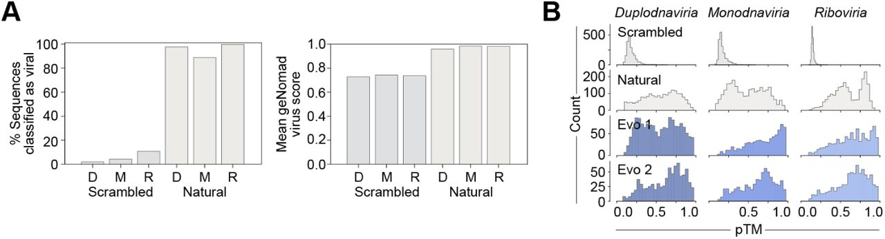

**Figure S1 Supplementary data for phage realm sequence generation.(A) Percent of natural and scrambled natural sequences classified as viral by geNomad (left), and their mean geNomad virus scores (right). D, Duplodnaviria; M, Monodnaviria; R, Riboviria. geNomad effectively discriminates real natural sequences from scrambled ones. (B) ESMFold-predicted protein structures from generated sequences have mean predicted template modeling (pTM) scores similar to natural proteins, substantially higher than scrambled natural sequence controls.**

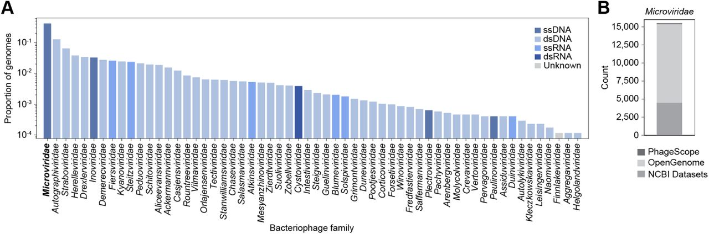

**Figure S2 Microviridae sequence data. (A) Relative proportions of complete phage genomes on NCBI Virus as of May 12, 2025. (B) Microviridae data for fine-tuning collected from PhageScope, OpenGenome, and NCBI Datasets.**

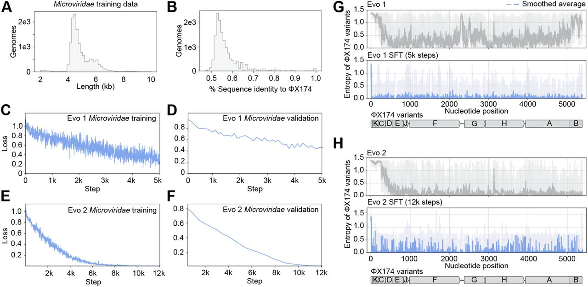

**Figure S3 Fine-tuning Evo 1 and Evo 2 on Microviridae genomes.(A) Lengths of genomic sequences in the Microviridae training data. kb, kilobase. (B) Percent sequence identity of genomes in the Microviridae data aligned to ΦX174. (C–F) Training and validation loss curves for Evo 1 fine-tuning (C–D) and Evo 2 fine-tuning (E–F). (G–H) Per-position entropy of ΦX174 variant sequences calculated by Evo 1 7B 131K and Evo 1 SFT at 5k training steps (G), and Evo 2 7B 8K and Evo 2 SFT at 12k training steps (H). Dark gray and dark blue, smoothed average of positional entropies; light gray and light blue, range of position entropies. Schematic of the ΦX174 genome is shown below.**

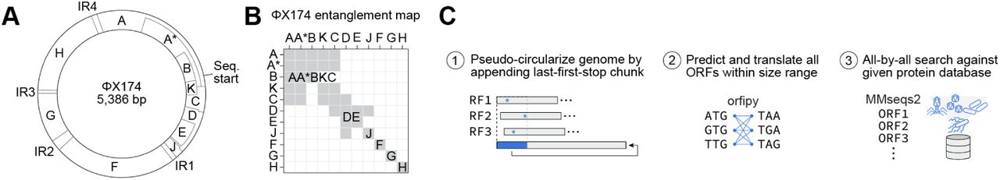

**Figure S4 Method for predicting genes inΦX174-like sequences. (A) Circular schematic of the ΦX174 genome. IR, intergenic region. (B) Pairwise matrix indicating overlapping genes (gray) in the ΦX174 genome. (C) Steps of our gene annotation method. First, sequences are “pseudo-circularized” by searching for the first stop codon in each reading frame (RF), identifying the most downstream first stop codon position, extracting the sequence up to the position, and appending it to the end of the genome. Then, all possible open reading frames (ORFs) are determined with input start and stop codons using orfipy (Singh & Wurtele, 2021). Finally, an all-by-all search of the ORFs against an input protein database using MMseqs2 (Steinegger & Söding, 2017) is performed.**

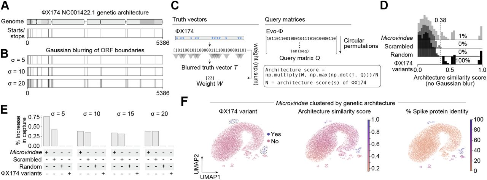

**Figure S5 Scoring architectural similarity of genomes.(A) Top: Schematic of ΦX174 NC_001422.1 genome architecture. Bottom: Visualization of one-hot encoding of the known start and stop codon boundaries in the ΦX174 genome. (B) Applying Gaussian blurs to the one-hot encoding produces smoothed open reading frame (ORF) boundary profiles, making the similarity metric less sensitive to exact start/stop positions. (C) Architectural similarity scoring process (Methods). (D) Distribution of architecture similarity scores normalized to ΦX174 NC_001422.1 without Gaussian blurring show that ΦX174 variants score highly (close to 1), while natural Microviridae, scrambled Microviridae, and random sequences have low scores. A score >0.38 reliably delineates ΦX174-like sequences. (E) Increasing the Gaussian blur parameter 𝜎 expands the capture of sequences above the 0.38 threshold. At 𝜎 = 5, the method balances sensitivity (capturing more ΦX174-like variants) with specificity (limiting scrambled or random sequences scoring as high). (F) Microviridae sequences clustered by their nearest one-hot encoded start/stop codon vectors relative to the ΦX174 reference. ΦX174 variants form distinct clusters with both high architecture similarity scores and high spike protein sequence identity to the ΦX174 spike protein.**

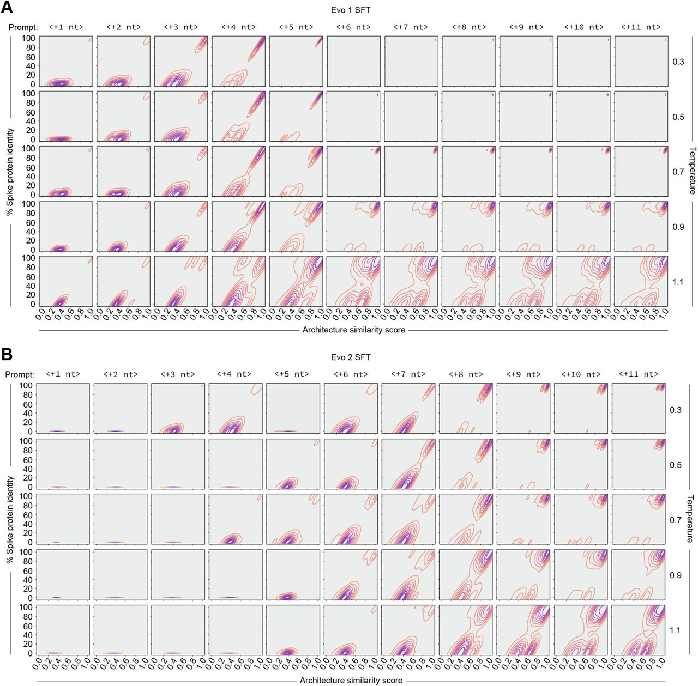

**Figure S6 Generation temperature and prompt sweep.(A) Percent predicted spike protein identity and architecture similarity score of Evo 1 SFT- and Evo 2 SFT-generated sequences with increasing prompt lengths and generation temperatures. 𝑛 = 1000 sequences per parameter combination.**

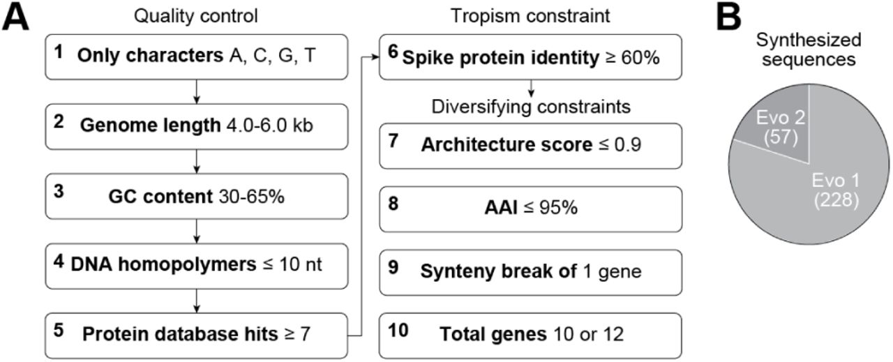

**Figure S7 Supplementary data for bacteriophage genome design filtering.(A) Final filtering criteria for generated phage genomes. Diversifying constraints were preferred but not always applied. kb, kilobase; nt, nucleotides; AAI, average amino acid sequence identity. (B) Proportions of final sequence candidates generated by Evo 1 and Evo 2 that could be synthesized.**

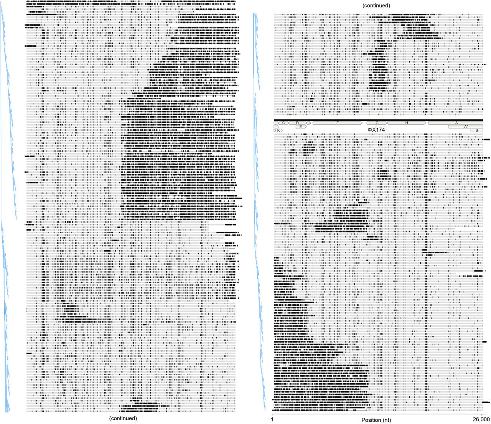

**Figure S8 Alignment of synthesized bacteriophage genome design candidates.Alignment of final bacteriophage genome candidates and ΦX174, ordered by a neighbor-joining phylogenetic tree. Black, unaligned nucleotides to ΦX174, gray, aligned nucleotides to ΦX174.**

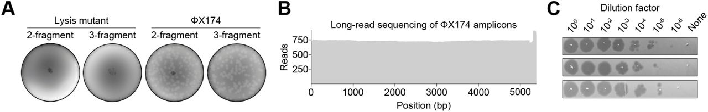

**Figure S9 Supplementary data for bacteriophage genome assembly and rebooting.(A) Plaque assays of ΦX174 wild-type or lysis mutant genome assemblies transformed into E. coli C show robust phage rebooting with wild-type only. Two- and three-fragment Gibson assemblies were tested. (B) Long-read sequencing read counts of PCR amplicons from ΦX174 plaques. (C) Titrations of purified ΦX174 particles on E. coli C.**

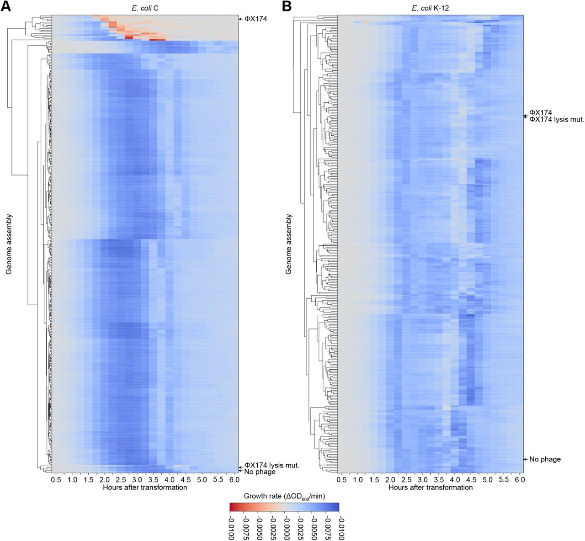

**Figure S10 Supplementary data for bacteriophage rebooting in E. coli C and E. coli K-12. (A–B)Heatmaps of growth rate of E. coli C (A) and E. coli K-12 (B) over 6 hours after transformation with assembled phage genomes. Growth rates of E. coli C transformed with viable generated phages clusters with ΦX174.**

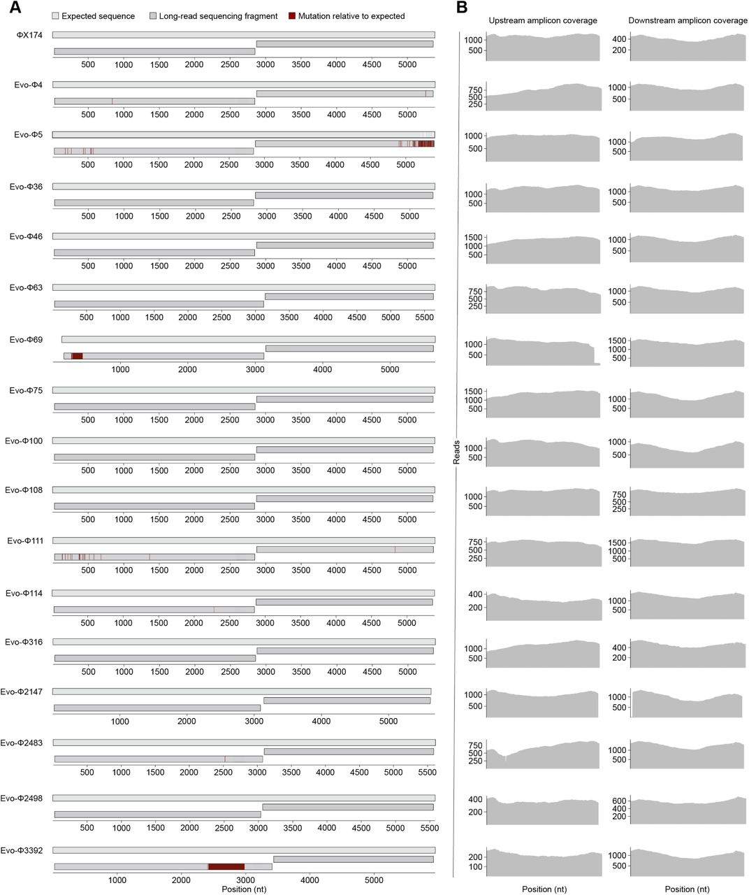

**Figure S11 Long-read sequencing of viable generated bacteriophage genomes.(A) Long-read sequencing of PCR amplicons (dark gray) from ΦX174 and generated phage stocks, aligned against the expected sequence (light gray). Red, mutations relative to the expected sequence; white, gaps in the alignment. (B) Read counts from long-read sequencing.**

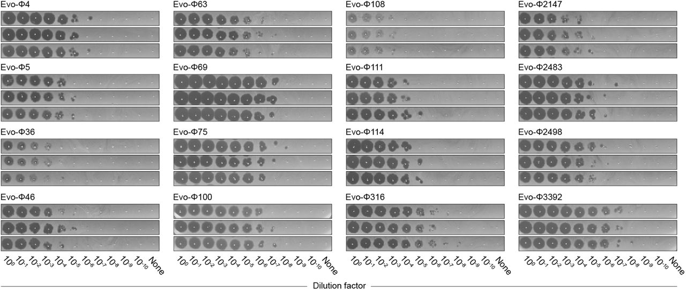

**Figure S12 Titration of viable generated bacteriophage genomes.Plaque titrations of purified generated phages on E. coli C. Each row is a titration replicate.**

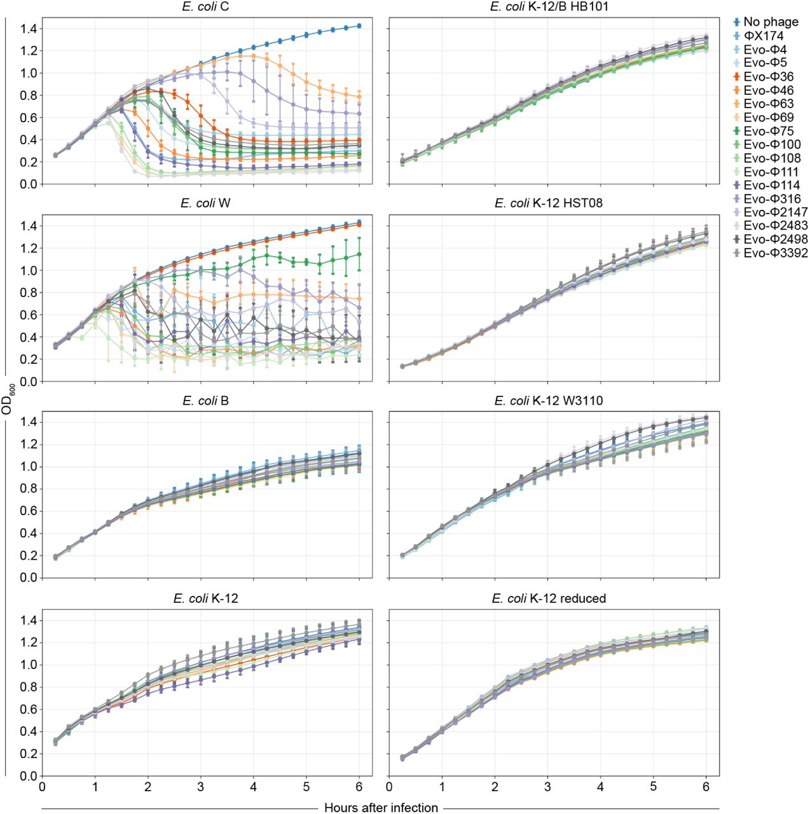

**Figure S13 Supplementary data for host tropism assay.Growth curves of eight different E. coli strains infected with generated phages and ΦX174.**

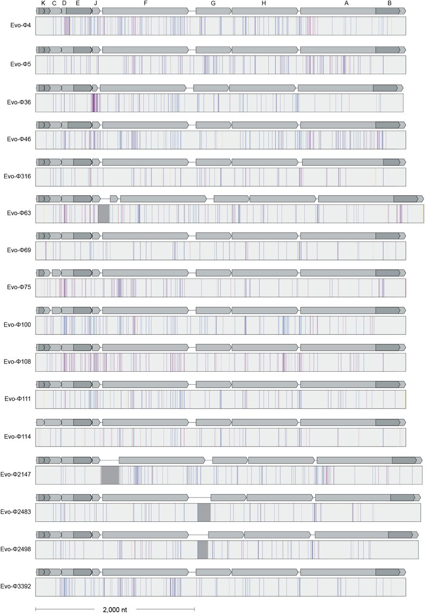
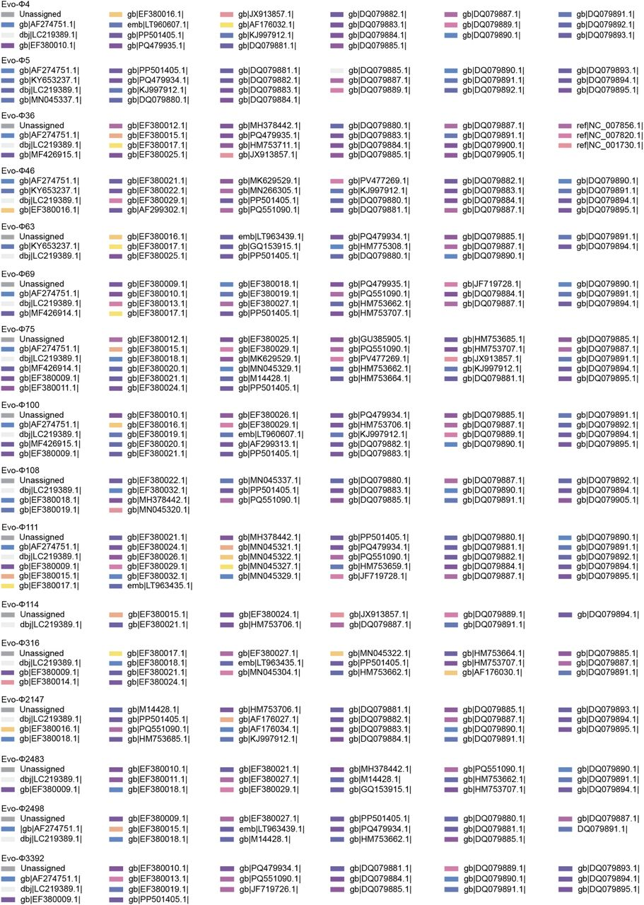

**Figure S14 Supplementary data for cumulative genome attribution analysis.Sequence attribution analysis of generated phages, with nucleotides colored as “Unassigned” or by their top nucleotide BLAST hit in the core_nt database. Mutations in most generated phages cannot be completely attributed to mutations seen in nature.**

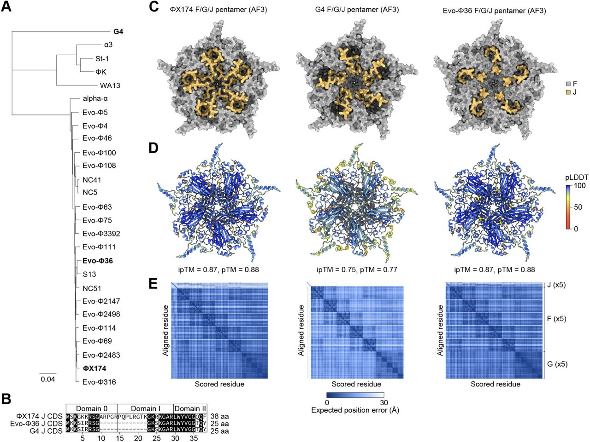

**Figure S15 Phylogenetic analysis of Evo-Φ36 J gene. (A) Neighbor-joining phylogenetic tree of representative Microviridae phages and generated phages. (B) Coding sequence (CDS) of gene J of ΦX174, Evo-Φ36, and phage G4, with positions of domains 0, I, and II shown. Black shading, identical residues; aa, amino acids. (C) AlphaFold 3 (AF3) predictions of F (capsid, gray), spike (G, not visible), and J protein (yellow) pentamers of ΦX174, G4, and Evo-Φ36. The interior face of the pentamers is shown, highlighting the notable differences in J protein interactions with capsid proteins. (D) AF3 predictions of F/G/J pentamers colored by predicted local distance difference test (pLDDT) score. ipTM, interface predicted template modeling score; pTM, predicted template modeling score. (E) Predicted aligned error (PAE) plots of the AF3 predictions.**

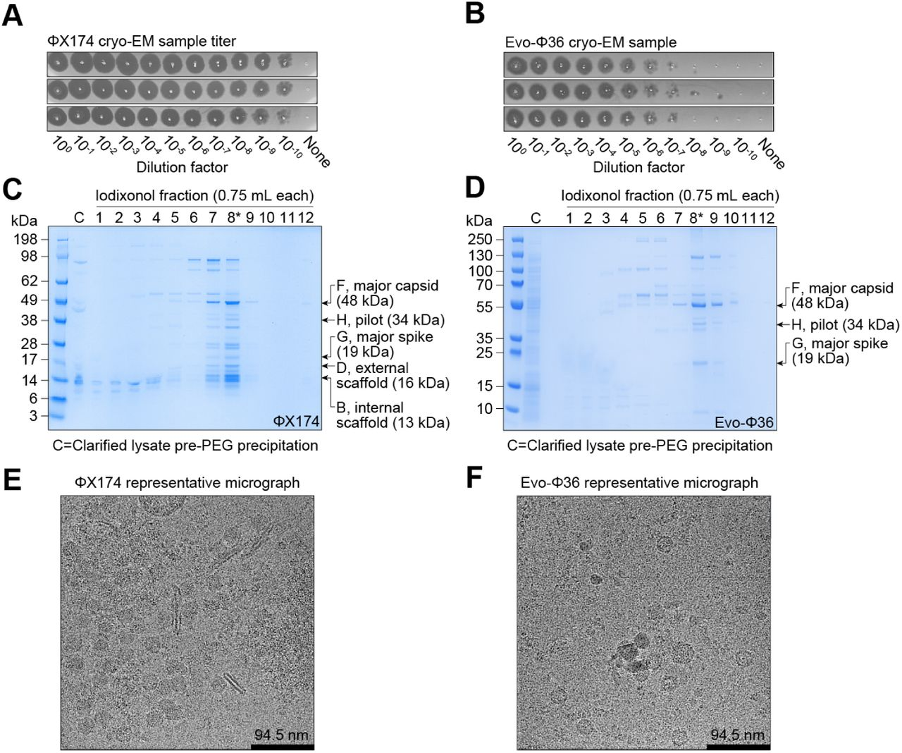

\**Figure S16 Supplementary data for cryo-EM analysis. (A–B)Titrations of purified ΦX174 (A) and Evo-Φ36 (B) cryo-EM samples. (C–D) SDS-PAGE of ΦX174 (C) and Evo-Φ36 (D) iodixonol gradient fractions. *, fraction used for cryo-EM. (E–F) Representative cryo-EM micrographs of ΦX174 (E) and Evo-Φ36 (F) grids used for cryo-EM data collection.**

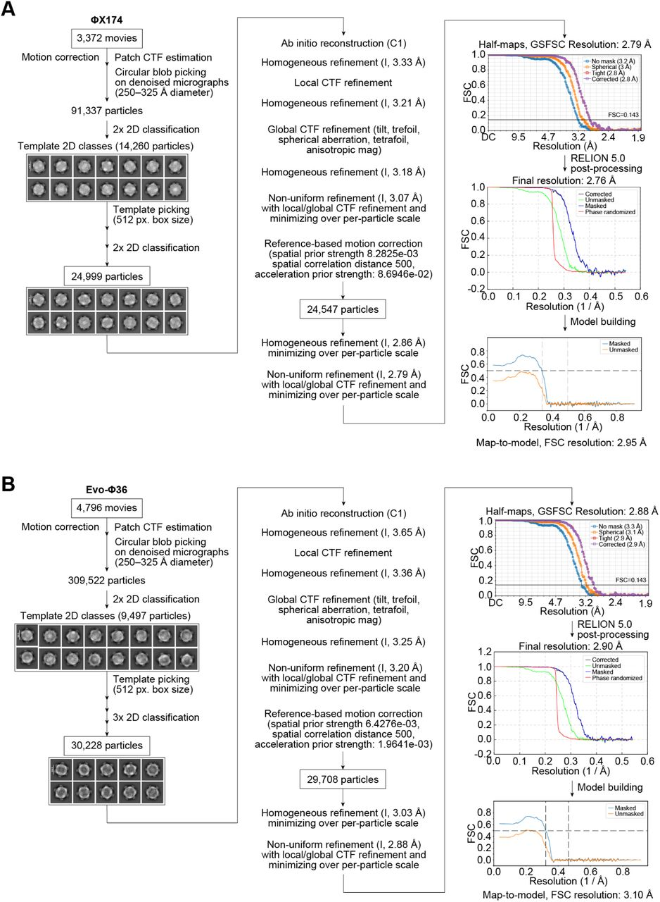

**Figure S17 Cryo-EM data processing workflow. (A–B)Cryo-EM data processing workflows in cryoSPARC for ΦX174 (A) and Evo-Φ36 (B) with half-map FSCs as reported by cryoSPARC without auto-tightening of the mask, FSCs from RELION with threshold-based mask, and map-to-model FSCs from Phenix with a threshold of FSC = 0.5. Masks for RELION post-processing were constructed using a low-pass filter of 20 Å, 1 pixel extension, and 8 pixel soft-edge with a binarization threshold of 0.015 and 0.01 for ΦX174 and Evo-Φ36, respectively.**

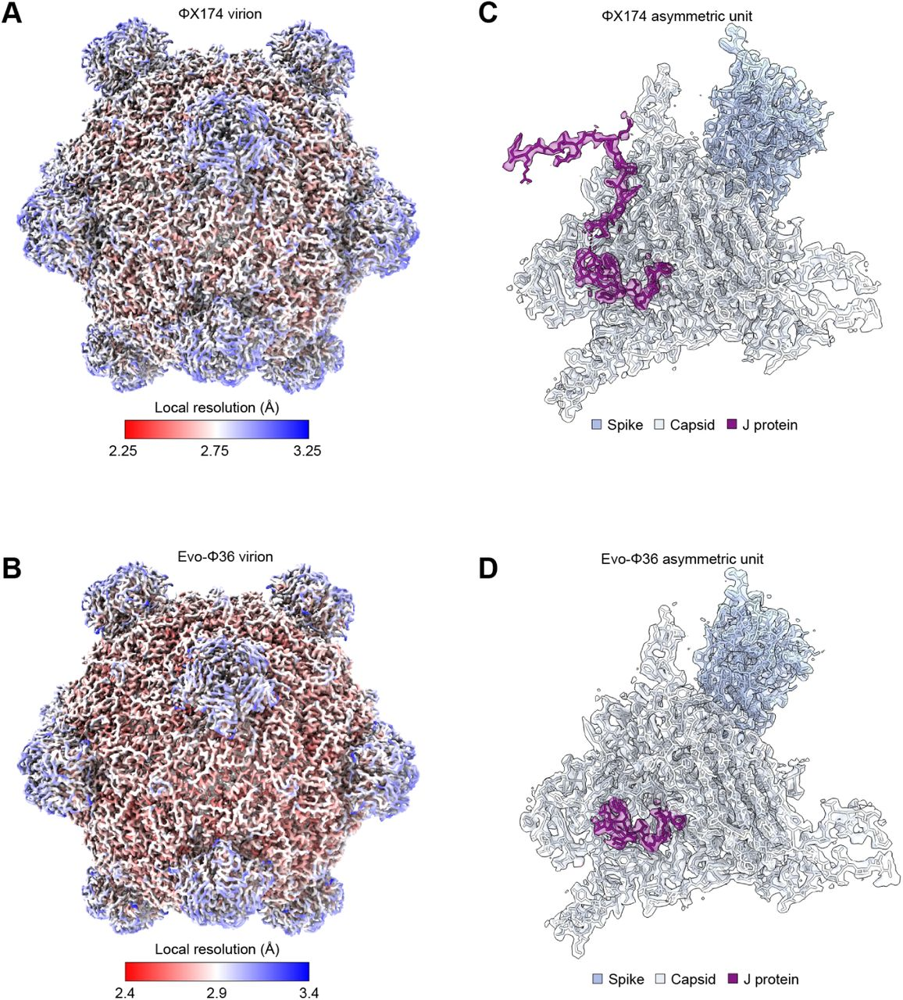

**Figure S18 Additional validation of cryo-EM maps and atomic models. (A–B)Local resolution estimation for for ΦX174 (A) and Evo-Φ36 (B) as output by cryoSPARC (FSC = 0.5). (C–D) Visualization of atomic models fit into cryo-EM densities for an asymmetric unit of ΦX174 (C) and Evo-Φ36 (D).**

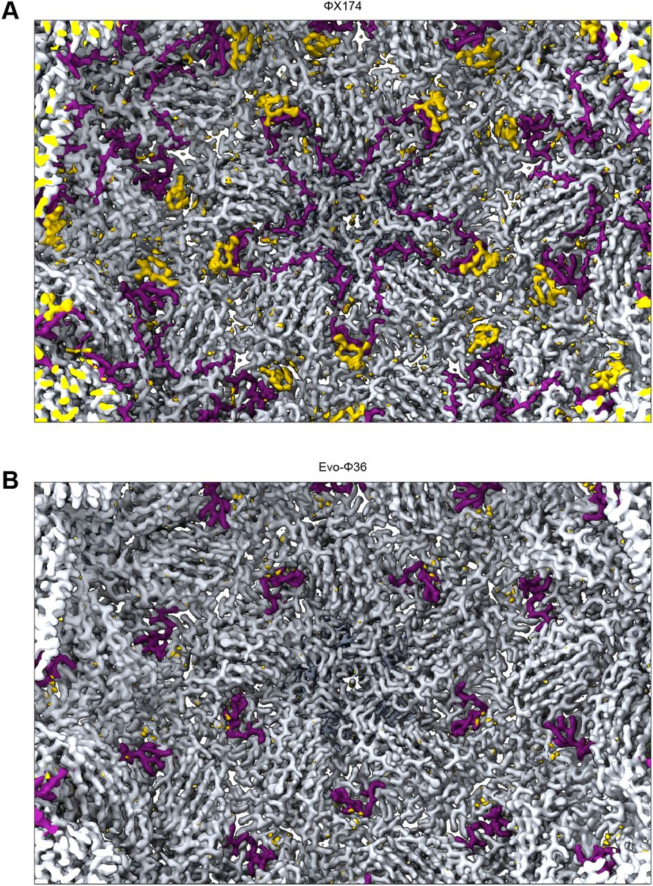

**Figure S19 Interior surface views of cryo-EM density maps. (A–B)Interior surface view of the cryo-EM density maps of ΦX174 (A) and Evo-Φ36 (B), colored by zone based on the model with capsid (F) in gray, spike (G) in light blue (largely not visible), and DNA packaging protein (J) in purple. Compare to Figure 4J. Gold corresponds to unmodeled densities, primarily of nucleic acids.**

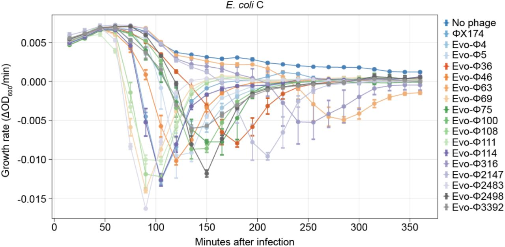

**Figure S20 Supplementary data for lytic assay.Growth rates of E. coli C infected by generated phages and ΦX174, with no phage infection control. Data point, mean OD600 value; error bar, standard deviation; 𝑛 = 3 infection replicates.**

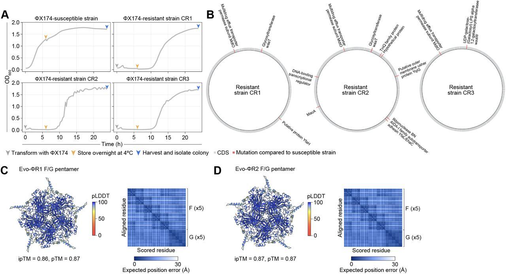

**Figure S21 Supplementary data for bacteriophage resistance assay.(A) Growth curves of E. coli C without infection by ΦX174 (ΦX174-susceptible strain), or transformed with ΦX174 genome (ΦX174-resistant strain). Arrowheads indicate key timepoints for producing and harvesting the different strains. (B) Whole-genome sequencing of resistant strains CR1, CR2, and CR3 show unique mutations compared to the susceptible strain. Gray, predicted coding sequence (CDS); red, point mutation relative to susceptible strain. (C–D) AlphaFold 3 (AF3) predictions of F (capsid) and spike (G) pentamers of Evo-ΦR1 and Evo-ΦR2. The exterior face of the pentamers is shown, colored by predicted local distance difference test (pLDDT) score. Predicted aligned error (PAE) plots of the AF3 predictions are shown on the right. ipTM, interface predicted template modeling score; pTM, predicted template modeling score.**

View this table:

- View inline
- [View popup](https://www.biorxiv.org/highwire/markup/4895020/expansion?width=1000&height=500&iframe=true&postprocessors=highwire_tables%2Chighwire_reclass%2Chighwire_figures%2Chighwire_math%2Chighwire_inline_linked_media%2Chighwire_embed)
- [Download powerpoint](https://www.biorxiv.org/highwire/powerpoint/4895020)

Table S1 Cryo-EM data collection, refinement, and validation statistics.

## **D.** Supplementary files

### **D.1.** File S1

Generated bacteriophage genome candidates, metrics, and assembly fragments DNA oligo sequences Bacteriophage genome amplicons for long-read sequencing Functional sequencing-verified bacteriophage genome sequences
