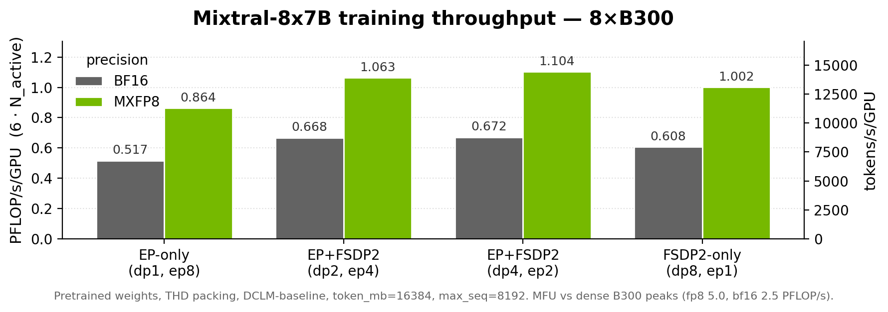

# TransformerEngine-accelerated Mixtral training with Expert Parallelism

This folder demonstrates how to train TE-accelerated Mixtral MoE with a native PyTorch training loop,
including **Expert Parallelism (EP)** composable with **FSDP2**, fused CuteDSL GroupedMLP kernels for
MXFP8 on Blackwell, and consolidated / EP-reshardable distributed checkpointing.

## How to use this recipe

This folder contains an independent, minimal training example. It does not depend on any other code in the
top-level bionemo-framework repository.

### Supported Models and Training Features

| Model                                     | BF16 | MXFP8<sup>[1]</sup> | Expert Parallelism | FSDP2 (over `dp`) | THD Sequence Packing |
| ----------------------------------------- | ---- | ------------------- | ------------------ | ----------------- | -------------------- |
| [Mixtral](../../models/mixtral/README.md) | ✅   | ✅                  | ✅                 | ✅                | ✅                   |

✅: Supported <br/>
🚧: Under development <br/>
❌: Not supported <br/>

\[1\]: MXFP8 fused GroupedMLP requires [compute capability](https://developer.nvidia.com/cuda-gpus) 10.0
and 10.3 (Blackwell); 12.0 support pending.

### Performance Benchmarks



Steady-state training throughput for Mixtral-8x7B on 8×B300 (DCLM-baseline, `max_seq=8192`,
`token_mb=16384`). Per-layout / per-precision numbers are in `benchmarks/mixtral_8x7b_8xB300.csv`
(and `benchmarks/mixtral_8x7b_8xB200.csv`).

### Installing Dependencies

The easiest way to get started is to use the provided Dockerfile, which uses the NVIDIA PyTorch 26.06 base
image. To build the container, run:

```bash
docker build -t mixtral_native_te .
```

To run the container:

```bash
docker run -it --gpus all --network host --ipc=host --rm -v ${PWD}:/workspace/bionemo mixtral_native_te /bin/bash
```

Alternatively, install dependencies manually in an environment with CUDA support. See `requirements.txt`
for the list of dependencies.

The fused MXFP8 GroupedMLP kernel (`ForwardGroupedMLP_CuTeGEMMSwiGLU_MXFP8`) used for the experts
requires a pinned CuteDSL dependency trio; see the explanatory comment in `requirements.txt` for the
version rationale. Training **asserts** `ForwardGroupedMLP_CuTeGEMMSwiGLU_MXFP8.is_supported()` at
startup when `expert_ffn_mode=fused_grouped_mlp` and `fp8_config.enabled=true`, so an incompatible
environment fails loudly rather than silently falling back to the numerically-broken unfused
grouped-linear path.

### Expert Parallelism and Device Mesh

Training uses a 2D `(dp, ep)` device mesh via `build_mesh_and_wrap(model, dp_size, ep_size)` in
`distributed_setup.py`:

- **Experts** (`experts_gate_up` / `experts_down` discrete `weight{i}` in `fused_grouped_mlp` mode)
  are EP-sharded as **local tensors** on each rank — no runtime DTensor on live expert weights.
- **Sharding depends on `dp_size`:** when `dp_size > 1`, whole decoder layers are FSDP2-`fully_shard`ed
  over the `"dp"` sub-mesh (so both dense *and* expert params are additionally sharded over `dp`), and
  the replicated dense grads are all-reduced over `ep` each step. When `dp_size == 1` there is **no
  FSDP2 wrapping at all** (a size-1 FSDP mesh shards nothing yet trips a TE MXFP8/cross-group hazard):
  dense params are replicated and kept in sync purely by the explicit dense all-reduce over `ep`.
- **EP groups are set before FSDP2 wrapping** via `model.model.set_ep_groups(ep_group, ep_mesh)` (see
  `build_mesh_and_wrap` for why the ordering matters).

Configure parallelism in Hydra:

```yaml
parallelism:
  dp_size: 1   # data-parallel dimension = the FSDP2 sharding group (non-expert params, and experts when dp>1)
  ep_size: 2   # expert-parallel dimension; dp_size * ep_size must equal world_size
```

## Commands to Launch Training

To run the L0 sanity check on 2 GPUs (tiny Mixtral, EP=2):

```bash
torchrun --nproc_per_node=2 train_fsdp2_ep.py --config-name L0_sanity
```

For the full Mixtral-8x7B EP=8 MXFP8 configuration (8 GPUs):

```bash
torchrun --nproc_per_node=8 train_fsdp2_ep.py --config-name L1_8x7B_ep checkpoint.ckpt_dir=/path/to/ckpt
```

Gradient accumulation is supported via `grad_acc_steps`:

```bash
torchrun --nproc_per_node=2 train_fsdp2_ep.py --config-name L0_sanity grad_acc_steps=2
```

### Precision Modes

All training paths use TE **`FusedAdam`** (required for mixing EP-local expert params with FSDP2
DTensors). FP32 optimizer **master weights** are enabled automatically for persistent-MXFP8 params
(`quantized_model_init`), and can be enabled for bf16 via `optimizer_master_weights=true`
(optionally with `optimizer_store_param_remainders=true` to halve the master footprint).

| Mode                            | Config                                                                 | Behavior                                                                                                                                                                       |
| ------------------------------- | ---------------------------------------------------------------------- | ------------------------------------------------------------------------------------------------------------------------------------------------------------------------------ |
| **(a) BF16**                    | `fp8_config.enabled=false` (default)                                   | bf16 model params; no `te.autocast`                                                                                                                                            |
| **(b) MXFP8 via `te.autocast`** | `fp8_config.enabled=true`, `quantized_model_init_kwargs.enabled=false` | bf16 master weights; MXFP8 compute via per-layer `te.autocast(recipe=MXFP8BlockScaling)`                                                                                       |
| **(c) MXFP8 persistent params** | `fp8_config.enabled=true`, `quantized_model_init_kwargs.enabled=true`  | weights created in `te.quantized_model_init`; `FusedAdam(master_weights=True)` seeds FP32 masters from high-precision init values when `preserve_high_precision_init_val=true` |

**BF16 baseline:**

```bash
torchrun --nproc_per_node=2 train_fsdp2_ep.py --config-name L0_sanity
```

**MXFP8 with autocast (bf16 masters):**

```bash
torchrun --nproc_per_node=2 train_fsdp2_ep.py --config-name L0_sanity fp8_config.enabled=true
```

**MXFP8 with quantized model init (persistent MXFP8 params + bf16 masters):**

```bash
torchrun --nproc_per_node=2 train_fsdp2_ep.py --config-name L0_sanity \
  fp8_config.enabled=true \
  fp8_config.quantized_model_init_kwargs.enabled=true \
  fp8_config.quantized_model_init_kwargs.preserve_high_precision_init_val=true
```

The `L1_8x7B_ep` config enables mode (c) by default.

### Sequence Packing (THD input format)

Sequence packing is handled via a padding-free collator (`collator.py`, synced from `models/esm2`).
Enable with `use_sequence_packing=true` in the Hydra configuration.

## Saving and Loading Checkpoints

Checkpointing splits state across two paths:

1. **Non-expert state** — standard FSDP2 DCP via `torch.distributed.checkpoint` (attention, norms,
   embeddings, router, lm_head).
2. **Expert weights + FusedAdam optimizer state** — consolidated, EP-reshardable checkpoints via
   `grouped_dcp` (`save_consolidated` / `load_consolidated` and
   `save_optimizer_consolidated` / `load_optimizer_consolidated`). Expert MXFP8 weights are
   dequantized to bf16, stacked as `DTensor(Shard(0))`, and support **EP=N→M reshard** on load.

To enable checkpoint saving:

```bash
torchrun --nproc_per_node=2 train_fsdp2_ep.py --config-name L0_sanity \
  checkpoint.ckpt_dir=/path/to/ckpt_dir \
  checkpoint.save_every_n_steps=100
```

To resume:

```bash
torchrun --nproc_per_node=2 train_fsdp2_ep.py --config-name L0_sanity \
  checkpoint.ckpt_dir=/path/to/ckpt_dir \
  checkpoint.resume_from_checkpoint=true
```

See `checkpoint.py` and `grouped_dcp.py` for implementation details. Tests cover round-trip save/load
and EP resharding in `tests/test_checkpoint.py` and `tests/test_checkpoint_ep.py`.

## Developer Guide

### Running tests

From the repository root:

```bash
./ci/scripts/recipes_local_test.py recipes/mixtral_native_te/
```

Or inside the recipe directory:

```bash
pytest -v .
```

Fused GroupedMLP tests require Blackwell (sm_100+) and are skipped on other GPUs.

### Copied files

Several files are synced from upstream model folders via `ci/scripts/check_copied_files.py`:

- `modeling_mixtral_te.py` ← `models/mixtral/modeling_mixtral_te.py`
- `grouped_dcp.py` ← `models/mixtral/grouped_dcp.py`
- `collator.py` ← `models/esm2/collator.py`

Edit the source copy and regenerate destinations with `--fix`; do not hand-edit destination copies.

### Hydra Tips

Configuration parameters can be overridden from the command line, e.g.
`torchrun ... train_fsdp2_ep.py --config-name L0_sanity fp8_config.enabled=true`.

Available configs:

- `L0_sanity` — tiny Mixtral, EP=2, 10 steps, bf16
- `L1_8x7B_ep` — Mixtral-8x7B, EP=8, MXFP8 + quantized model init
